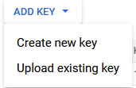

# Primero

Descarga [gcloud CLI](https://cloud.google.com/sdk/install) 

# Segundo

Dirígete a [Service Account](https://console.cloud.google.com/iam-admin/serviceaccounts?authuser=1&hl=en&project=cdt-principal&supportedpurview=project)

Dentro veremos la cuenta del servicio que estamos utilizando. Podemos crear otras presionando en `Create Service Account` pero depende de nuestros privilegios. En mi caso tuve que ir a la creada por defecto.

Bueno seguimos, apretamos los 3 puntos debajo de `Actions`:

Y dentro del menú desplegable de la imagen anterior presionamos `Manage keys`. Por defecto nos sale vacío por lo lo que tenemos que presionar en `Add Key` (en mi caso ya había creado una):

En el menú desplegable de `Add Key` presionamos `Create new key`

Nos saldrá una ventana para seleccionar el formato, yo seleccioné json:

Esta se nos descarga automáticamente en la PC.

# Tercero

Abrimos una terminal en nuestra pc donde mismo tengamos nuestro archivo recientemente descargado.

Una vez abierta introducimos el siguiente comando:

`gcloud auth activate-service-account --key-file key.json`

> Sustituye key.json por el archivo que acabas de descargar

De esta forma ya añadimos la cuenta a nuestro `gcloud` en la pc.

# Cuarto

Comprobamos que se poseen las credenciales. Para ello ejecutamos el comando:

`gcloud auth print-access-token`

El resultado debe ser un token de autenticación.
