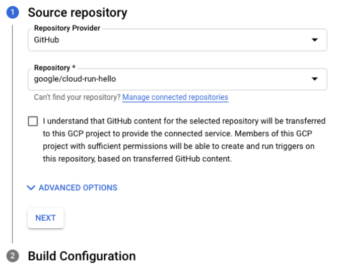
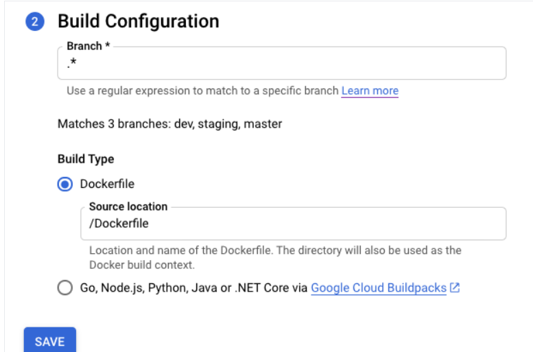
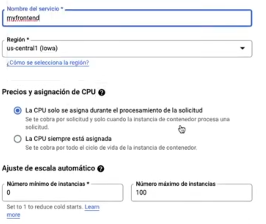
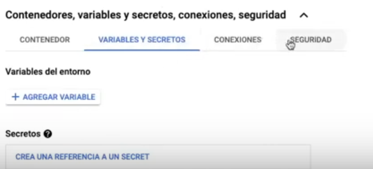

# Instalar gCloud CLI

El `gCloud CLI` no es más que la herramienta que nos permitirá, mediante la consola de comandos, interactuar con nuestros servicios dentro de `Google Cloud`. Además, nos permite agilizar nuestro trabajo emulando funcionalidades de `gCloud`.

> No confundir con `Cloud Shell` que es una terminal directa en el navegador que nos permite interactuar con `google cloud` y codificar.

1. Descargar e instalar el Google Cloud SDK (https://cloud.google.com/sdk/docs/install/) (149kb) -> Necesita conexión a internet.
 - Necesitas tener python instalado. Cualquier versión de la 3.8 a la 3.12. De todas formas, el instalador se encarga de eso.
 - En caso que no queramos que se descargue la versión de python, puedes dirigirte al siguiente link (https://cloud.google.com/sdk/gcloud/reference/topic/startup) para conocer como configurar el `gCloud CLI`.
 - La instalación puede demorarse en dependencia de la velocidad de su internet.

# Inicializar aplicación de `gCloud`

Partimos de acceder a la carpeta que más nos interese para crear el proyecto y abrimos una consola de comando dentro de ella. Dentro de la consola escribiremos `gcloud init`.

El comando comenzará comprobando la calidad del internet y posteriormente nos pedirá que introduzcamos las credenciales de nuestra cuenta de `Google Cloud`.

> Este punto queda pendiente debido a que no poseemos actualmente credenciales.

Después que termine la inicialización del proyecto, debemos asignarle un ID o nombre. Para ello ejecutamos el comando `gcloud config set project NOMBRE_AQUI`

# Escribiendo el primer proyecto para probar

> Antes de comenzar este apartado, le brindamos este proyecto de [github](https://github.com/GoogleCloudPlatform/nodejs-docs-samples.git), donde podrá encontrar una serie de ejemplo de aplicaciones creadas con `node.js` para desplegar en dicha plataforma.

En este proyecto utilizaremos el sencillo [`Hello World`](https://github.com/GoogleCloudPlatform/nodejs-docs-samples/tree/ebc7aca48f8cc493d73566621ca621af4764c006/run/helloworld) que se encuentra dentro de la carpeta `run`.

La aplicación a utilizar es bastante sencilla. Le dejamos a continuación el código principal de la misma:

```js
const express = require('express');
const app = express();

app.get('/', (req, res) => {
  const name = process.env.NAME || 'World';
  res.send(`Hello ${name}!`);
});

const port = parseInt(process.env.PORT) || 8080;
app.listen(port, () => {
  console.log(`helloworld: listening on port ${port}`);
});
```

Otros temas a tener en cuenta para trabajar con aplicaciones en `google cloud` es el `.gcloudignore` para evitar la subida de archivos no deseados y que puedan ocuparnos más espacio del debido:

```txt
node_modules
npm-debug.log
```
Además toda aplicaciones que subamos debe estar dentro de un contenedor de docker para su correcto despliegue y funcionamiento:

```Dockerfile
FROM node:18-slim
WORKDIR /usr/src/app
COPY package*.json ./
RUN npm install --only=production
COPY . ./
CMD [ "node", "index.js" ]
```

Junto a su inseparable archivo `.dockerignore`

```dockerignore
Dockerfile
.dockerignore
node_modules
npm-debug.log
```

# Desplegando la aplicación desde nuestras pc

> Antes de continuar, debemos decir que para poder realizar la acción de despliegue en google cloud nuestro rol debe ser el de propietario (`owner`) o `editor`. En caso que no tengas ninguno de los dos, se te deben brindar los siguientes permisos:
> - Cloud Run deployment permissions
> - Cloud Build permissions
> - Artifact Registry permissions

Teniendo todo lo anterior, podemos comenzar a desplegar nuestra aplicación. Para ello, escribimos el siguiente código en la consola dentro de la carpeta donde iniciamos el proyecto de `gcloud`:

- `gcloud run deploy`

> No tenemos cuenta todavía a `google cloud`.

Este comando, nos realizará las siguiente preguntas:
1. Donde se encuentra el código a desplegar. Si estamos en la carpeta presionamos enter
2. El nombre del servicio a desplegar. Si queremos mantener el nombre de nuestra aplicación para que tome el nombre del `package.json`.
3. Es posible que el sistema pregunte si queremos habilitar la API de registro de los artefactos. Escribimos `y` para aceptar.
4. Este paso es bastante importante ya que consiste en seleccionar la región donde queremos desplegar la aplicación. 
5. Por último el sistema preguntará si queremos permitir la invocación de nuestra aplicación sin autenticación.

Solo nos resta esperar a que el sistema termine de compilar y nos proporcione la `url` de acceso a la aplicación.

> Ojo, `Google Cloud Run` donde desplegamos nuestra aplicación, se encargará del escalado automático. Pero ojo, `google` nos cobrará por uso de **CPU**, **memoria** y **red**. El lado bueno, si no se usa, no se cobra por tener almacenada la aplicación (Esto lo dice google); aunque, si decidimos añadir nuestra imagen a `Registry Artifact`, google nos cobrará por su estancia dentro de ese sistema.

# Crear repositorio en google cloud

Antes de pasar al despliegue de un repositorio, debemos comenzar con la opción de crear un nuevo repositorio:
1. Comencemos abriendo la consola de [`google cloud`](https://source.cloud.google.com/repos)
2. Presionamos la opción de adicionar repositorio (`Add repository`)
3. En la página que nos aparecerá, presionamos `Create new repository` (crear nuevo repositorio)
4. Se nos abrirá una ventana para añadir el nombre de nuestro repositorio. 
5. Seleccionamos a que proyecto de google cloud pertenecerá nuestro repositorio.
6. Presionamos `Create`

Y de esta forma creamos un repositorio vacío en `Google Cloud`.

> Ojo, todo repositorio debe pertenecer a un proyecto. Si no se posee un proyecto creado con anterioridad, dentro del mismo proceso de crear un repositorio, podemos acceder a la creación de un proyecto.

# Desplegando la aplicación desde github

> Este apartado del tutorial asume que ya posee en google cloud todo el código necesario para desplegar su aplicación. Si solo quieres probar y no tienes un proyecto, puedes utilizar el `hello world` de arriba.

1. Comencemos por entrar a [Google Run](github.com/GoogleCloudPlatform/cloud-run-microservice-template-nodejs)
2. Buscamos el apartado `service` y presionamos `Create`. Esto nos mostrará un formulario que nos brindará debemos seleccionar:
    - `Continuously deploy new revisions from a source repository` (Despliegue continuo desde el código de un repositorio)
    - Presionamos `Set up with Cloud Build`
3. Nos aparecerá un panel donde presionaremos la opción `Enable Cloud Build Api`
4. Debajo del apartado repositorio nos aparecerá un listado con los repositorios disponibles. Buscamos el que nos interesa y lo seleccionamos.
5. Presionamos siguiente y debajo de `Build Type` seleccionamos `Google Cloud Buildpacks` para permitir el proceso de construcción de nuestra aplicación.
6. Presionamos `Save` y pasamos al formulario `Create Service`.
7. Añadimos un nombre al servicio.
8. Seleccionamos la región donde queremos desplegar la aplicación.
9. Seleccionamos la opción `Allow unauthenticated invocations` para permitir la invocación de nuestra aplicación sin la necesidad de credenciales.
10. Presionamos `Create` y solo es esperar a que se construya nuestra aplicación.

# Realizar un espejo del código de GitHub

> Aquí partimos de la existencia de un código subido en github.

1. Accedemos a la página de [`Cloud Source Repository`](https://source.cloud.google.com/repos)
2. Presionamos la opción `Add Repository` (adicionar repositorio)
3. En el tipo de repositorio seleccionamos `Connect external repository`. Esto abrirá una nueva página.
4. Seleccionamos el proyecto al que pertenecerá el código o creamos un proyecto nuevo.
5. En el apartado `Git provider` seleccionamos `git`. Esta acción solo se permite para `GitHub` y `BitBucket`.
6. Presionamos el `checkbox` para autorizar a `Cloud Source Repository` almacenar las credenciales de `GitHub`.
7. Presionamos la opción `Connect to GitHub`.
8. Introducimos las credenciales de `GitHub`.
9. Presionamos `Authorize GoogleCloudPlatform`. Esto nos permite darle el acceso a `Google Cloud` a nuestro repositorio de `GitHub`
10. Seleccionamos el repositorio que queremos utilizar como origen para realizar el espejo.
11. Presionamos `Connect Selected Repository`.


# Despliegue continuo

> Aquí asumimos que posees tu repositorio dentro de google cloud o github.
> Además, debes tener habilitadas las funcionalidades de `Cloud Source Repositories Apis` y `Cloud Build`

1. Vamos al apartado de crear servicio
2. Cunado se crea el servicio, debe seleccionar `Continuously deploy new revisions from a source repository` (Despliegue continuo desde un repositorio) en el apartado de configuración.
3. En la creación del servicio presionamos el botón de `Set up with Cloud Build` o `Configurar con Cloud Build`
4. Selecciona el proveedor (**GitHub**, **Bitbucket** y **Cloud Repository**). En los dos primeros casos, debemos autenticarnos o en el caso específico de **GitHub**, podemos crear un espejo del código dentro de **Cloud Repository**.

5. En el próximo paso del formulario, nos toca seleccionar la rama (`branch`) que se estará observando para hacer el despliegue.
6. Ahora viene la parte importante. Cómo queremos desplegar nuestra aplicación. Si vamos a utilizar docker para nuestro despliegue, debemos seleccionar la opción `Dockerfile` y darle la dirección a dicho archivo.
    - En caso de querer compilar el código directamente debemos seleccionar la segunda opción. Tenga en cuenta que solo se podrán compilar los lenguajes soportados por `Google Cloud Buildpacks`.

7. Al presionar `save` podremos continuar con la configuración de nuestro `Cloud Run`.
8. Ahora pasaremos a introducir el nombre del servicio y la región en que lo queremos desplegar.
9. Posteriormente comenzaremos a ajustar los parámetros de uso de nuestra aplicación. Desde uso de CPU hasta el escalado automático.

10. Hasta aquí la configuración básica. Un poco más abajo, antes del botón `create` tenemos un objeto desplegable que nos muestra opciones extras de configuración:

11. Presionamos el botón `create` y toca esperar a que se despliegue el archivo docker.

Después de terminada la creación del servicio, seremos redirigidos a la página de detalles del servicio. Dentro podremos seguir el ciclo de vida de los despliegues realizados por la aplicación y en caso de que exista un error, podremos ver un log detallado.


# Quitando la app de `gCloud`

Tenemos que dirigirnos a [Administrar recursos](https://console.cloud.google.com/iam-admin/projects?_ga=2.217851734.1325940756.1702656178-550097643.1702656178) con nuestra cuenta de admin. Buscamos el proyecto, presionamos sobre el botón `eliminar` y ya terminamos. Hemos borrado totalmente nuestro proyecto de `google cloud`
