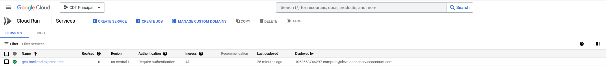
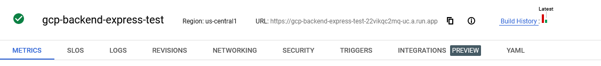
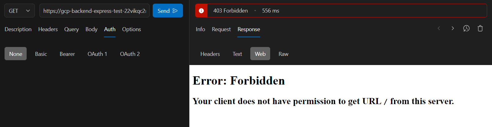
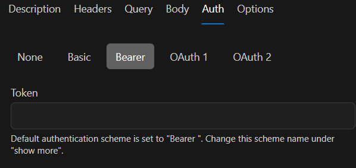
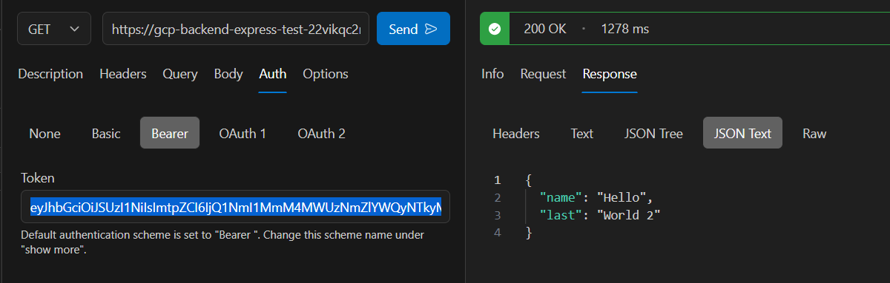

# Primero

> Para este tutorial partimos de que ya ejecutó todos los pasos de `0. generar-auth-token`.

Lo primero que vamos a hacer es acceder a nuestro `Cloud Run`:

En mi caso solo tengo un servicio creado pero aquí aparecerán todos los servicios que hayamos desplegado.

# Segundo

1. Seleccionamos el servicio que queramos utilizar. 

> Para acceder al servicio, presionamos sobre el nombre

2. Dentro, nos fijaremos en las propiedades principales del servicio.

> Estas aparecen al lado del nombre

3. Dentro nos copiamos la url que aparece al lado del nombre.

# Tercero

1. Con la url copiada vamos a cualquier software que nos permita realizar peticiones `HTTP`.

> En mi caso estoy utilizando `RapidApi Client` de visual studio code

2. Dentro de nuestro software vamos al apartado correspondiente a una petición `HTTP` de tipo `GET`.

3. En el input correspondiente pegamos la url que nos copiamos de `Cloud Run`

4. Para ve que pasa, presionamos `Enviar` o el botón dedicado a ejecutar la petición.

> Como pueden observar, de error 403 debido a que por defecto, google cloud solo acepta peticiones de usuarios autenticados. Es posible cambiar esta configuración en el apartado de `security` de cloud run, pero debes tener los privilegios necesarios.

5. Para obtener el token de autenticación ejecutamos el siguiente comando en nuestra consola
    - gcloud auth print-identity-token

6. Copiamos el token generado en la consola y volvemos a la ventana donde hicimos la petición anteriormente.

7. Dentro buscamos donde poner los parámetros de autenticación. En mi caso es ir a `Auth`

8. Dentro del apartado de autenticación nos dirigimos a `Bearer` y pegamos el token generado mediante la consola

9. Volvamos a ejecutar la petición y veremos como ahora si nos muestra el resultado correcto.

