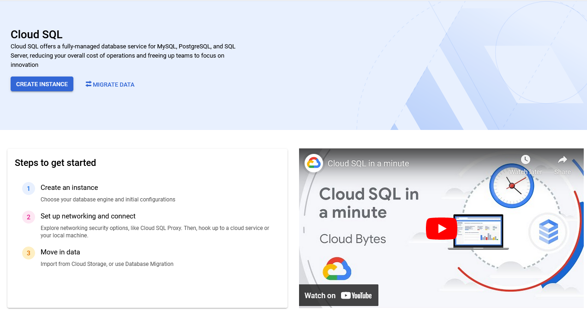
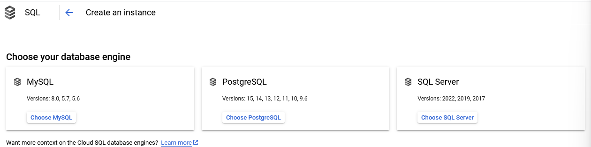
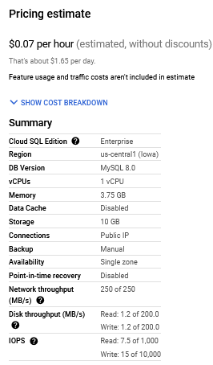

# Cloud Sql

Cloud SQL es un servicio de base de datos relacional totalmente administrado de Google Cloud Platform (GCP). Ofrece una solución de base de datos relacional basada en la nube que facilita la configuración, el mantenimiento, la administración, la escalabilidad y el acceso a bases de datos MySQL, PostgreSQL y SQL Server.

# Crear una instancia de MySQL en GCP

> Antes de crear la instancia de base de datos a utilizar, tenga en cuenta que debe cumplir con los siguientes requisitos:
> - Tener una cuenta en Google Cloud
> - La cuenta utilizada debe tener el rol de `Cloud SQL Admin` y `Compute Viewer` 

1. Dentro de `GCP` vamos en el menú lateral al apartado `SQL` y presionamos `Create Instance` o `Crear instancia`



2. Dentro podemos seleccionar entre `Postgres`, `MySql` y `Sql Server`



3. Puede que el sistema necesite que actives la `API` correspondiente a `SQL`.
4. Ahora iremos a configurar la instancia de acceso a nuestra base de datos.
    - `Instance ID`: un nombre identificativo
    - `Password`: podemos generarlo directamente en la aplicación.
    - `Database version`: debemos seleccionar que versión de base de datos vamos a utilizar.
    - `Region`: seleccionamos en que región vamos a desplegar nuestra base de datos
    - `Zona Availability`: definimos si queremos que este disponible para diferentes zonas.


5. Además, podemos añadir otras configuraciones. Para ello presionamos el botón `Show Configuration Options`: 
    - `Storage > Machine Type`: Cuantos CPU queremos utilizar para nuestra base de datos.
    - `Storage > Storage Type`: Podemos seleccionar si queremos utilizar un SSD o un HDD.
    - `Storage > Storage Capacity`: El espacio que vamos a reservar para nuestra base de datos.
    - `Backups > Automate backups`: Podemos seleccionar si queremos tener backups automáticos o manuales.
    - `Backups > Enable point-in-time recover`: Podemos seleccionar un punto en el tiempo para restaurar la base de datos.
6. Presionamos el botón `Create instance`.

> Tengan en cuenta que google les va a cobrar por hora de uso de la base de datos. Por eso deben tener cuidado con las propiedades que seleccionamos. Vean un ejemplo a continuación. En este caso seleccionamos lo mínimo de lo mínimo:



# PENDIENTE

> Si desea hacer todo los pasos anterior por comando, puede utilizar los siguientes:

- Crear instancia de `Cloud Sql`
```shell
gcloud sql instances create quickstart-instance \
  --database-version=POSTGRES_14 \
  --cpu=1 \
  --memory=4GB \
  --region=us-central1 \
  --database-flags=cloudsql.iam_authentication=on
```

- Crear base de datos
```shell
gcloud sql databases create quickstart_db \
  --instance=quickstart-instance
```

- Crear un usuario de la base de datos a utilizar. El usuario debe ser el nombre del service account creado para el proyecto que se esté utilizando

```shell
gcloud sql users create quickstart-service-account@${GOOGLE_CLOUD_PROJECT}.iam \
  --instance=quickstart-instance \
  --type=cloud_iam_service_account
```