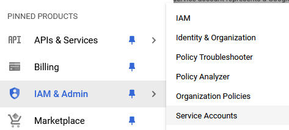
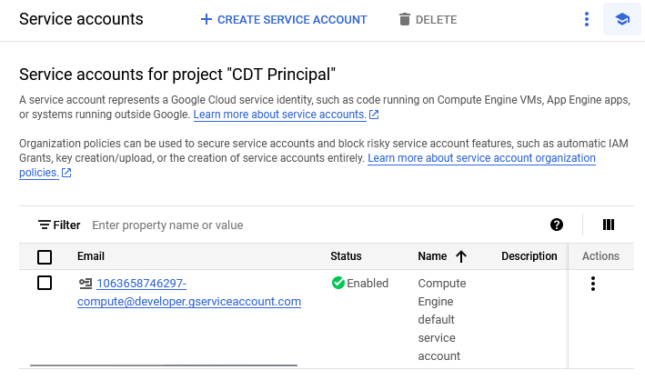
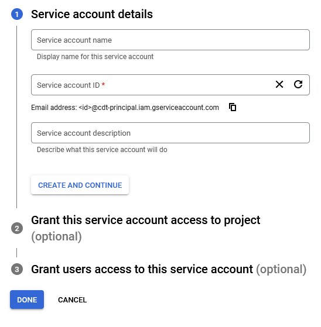

# Node y Cloud SQL

En este vamos a ver como podemos crear una conexión entre la base de datos de` Cloud SQL` con nuestra aplicación `nodeJS`. 

> Para este tutorial, ya se debe poseer un proyecto creado en `google cloud platform`

# Primer paso

Comencemos descargando el paquete de node dedicado para la conexión hacia la base de datos:

- https://github.com/GoogleCloudPlatform/cloud-sql-nodejs-connector#readme

# Segundo paso (comandos)

- Primero debemos crear dentro del `IAM` una cuenta para el acceso para los servicios. Para ello ejecutamos el siguiente comando.

`gcloud iam service-accounts create quickstart-service-account --display-name="Quickstart Service Account"`

- Después tenemos que vincular el servicio creado con los roles que necesitemos. Para ello ejecutamos el comando que a continuación veremos. Mientras que trabajemos en el `Cloud Shell` podemos utilizar variables de entorno para obtener datos de nuestra cuenta; por ejemplo, en este caso se utilizará esta variable ${GOOGLE_CLOUD_PROJECT} que será sustituida por el nombre de nuestro proyecto actual.

`gcloud projects add-iam-policy-binding ${GOOGLE_CLOUD_PROJECT} \  --member="serviceAccount:quickstart-service-account@${GOOGLE_CLOUD_PROJECT}.iam.gserviceaccount.com" \ --role="roles/cloudsql.client"`

- El anterior es el comando para vincular el rol de cliente a nuestro servicio y ahora nos toca añadir la capacidad de acceder a las instancias de `cloudSql`

`gcloud projects add-iam-policy-binding ${GOOGLE_CLOUD_PROJECT} \ --member="serviceAccount:quickstart-service-account@${GOOGLE_CLOUD_PROJECT}.iam.gserviceaccount.com" \ --role="roles/cloudsql.instanceUser"`

- Por último, añadimos la capacidad de escribir logs

`gcloud projects add-iam-policy-binding ${GOOGLE_CLOUD_PROJECT} \ --member="serviceAccount:quickstart-service-account@${GOOGLE_CLOUD_PROJECT}.iam.gserviceaccount.com" \ --role="roles/logging.logWriter"`

# Segundo paso (visual)

1. Nos vamos a la consola de `Google Cloud` y en el menú lateral seleccionamos a `IAM & Admin` > `Service Accounts`:



Dentro podemos crear un service account mediante el botón `Create Service Account`



Presionamos `create service` y llenamos los datos correspondientes. 



Los datos a llenar son bastante sencillos:

- Un nombre identificativo
- Un id para la cuenta, puede ser la primera parte del correo electrónico
- Una descripción.

Presionamos `Done` o `Finalizar` y tenemos la cuenta creada. 

2. El paso siguiente es vincular nuestro service account con el rol perteneciente a CloudSql client. 

> Para este paso debemos tener permiso de administrador.

> En este momento no puedo hacerlo, pero posteriormente lo agregaré

3. Lo próximo es añadir a nuestro servicio el rol de acceso a la instancia de cloud sql

> Para este paso debemos tener permiso de administrador.

> En este momento no puedo hacerlo, pero posteriormente lo agregaré

4. Solo nos resta añadir los permisos para escribir logs

> Para este paso debemos tener permiso de administrador.

> En este momento no puedo hacerlo, pero posteriormente lo agregaré

# Tercer paso

Aquí pueden ver el documento `3. create-database-cloud-sql` donde se explica como crear una instancia de Cloud SQL.

# Cuarto paso

El siguiente paso es preparar nuestra aplicación para conectarse con la base de datos. Al principio de este documento mencionamos que librería debemos instalar. Además de importar la librería anterior, debemos añadir el conector a la base de datos (ojo, no es lo mismo este conector y el de google).

- MySQL
    - `npm install mysql2`
- Postgres
    - `npm install pg`
- Sql Server
    - `npm install mssql`

El ejemplo que veremos a continuación es en Postgres:

```js
// Importamos las librerías correspondientes
import pg from 'pg';
import {Connector} from '@google-cloud/cloud-sql-connector';


// Obtenemos las clases que nos interesan del conector de Postgres
const {Pool} = pg;

// Creamos la conexión a google cloud
const connector = new Connector();
const clientOpts = await connector.getOptions({
    instanceConnectionName: process.env.INSTANCE_CONNECTION_NAME,
    authType: 'IAM'
});

// Creamos el pool de conexiones
const pool = new Pool({
    ...clientOpts,
    user: process.env.DB_USER,
    database: process.env.DB_NAME
});

// ...

// Este es un método de prueba para ejecutar querys en la base de datos
app.get('/', async (req, res) => {
  await pool.query('INSERT INTO visits(created_at) VALUES(NOW())');
  const {rows} = await pool.query('SELECT created_at FROM visits ORDER BY created_at DESC LIMIT 5');
  console.table(rows);
  res.send(rows);
});
```

# Quinto paso

Ahora tenemos que crear el deploy dentro de `code run`. Para ello, podemos guiarnos por el archivo `1. info-general.md`. Simplemente debemos agregar en el deploy las variables de entorno para acceder a la base de datos. las variables de entorno que se deben agregar en este caso son:

- `INSTANCE_CONNECTION_NAME="${GOOGLE_CLOUD_PROJECT}:us-central1:quickstart-instance"`
- `DB_NAME="quickstart_db"`
- `DB_USER="quickstart-service-account@${GOOGLE_CLOUD_PROJECT}.iam"`

En caso que quieras crear un despliegue por consola puedes utilizar el siguiente comando:

```shell
gcloud run deploy helloworld \
  --region=us-central1 \
  --source=. \
  --set-env-vars INSTANCE_CONNECTION_NAME="${GOOGLE_CLOUD_PROJECT}:us-central1:quickstart-instance" \
  --set-env-vars DB_NAME="quickstart_db" \
  --set-env-vars DB_USER="quickstart-service-account@${GOOGLE_CLOUD_PROJECT}.iam" \
  --service-account="quickstart-service-account@${GOOGLE_CLOUD_PROJECT}.iam.gserviceaccount.com" \
  --allow-unauthenticated
```

> Es claro que el source apunta a una carpeta local. Esto es debido a que con Cloud Shell puedes crear carpetas directamente en la nube y programar en un entorno propio de google. 

# Limpieza

Después que termines de trabajar puedes limpiar por completo tu proyecto para evitar posibles cobros por parte de Google.

- `gcloud projects delete ${GOOGLE_CLOUD_PROJECT}`

O manual, que seria directamente borrarlo en la consola de google.