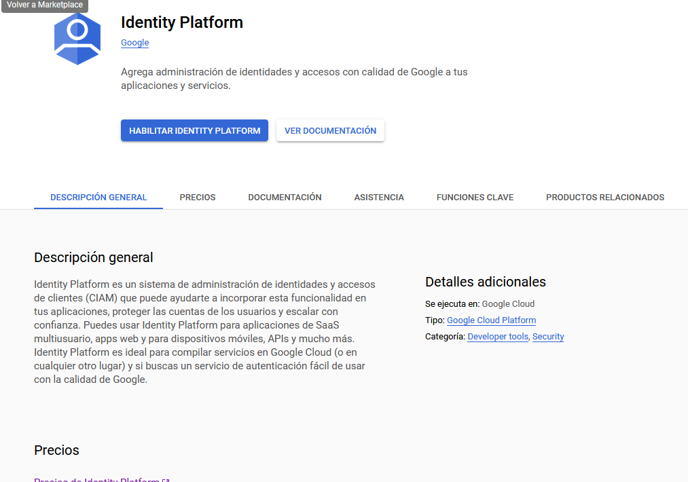
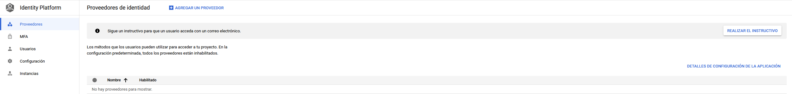

# Identity Platform

> https://console.cloud.google.com/marketplace/details/google-cloud-platform/customer-identity?authuser=1&project=cdt-principal

La primera vez que accedemos, tenemos que habilitar esta API para ser usada dentro de nuestro proyecto actual:

Después de habilitar la `API` de `Identity Platform` nos aparecerá el siguiente `Dashboard`:

