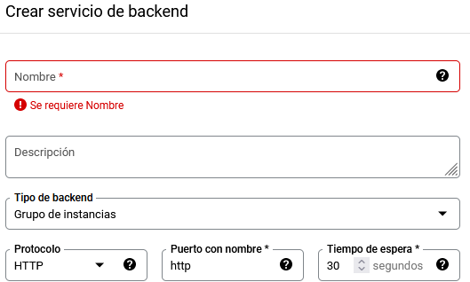
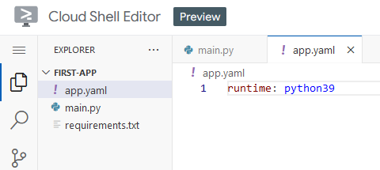
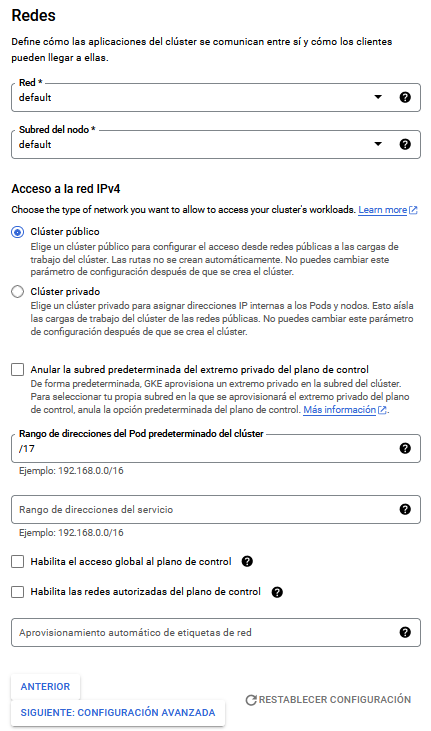
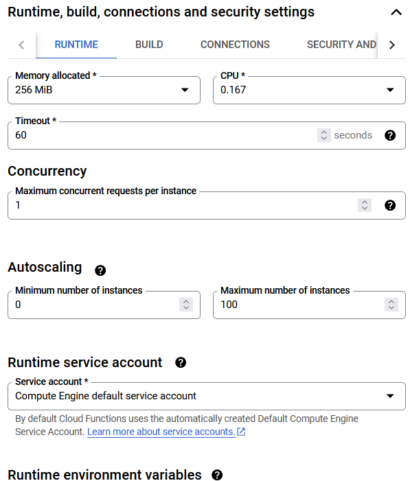
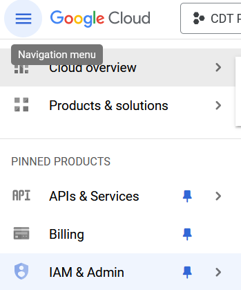
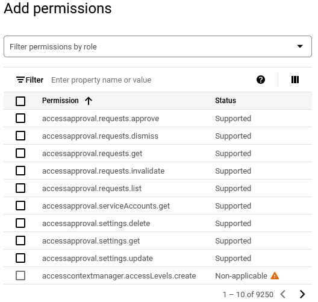
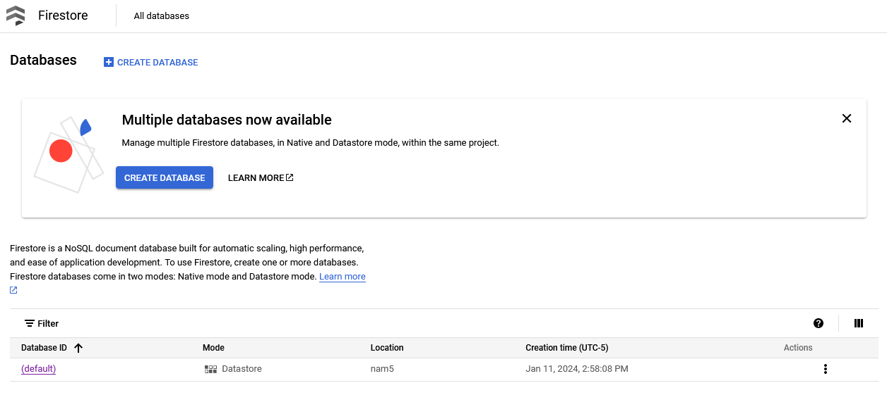
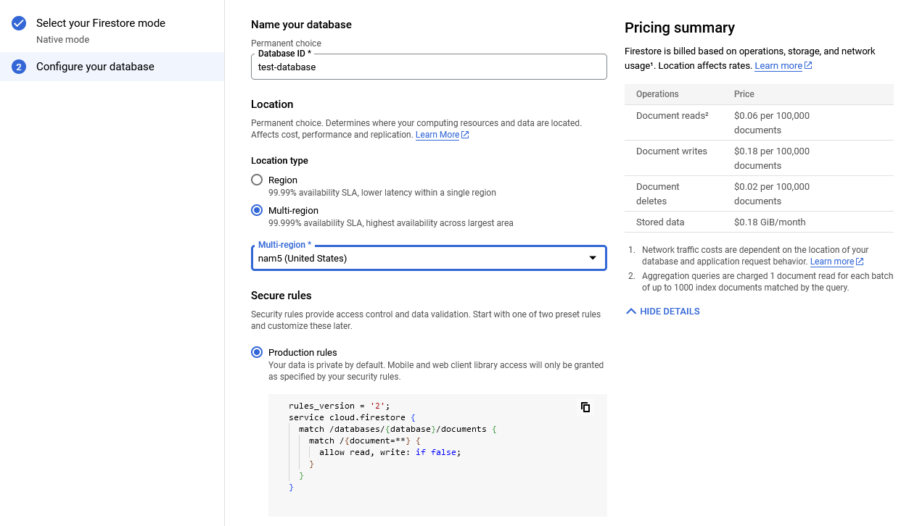

# Información general

Antes de comenzar a trabajar con GCP, debe tener en cuenta:

- Posee 300 dólares en un inicio para probar la aplicación.
- Google Cloud trabaja por zonas de despliegue. Esto quiere decir si usted despliega una aplicación en Europa, el acceso desde Estados Unidos será un poco más lento.
- Siempre tenga en cuenta los gastos que va haciendo dentro de la plataforma. Aunque existe un apartado llamado Billing que le permite llevar un histórico de los gastos realizados y crear alertas.
- Google shell o la consola de comandos es gratis y funciona tanto desde el sitio web como la pc de mesa.

Si tiene duda que servicio de google cloud seleccionar para ejecutar su aplicación, puede ver el siguiente video: https://www.youtube.com/watch?v=2tLXKCgqwLY

# Compute Engine (máquinas virtuales)

En este apartado se trabaja mediante máquinas virtuales. Debe tener en cuenta que el cobro dentro de este apartado es por minuto y por cada CPU virtual que se le asigne a la máquina a crear. Además, puedes crear una máquina virtual que use GPU para realizar cálculos pesados; este apartado está pensado para ML/IA.

Veamos la pantalla principal:


Para crear una nueva máquina virtual, presionamos el botón _Crear Instancia_ y nos aparecerá un formulario con diferentes campos. Vamos a ir viéndolo parte por parte:


- Nombre: Definimos el nombre que le daremos a nuestra máquina virtual.
- Región: En que región vamos a desplegar nuestra máquina virtual.
  - Podemos seleccionar entre varias regiones, tenga en cuenta que el acceso de una región externa a la seleccionada será lento. Por lo que es mejor utilizar la más cercana a su público principal.
- Zona: Dentro de cada región existe una zona de despliegue. Esto puede utilizarlo para mantener diferentes instancias de una misma aplicación en una misma región.
- Configuración de la máquina: En este apartado comenzamos a declarar las propiedades que tendrá nuestra computadora.
  - Primeramente debemos seleccionar el propósito general de nuestra máquina y las propiedades que va a tener.
  - El propósito de la máquina está bastante bien explicado dentro de la plataforma aunque la idea pivota en dos sentidos. El primero es Máquina de uso general o lo mismo, pero optimizando memoria o procesador. Del otro lado está la GPU que son computadoras que poseerán GPU para realizar cálculos intensivos.


- El próximo paso es seleccionar el tipo de máquina a utilizar según la familia seleccionada en el paso anterior.
  - Dentro podemos encontrar una gran variedad de configuraciones.
  - Tenga en cuenta que mientras mayor sea la propiedad de la pc, más dinero tendrá que pagar por hora de uso.
- Política de disponibilidad: Dentro podemos encontrar varias opciones interesantes:
  - Modelo de aprovisionamiento: Podemos seleccionar entre mantener nuestra máquina corriendo de forma indefinida o una máquina que sea capaz de detenerse en caso de ocurrir errores o problemas internos.
    - Como extra, existe la versión SPOT que son máquina efímeras o interrumpibles para trabajo con tiempo definido, pero solo están disponibles en cuando terminas los 300 dólares de prueba.
    - Además, este tipo de modelo, viene con descuento en su uso.
  - Establecer un límite de tiempo para la VM: Nos permite definir el tiempo de vida de una máquina virtual. De esta forma podemos crear una máquina virtual estándar que sea capaz de eliminarse a los 30 días poro ejemplo.
  - Reinicio automático: nos permite definir si queremos que la máquina virtual se reinicie en caso de ocurrir un error que la pare por completo.


- Ahora entramos con las configuraciones avanzadas y vamos a comenzar hablando de _Contenedor_ que nos permite usar la máquina virtual como una imagen de docker.
- Disco de arranque: Define el disco duro a utilizar para el sistema operativo. Además nos permite seleccionar el SO a instalar.

> Jugamos un poco con las configuraciones y nos dió un presupuesto de 24 280.14 dólares mensuales. Intentamos utilizar las opciones más caras, aunque de seguro es posible que se encarezca más.

> Tenga en cuenta que no puede cambiar los recursos de una máquina virtual sin apagarla con antelación.

- Creemos plantillas

GCP también ofrece la capacidad de crear plantillas a partir de una instancia creada, de esta forma, el proceso de creación es más rápido a la hora de trabajar. Tenga en cuenta que puede tener la cantidad de plantillas almacenadas que desee, pero Google le cobrará por cada uso que tenga la plantilla.

Para crear una plantilla debemos ir a `Compute Engine` en el menú principal y dentro seleccionamos `Instance templates`:


Y esto nos lleva a la siguiente pantalla donde podremos crear una plantilla de instancia:


Vamos a presionar el botón azul con el nombre `Create Instance Template`:


Como pueden observar, los pasos a seguir son idénticos a los vistos anteriormente en la creación de la máquina virtual. La diferencia que aquí no se creará la instancia de la máquina virtual, sino la plantilla para crear esas instancias.

- Hablemos de IPs

Por defecto, las máquinas virtuales que creemos, tendrá una IP dinámica asignada. Y esto no es malo, pero imagina que apagas la máquina virtual y al iniciarla de nuevo cambia la ip. Esto nos inutilizará el acceso a la máquina que hemos creado.

Para poder resolver este problema, tenemos que crear una dirección IP estática. Veamos como podemos hacer esto:

- Vamos a `VPC network` y dentro seleccionamos la opción de `Ip addresses`
- Dentro se nos brindan dos opciones:

  - `Reserve External Static Ip Address`: Nos permite declarar una IP externa al contenedor de forma estática.
  - `Reserve Internal Static Ip Address`: Lo mismo que la anterior, pero en este caso estaríamos creando la ip interna.

  

- En este caso seleccionaremos la opción de crear una IP externa.
- Dentro, encontraremos un simple formulario que nos pedirá información sobre la dirección a crear:
   - `Name`: Nombre que le daremos a la ip a crear. - `Description`: Descripción de la ip a crear. - `Network Service Tier`: Aquí podemos seleccionar por donde viajará el tráfico que venga o salga de nuestra ip. - `Premium`: La mejor de las dos, ya que permite que el acceso sea manejado por el sistema de google más cercano al usuario. - `Standard`: El tráfico es manejado mediante el servidor correspondiente a la zona donde se encuentra desplegada la aplicación. - `IP Version`: Define la versión de la IP a utilizar. En la opción `standard` solo está disponible `IPv4`, mientras que en premium, es posible seleccionar cualquiera de la presentes. - `Type`: Esto tiene que ver con lo que se hablaba en el apartado de `Network Service Tier`. La ip de tipo `standard` solo estará disponible para la región donde se despliegue la aplicación. El caso de `Global`, podremos acceder desde cualquier parte del mundo. - `Region`: Seleccionamos a la región que pertenecerá la IP. - `Attached to`: A quien se le asignará la ip. Aquí podemos seleccionar cualquiera de los elementos que tengamos creados que trabajen por ip. Puede ser un `load balancer` o una `virtual instance`.

> Tenga en cuenta que las ip no asignadas se cobrarán por encima del precio original.

- Vamos a añadir un script de inicio

Cuando estemos creando una instancia de una máquina virtual, tenemos la opción de agregar un script que se ejecutará al inicio de la misma. Esto nos permite quitarnos carga a la hora de trabajar con la máquina virtual, ya que desde un inicio vendrá poblada con los software que nos interesa utilizar. Para el siguiente ejemplo, instalaremos apache al inicio de la máquina virtual.

- Durante el proceso de creación, nos dirigimos a `Advanced options`
- Dentro buscamos la opción de `Management`
  
- Dentro del campo `automation` pegamos o escribimos el script de inicialización:

```bash
#!/bin/bash
apt update
apt -y install apache2
echo "Hello world from $(hostname) $(hostname -I)" > /var/www/html/index.html
```

- Terminamos nuestras configuraciones, guardamos y esperamos que se termine de inicializar la máquina virtual.

# Cloud Shell

Para acceder al `shell` de GCloud nos dirigimos al icono a la izquierda de las notificaciones. Presionamos y estamos listos para usar la línea de comando desde el navegador. También podemos vincular nuestra línea de comando en la pc con nuestro proyecto en la nube y así trabajar local cómodamente.

\*\* https://cloud.google.com/sdk/gcloud/reference

> gcloud GROUP SUBGROUP ACTION ...
> Group -> grupo de herramientas. config por ejemplo
> SUBGROUP -> parte del subarbol del grupo seleccionado
> ACTION -> Accion que vamos a realizar

> Para ver todos los comando usados en el curso, presiones [aquí](./2.google_shell.md)

# Instance Groups

Los grupos de instancias es una agrupación de diferentes máquina virtuales que a criterio del administrador cumplan con ciertas características (misma imagen por ejemplo). Los grupo de instancia nos permiten administrar de forma global varias instancias simultáneamente.

Existen dos tipos de `instance group`

- `Managed`: Máquinas virtuales idénticas creadas usadas mediante las plantillas.
  - Características: Auto escalado, recuperación automática y posibilidad de administrar las liberaciones.
- `Unmanaged`: Diferentes configuraciones dentro de un mismo grupo.

  - No permite el auto escalado, la recuperación automática y otros servicios presentes para grupos de tipo `Managed`
  - Preferiblemente no usarla al no ser que sea estrictamente necesario.

- Comencemos viendo como crear un `Managed Instance Group`

**Requisitos**

- Tener creado un `instance template`

**Cómo funciona el auto escalado?**

- Número mínimo de instancias.
- Número máximo de instancias.
- Reglas de auto escalado según uso de la CPU, carga del balanceador de carga u otras métricas.
- Tiempo de espera para comprobar las reglas de auto escalado.
- Control de escalado.
- Configurar el chequeo de salud

**Cómo crear un instance group**

- Primero nos dirigimos al menú lateral de `Compute Engine`
- Seleccionamos la opción `Instance groups`


- Nos aparecerá un dashboard en el cual podemos presionar el botón `Create instance group`.
- Se pueden crear tres tipos de `Instance Group`
   - `Managed Instance Group (stateless)` -> Si no nos interesa que se almacenen estados o datos en la máquina virtual, se debe utilizar esta. - `Managed Instance Group (stateful)` -> Si la máquina virtual poseerá una base de datos o necesita almacenar datos de forma permanente, debemos mantener el estado. - `Unmanaged Instance Group` -> Agrupar instancias de máquinas virtuales sin o muy pocas características comunes
- Después de seleccionar el tipo de instancia a crear, podemos llenar el formulario, aunque no es obligado tener un orden en específico:

 - `Name`: Nombre que le pondremos al grupo. - `Description`: Nos permite introducir una breve descripción de la instancia a crear. - `Instance Template`: Esta opción es propia de _managed instance group_. En este caso debemos seleccionar que `template` queremos utilizar para agrupar. - `Number of instances`: Numero de instancias que tendrá el grupo. - `Location`: Nos permite definir la región y la zona donde se utilizará el grupo. Además, podemos agregar multiples zonas.
 - `Actions on failure`: Que hacer en caso que falle alguna instancia. - `Autohealing`: En este apartado podemos definir el chequeo de seguridad. - Este apartado tiene una ventana de configuración externa, bastante sencilla e intuitiva. - `Updates during VM instance repair`: En caso de fallo, podemos reparar con la misma configuración que tenía la instancia o actualizarla. - `Port mapping`: Nos permite mapear el puerto externo con el interno para poder crear un sistema de balanceo de carga.

- Presionamos create y ya tenemos creado un `instance group`.

> Las opciones de auto-scaling solo se encuentran disponibles dentro de `stateless`


**Tipos de formas existentes para aplicar actualizaciones**

- `Rolling update`: Actualización gradual de las instancias.
  - Podemos definir la estrategia a seguir para la actualización.
  - Podemos definir si queremos utilizar una nueva plantilla para la actualización.
  - Nos permite definir cuando queremos hacer la actualización.
- `Rolling Restart/replace`: De forma graduar de reinician las instancias para actualizarse o se van remplazando.

Para aplicar los `updates`:

- Ir a `Instance Groups`.
- Buscar la instancia que queremos modificar.
- `Update VMS`: En esta opción podemos acceder al formulario para actualizar las `VM`
  - Dentro podemos cambiar la `instance template` que vamos a utilizar.
  - Nos permite definir una estrategia para la actualización de las imágenes. Incluso, podemos definir de las instancias, cuantas se actualizan y el resto se mantendrá en el `template` viejo.
  - Además podemos definir si la actualización será:
    - `Automática`: El nombre lo indica.
    - `Selective`: Esta actualización solo se aplicará cuando se reemplace, refresque o reinicia la instancia. Solamente si no es un proceso de auto reparación.

En el caso que queramos realizar un `restart/replace`:

- Ir a `Instance Groups`.
- Buscar la instancia que queremos modificar.
- Seleccionamos la opción `Restart/Replace VMs`
- Dentro seleccionamos entre `restart` o `replace`
- Para evitar que el sistema completo se quede sin instancias, podemos seleccionar cuantas instancias aplicar el `restart` o `replace`.

# Load Balancer

Los balanceadores de carga se encargan de distribuir el tráfico entre instancias de una o varias regiones.

Vamos a ver como crear un balanceador de carga:
- Desde el menú lateral en la pantalla principal, buscamos la opción de `Network services`

> Este elemento no sale al inicio, por lo que debemos buscarlo en el apartado de otros servicios.
- Dentro, iremos directamente a parar al `Load balancing`

-  Presionamos la opción `Create load balancer` y nos aparecerá la siguiente pantalla:

  - Google nos brinda tres opciones para crear un balanceador de carga según el protocolo que queramos utilizar:
    - HTTP/S.
    - TCP/SSL.
    - UDP/Múltiples protocolos.

> Si desea conocer un poco sobre el balanceador de carga a utilizar, puede fijarse en la siguiente imagen
> 
  
- Para probar, utilizaremos HTTP:

  - Aquí nos dan dos configuraciones, la primera es para que queremos utilizar el load balancer. En caso de querer usarlo para manejar el tráfico de internet a los servidores internos, se debe seleccionar la primera opción; en caso contrario, estaría creando un balanceador de carga encargado de manejar la comunicación entre los servidores internos.
  - La segunda opción se basa en seleccionar el tipo de balanceador. Esto lo que hace es delimitar el alcance del balanceador. Puedes leer las recomendaciones en cada uno de los casos y ver cual es el que se ajusta más a tus necesidades.
- Posteriormente, pasamos a la configuración de los componentes del balanceador de carga:

- Comencemos configurando el frontend. 
  - Aquí definimos la ip que será utilizada para el balanceo de carga
  - Por defecto, podemos dejar la configuración existente, pero es posible cambiarla.
  

- Pasemos al backend.
  - Aquí definimos los servicios que estarán utilizando el balanceo de carga.
  - Tenemos que crear un backend service o utilizar uno ya creado.
    
  - Los datos iniciales que piden son información básica, pero lo que nos interesa principalmente es el `tipo de backend`. Mediante este podemos seleccionar que apartado de Google Cloud estará utilizando el balanceador.
  - Por defecto viene en `Group instance`, pero podemos cambiarlo a nuestro gusto. Este cambio hace que el formulario se modifique.
  - Seguido del `tipo de backend`, tenemos el protocolo que se utilizará. Como seleccionamos un balanceador de carga de tipo HTTP, será el que aparezca por defecto. Pero podemos cambiar entre `HTTP`, `HTTPS` y `HTTP/2`.
  - `Cloud CDN`. Habilitar esta opción, nos permitirá guardar en cache archivos estáticos que no se actualicen constantemente para acelerar el acceso al servicio.

- Reglas de host y rutas
  - Piensa en esto como un api gateway.
  - Aquí definimos las rutas que tomaremos a nuestros servicios backend.
  - Esto es muy útil cuando se esté trabajando con arquitectura de microservices.
  

- Características de los Load Balancing


- Cuando usar un balanceador de carga?

  - Solo queremos que las instancias sin errores reciban el tráfico
    - Configura el health check del balanceador.
  - Alta disponibilidad de la aplicación
    - Configura la aplicación para ejecutarse en multiples regiones y accede mediante el balanceador
  - Quieres que las peticiones sean redirigidas según el microservicio utilizado
    - Crea un balanceador de carga con reglas de enrutamiento.
  - Quieres enrutar el trafico a diferentes instancias que se encuentran en múltiples regiones.
    - Utiliza External HTTP(S) Load Balancer
  - Usar SSL en el trafico no HTTP(S) y balancear la carga
    - Utiliza SSL Proxy Load Balancer

# Administremos servicios (Managed Services)

Términos:
- IaaS: Infraestructura como servicio.
- CaaS: Contenedor como servicio.
- PaaS: Plataforma como servicio.
- FaaS: Función como servicio.

GPC brinda varios servicios dentro de su infraestructura y cada uno pertenece a una categoría en específico (IaaS, etc). A continuación mostramos algunos de los componentes más importantes y a que categoría pertenecen:

- Compute Engine: Máquinas virtuales de propósito general.
  - IaaS.
- Google Kubernetes Engine: Permite crear cluster de Kubernetes para administrar nuestras aplicaciones.
  - CaaS.
- App Engine: Permite construir aplicaciones en una plataforma que te permite una administración total de forma amigable.
  - PaaS.
- Cloud Functions: Permite construir aplicaciones basadas en funciones y dirigidas por eventos.
  - FaaS.
- Cloud Run: Permite ejecutar aplicaciones contenerizadas sin la necesidad de la creación manual de un cluster.
  - CaaS.

# App Engine

Este componente de `Google Cloud` nos provee de múltiples herramientas para la administración de nuestra aplicaciones. Soporta una amplia variedad de lenguajes de forma nativa, pero es posible crear aplicaciones en cualquier lenguaje siempre y cuando se proporciones el run-time necesario. Permite la conexión con diferentes base de datos basadas en la nube y solo sobra por los recursos utilizados, no por el tráfico.

Como característica posee la capacidad de realizar de forma automática el auto escalado y el balanceo de carga. Administra el proceso de actualización de las aplicaciones y la capacidad de monitorear su estado de salud.

Existen dos tipo de entornos dentro de `App Engine`:

- `Standard`: Permite la compilación de las aplicaciones directamente. Por lo que podemos subir nuestro código y `App Engine` se encargará de compilarlo y ejecutarlo por nosotros.

- `Flexible`: La aplicación será ejecutada en un contenedor de docker.


Ahora veamos cuál es la estructura de los componentes dentro de `App Engine`.

- Una **aplicación** por proyecto.
- Una **aplicación** posee múltiples **servicios**.
- Cada **servicio** puede poseer multiples **versiones**.
- Cada **versión** puede tener diferentes **instancias**.
- Diferentes **versiones** pueden estar ejecutándose al mismo tiempo.

## Veamos app engine

- Comencemos accediendo a `App Engine`. En el campo de búsqueda escribimos `app engine`


- Presionamos la opción que evidentemente nos llevará a donde queremos. Es `App Engine` por cierto.

- Una vez dentro, veremos el siguiente dashboard:


Demos paso a ver como se crea una aplicación:

- En el dashboard presionamos `create application`
- Esto nos llevará a un menú de dos pasos:
  - Paso 1:
  
    - `Select a region`: De esta forma seleccionamos la región donde desplegaremos nuestra aplicación. Siempre tenga en cuenta desplegarla cerca de su público objetivo.
    - `Identity and API access`: Nos permite seleccionar un `service account`. Recuerde que los `service account` nos permiten definir los permisos que posee una cuenta.
  - Paso 2:
  
    - `Resources`: En este apartado definimos el lenguaje de programación y el entorno a utilizar.
    - `Deploy with Google Cloud SDK`: Este paso es importante y solo se puede realizar desde la consola de la computadora. Ya que debemos subir nuestra aplicación al `app engine`. (Nosotros lo haremos directamente desde la nube)

Ya con esto tenemos creada la aplicación que corresponde a nuestro proyecto. Para probar, comencemos por subir una aplicación de prueba. Para abrir el `shell` presionamos el ícono `>_` y esperamos que inicie la consola.

Para esta prueba, creamos una sencilla app de `python`, pero lo puede hacer en cualquier lenguaje de los soportados. La estructura que utilizaremos es la siguiente:


  
- Tenga en cuenta que debe crear el archivo `app.yaml` para indicarle al `App Engine` que runtime se debe utilizar. Aquí también pueden ir otras configuraciones a ser leídas por este componente de GCP.

Comencemos ejecutando el comando `gcloud app deploy` para desplegar la aplicación que acabamos de crear.


Cuando vamos a la consola de `App Engine`, dentro del menú de `Services`, aparecerá el servicio que acabamos de crear:


Pasemos a ver las versiones de un servicio creado pero desde la consola. Pero antes voy a hacer un cambio a la aplicación y volver a hacer deploy para así tener dos servicios.

- `gcloud app deploy --version v2` -> para desplegar una nueva versión pero con un tag definido por nosotros mismo
- `gcloud app services list`:


Cuando tenemos más de una versión de un servicio, es posible distribuir el tráfico entre ellas. Para hacerlo por la consola, tenemos que utilizar el siguiente comando:

- `gcloud app services set-traffic --splits=v3=.5,v2=.5 --split-by=random`

De forma automática, el tráfico entre dos versiones será dividido. El flag split by nos permite definir la estrategia de división del tráfico a seguir. Si queremos hacerlo mediante la consola, debemos dirigirnos al menú de `versions` y seleccionar `split traffic`:


Ahora vamos a desplegar un segundo servicio, pero esta vez la vamos a asignar un nombre. Vamos a mantener la aplicación anteriormente creada, similar en todos los sentidos, menos en el `app.yaml`. Ahora vamos a agregar una configuración llamada `service: NAME`


Resultado:


## App yaml

Este archivo es bastante importante ya que nos evita tener que introducir de forma manual algunas de las configuraciones que pueden ser realizadas de forma automática mediante un archivo. Si vienen de trabajar con docker, esto es una especie de docker compose que le dice a la consola de gcloud las instrucciones que debe seguir para agregar metadata al despliegue. Veamos algunas propiedades y para que sirven:

```yaml
runtime: python28 # Define el runtime utilizado para compilar la app.
api_version: 1 # Especificamos la versión del despliegue.
instance_class: F1
service: NAME_HERE # Nombre del servicio a ser desplegado.
#env: flex # Si queremos desplegar en flex. Sin esto se despliega en standard

inbound_services:
- warmup

env_variables: # Permite crear las variables de entorno para usar en la app
  ENV_VARIABLE_NAME: "value"

handlers: # Scripts a ejecutar en url específicas
- url: /
  script: home.app

# Escalados. Usar solo uno
automatic_scaling: # Definimos las reglas de escalado automático 
  target_cpu_utilization: 0.65 # Escalar cuando la cpu tenga un % de uso mayor o igual a 65%
  min_instances: 5 # Instancias mínimas
  max_instances: 5 # Instancias máximas
  max_concurrent_request: 50 
#basic_scaling: # Escalado básico
  #max_instances: 5 # Instancias máximas
  #idle_timeout: 10m
#manual_scaling # Escalado manual
  #instances: 5 # cantidad de instancias
```

Si quieren conocer más a fondo las configuraciones, pueden visitar la siguiente página: https://cloud.google.com/appengine/docs/standard/reference/app-yaml?tab=node.js#top

## Como manejar la separación de tráfico

Anterior mente vimos que teníamos opciones para separar el tráfico de un servicio con múltiples versiones. Entre las opciones disponibles se encuentran:

- `IP`: Se basa en usar rangos o ip específicas para acceder a los servicios
- `Cookies`: Se basa en la cookie `GOOGAPPUID` de las peticiones para definir a que servicio se debe enviar.
- `Random`: El servicio se asigna de forma random

## Trabajos cronometrados

Para crear un cron, debemos primero inicializar un archivo llamado `cron.yaml`. Dentro podremos crear las diferentes acciones que queramos ejecutar. A continuación le mostramos un ejemplo sencillo:

```yaml
cron:
- description: "algo aquí"
  url: /task/summary
  schedule: every 24 hours
```

> Para más información, visite https://cloud.google.com/appengine/docs/flexible/scheduling-jobs-with-cron-yaml

Para desplegarlo, puedes utilizar el siguiente comando `gcloud app deploy cron.yaml`. Por defecto, los cron ejecutan una url cada cierto tiempo (`schedule`); por lo que dentro de nuestra aplicación, deben estar expuestos dichos endpoints para su ejecución.

## Dispatch and queue

Existe otra configuración que podemos agregar a nuestro `App engine` que se llama `dispatch.yaml`, aquí de forma manual, podemos configurar las rutas de acceso a nuestros servicios. Las especificaciones de estas configuraciones las puede ver en https://cloud.google.com/appengine/docs/standard/reference/dispatch-yaml?tab=node.js. Para desplegarlo, simplemente escribimos en la consola `gcloud app deploy dispatch.yaml`. Veamos un ejemplo:

```yaml
dispatch:
- url: "*/mobile/*" # url statica o patrón que debe seguir la petición para enrutarla hacia un servicio
  service: mobile-frontend # Que servicio vamos a utilizar
- url: "*/work/*"
  service: static-backend
```

Otra configuración que podemos realizar es el manejo de las colas. Este mecanismo es similar al uso de `Nats` o `Kafka` para la comunicación entre microservices. En `App Engine` existen dos tipos de cola, `Push` y `Pull`. Por defecto existe una cola de tipo `Push` llamada default; pero es obligatorio usar el archivo `queue.yaml` para crear una cola `Pull`. Ojo, también se puede configurar colas `Push` extras en el `queue.yaml` pero se recomienda hacerlo en un `deploy` aparte de las colas de tipo `Pull`. 

> Si quieres crear colas de tipo `PUSH` directo en la consola, puedes dirigirte a la siguiente dirección: https://cloud.google.com/tasks/docs/queue-yaml

Veamos un ejemplo de `queue.yaml`:

```yaml
queue:
- name: queuename # Nombre de la cola
  rate: 1/s
  retry_parameters:
    task_retry_limit: 7
    task_age_limit: 2d
```

## Desventajas
- Solo se puede tener un proyecto dentro de app engine.
- Es especifica de una región, por lo que no posee una alta disponibilidad.

## Ventajas
- Puedes tener múltiples servicios con diferentes versiones ejecutándose a la vez.
- Se pueden realizar despliegues sin compromiso en la disponibilidad.

# Google Kubernetes Engine (GKE)

Este servicio nos permite administrar servicios de Kubernetes directo en la nube. Nos permite minimizar operaciones dentro del ecosistema de Kubernetes como el reparado y actualizado automático. Además, provee la capacidad de auto escalado para los `Pods` y los `Clusters`. Como un extra podemos decir que provee el soporte para la persistencia de datos en HDD y SSD.

En las versiones recientes de `Google Cloud` existe un nuevo modo dentro de `GKE`, este se llama `Autopilot` y lo que hace es simplificar el proceso de administración, pero posee un cobro basado en la cantidad de `pods`. Veamos otras características de este modo:
- Creado para reducir los costos de operaciones en la ejecución de `cluster` de Kubernetes.

Comencemos creando un `cluster` de `Kubernetes`.

- Shell
  - `gcloud container clusters create` -> Crea el estándar por defecto

- Consola
  - Nos dirigimos al menú `Kubernetes Engine`
  
  - La primera vez que accedamos nos pedirá que activemos la `API` de `Kubernetes`
  - En el apartado de clúster seleccionamos el proyecto que vamos a utilizar (solo si no lo tenemos seleccionado)
  
  - Una vez totalmente adentro, podemos seleccionar la opción `crear`
  
  - Seleccionada esta opción, el sistema nos mostrará un formulario tomando como opción predeterminada el `Autopilot`.

- Configuración `Autopilot`.
  
  - `Nombre`: Nombre que recibirá el clúster.
  - `Región`: Donde desplegaremos el clúster.

  - `Red`: Podemos seleccionar cualquiera de las redes creadas dentro de `Google Cloud`
  - `Subred del nodo`: Lo mismo de lo anterior pero esta vez la red a utilizar para conectar los nodos del cluster
  - `Acceso a la red IPv4`: Podemos seleccionar si es un cluster público o privado, en dependencia de lo que queramos.
  - `Rango de direcciones del pod predeterminado del clúster`: Podemos definir los rangos de direcciones. Para más información del tema de subred, pude ver el siguiente link: https://www.freecodecamp.org/news/subnet-cheat-sheet-24-subnet-mask-30-26-27-29-and-other-ip-address-cidr-network-references/ 
  - `Habilitar acceso global...`: Esto nos permite acceder a nuestro sistema privado (panel de control) desde cualquier región o zona que nos encontremos.
  - `Habilitar las redes...`: En este caso solo permite que las redes autorizadas por GCP (definidas por el usuario) accedan al panel de control.

  - Aquí podemos realizar diferentes configuraciones con respecto a la seguridad, automatización de mantenimiento, etc.
  - Esto lo veremos más a fondo en otro momento.

  - La flota es un sistema de agrupación de clusters para una mejor configuración y mantenimiento.

- Configuración `Estándar`.

  - `Nombre`: Nombre que recibirá el clúster.
  - `Zonal` o `Regional`: Aquí decidimos si desplegaremos nuestro clúster para una región o una zona en específico.
  - `Versión`: Decidimos si google se encargará de actualizar nuestro panel de control o lo hacemos de forma manual cuando lo necesitemos.

  - Aquí encontraremos diferentes opciones para crear configurar los nodos, desde la capacidad del nodo a utilizar hasta la seguridad que queremos que tenga.

  - Mismas configuraciones vistas en el apartado `Autopilot`

> Ojo con el precio del clúster ``standard``. A la derecha de los formularios, podremos encontrar los gastos que tendremos:


> Por cuestiones de precio y presupuesto, no crearemos los clusters para trabajar, pero si veremos algunos temas internos.

## Trabajando en el cluster

- Conectarse a un cluster:
  - `gcloud container clusters get-credentials MY_CLUSTER --zone ZONA --project MY_PROYECTO`
- Creemos nuestro primer despliegue
  - `kubectl create deploy NAME --image=IMAGE`

- Vamos a crear un cluster `Autopilot` rápido para inspeccionar sus propiedades:

- Para acceder al cluster, presionamos sobre el nombre y nos saldrá la siguiente pantalla:

  - Además de la información vista en pantalla, poseemos varias configuraciones rápidas y pestañas de monitoreo.
- Cuando tengamos creados deployments dentro del clúster, podremos ir al apartado de `carga de trabajo`. Dentro podremos ver la información correspondiente a los elementos de nuestro clúster (servicios, deployments, etc).

> un ejemplo de lo anterior es:


> En caso que despliegues un elemento usando el archivo deployment yml, puedes especificar el POOL añadiendo la propiedad `nodeSelector`.
> `nodeSelector: cloud.google.com/gke-nodepool:POOL_NAME`

# Google functions

Las funciones de googles son pedazos de código escritos para cumplir una acción en específico, bastante similar a las lambdas de amazon. Las google functions son ejecutadas utilizando un sistema basado en eventos y pueden ser escritas en cualquiera de los lenguajes soportados por `GCP`. La ventaja de usar este tipo de arquitectura es que no debemos preocuparnos por el servidor, solo la lógica del negocio, ya que Google se encargará de escalar nuestras funciones de ser necesario. Lo malo es que se nos cobrará por números de invocaciones, tiempo de ejecución y recursos que utilicemos. 

Veamos como crear una función:
- Comencemos por buscar en el menú la opción `Cloud Functions`:

- Una vez dentro encontraremos el siguiente `Dashboard` donde presionaremos la opción `create function`

- Una vez presionemos `Create Function` y es la primera vez que accedemos, nos saldrá el siguiente modal pidiendo que habilitemos las ``APIs`` correspondientes:

- Una vez habilitemos las ``APIs``, pasaremos al formulario de configuración de la función:

  - `Environment`: Podemos seleccionar entre las funciones de primera o segunda generación. Tenga en cuenta que la segunda generación posee más opciones que configuración que la primera.
  - `Function name`: En este apartado añadimos el nombre que tendrá nuestra función.
  - `Region`: La región donde desplegaremos nuestra aplicación.
  - `Trigger`: Mediante este apartado podemos definir la acción que desencadenará nuestra función. Por defecto, se seleccionó una petición HTTPs; pero podemos cambiarla según nuestras necesidades.

  - Este apartado es sumamente importante ya que dentro podremos definir los recursos y configuraciones directas de nuestra función.
  - En la imagen se muestra las configuraciones correspondientes al aprovisionamiento de nuestra función.
  - Igual podemos jugar con las configuraciones de la conexión y seguridad.
- Una vez terminado el primer paso, podemos pasar al código de nuestra función:

  - Esto es bastante similar a los lambda de ``AWS``. En el lado izquierdo tenemos el proyecto con nuestro package json donde estarán nuestras dependencias y a la derecha tenemos la función que vamos a utilizar.
  - Si presionamos la opción de probar y esperamos un poco, se nos abrirá el terminal de google.
  - Después de esperar que se instalen una serie de elementos, podemos presionar la opción ``RUN TEST`` y a continuación mostramos el resultado.
  

  De esta forma podemos crear nuestras funciones dentro de google cloud.

# Encriptacion

Antes de comenzar a indagar en el uso de la encriptación dentro de Google Cloud, debemos ver los estados que poseen los datos dentro de esta plataforma:
- En descanso (rest): Datos almacenados en dispositivos o en backups (base de datos y archivos almacenados por ejemplo).
- En movimiento (motion): Datos que están siendo transferidos a trabes de la red. Estos datos pueden ser entre nuestro dispositivo y la nube o una comunicación directa entre diferentes servicios.
- En uso (use): Datos manejados por google cloud que todavía no se encuentran persistentes.

Ahora hablemos de los tipos de llaves que existen para la encriptación:
- Llaves simétricas: La misma llave utilizada para le encriptación, es usada para desencriptar los datos.
- Llaves asimétricas: Se tienen dos llaves, una pública y otra privada. La primera se utilizar para encriptar la información y la segunda para desencriptarla.

Dentro de Google Cloud existe un servicio llamado `Key Management Service`. Este nos permite la creación de llaves de encriptación de los dos tipos vistos anteriormente. Además, permite controlar su uso dentro de los servicios de GCP y las aplicaciones que queramos. POsee una API para el encriptado y el desencriptado de la información que enviemos. 

Es necesario conocer que las aplicaciones que trabajan con encriptado dentro de Google Cloud permiten diferentes tipos de encriptación:
- `Google managed key`: Dejamos que google decida la llave a utilizar para el proceso de encriptación.
- `Customer managed key`: Nos permite seleccionar cualquiera de las llaves creadas en `Key Management Service`.
- `Customer supplied key`: Podemos utilizar las llaves que tengamos On premise.

> Tenga en cuenta que según el tipo de llave que se cree, google aplicará una taza de cobro.

# Almacenamiento

Antes de comenzar tenemos que entender la diferencia entre `Block Storage` y `File Storage`. Comencemos por el primero:
- Son discos duros que se añaden a la computadora
- Normalmente un solo bloque de almacenamiento puede conectarse a un servidor virtual.
- Puedes tener una servidor virtual conectado a multiples bloques de almacenamiento.
- Son usados mayormente como DAS (Direct attached storage) o SAN (Storage area network)
Mientras que el segundo se basa en:
- Son archivos compartidos a uno o más computadora a través de la red.

En google cloud, se brindan las siguientes opciones por cada uno de los tipos de almacenamientos vistos:
- Block Storage:
  - Disco persistente (persistent disks): Bloque de almacenamiento a través de la red
    - zona: Los datos se replican solamente en esa zona
    - region: Los datos se replican en múltiples zonas de la misma región

  - SSD local: Bloque de almacenamiento que se encuentra donde mismo está el servidor utilizado.

- File Storage
  - Filestore: Almacén de archivos de alto rendimiento.

Los almacenamiento de tipo bloque pueden ser seleccionados directamente dentro de la creación de un servidor. Para poder usar el `File Storage`, debemos activar su API. Para ello hacemos:
- Vamos al menú lateral y dentro buscamos el apartado de `Storage` y dentro `FileStore`

- La primera vez que accedamos tendremos que habilitar la api correspondiente:

- Una vez dentro, veremos la siguiente interfaz:


Vamos a intentar crear una instancia de `Filestore`:
- En el dashboard visto anteriormente presionamos el botón `Create Instance`
- Dentro veremos el siguiente formulario:

  - Vamos a saltarnos los dos primeros campos que son bastantes sencillos y pasemos a ``Instance type``
  - `Instance Type` nos permite seleccionar entre (Basic, Enterprise, Zonal) para la creación de ficheros. En dependencia de cual seleccionemos, serán las opciones que aparecerán para la creación.
  - Vamos a seleccionar `Basic`
  
  - `Storage type`: Debemos seleccionar el tipo de disco duro donde queremos guardar la información (HDD o SSD). Según se seleccione, la capacidad puede variar.
  - `Allocate capacity`: Capacidad que tendrá el disco duro. A mayor capacidad, mayor será el pago.
  - `Choose where to store your data`: En que zona y region vamos a tener nuestro `file store` creado.
  - `Set up connections`: Opciones de red para acceso al `file store`.
  - `VPC network`: Definimos a que virtual private cloud network pertenece.
  - `Allocated IP range`: Definiremos que rango de IP serán usados para utilizar el `file store`.
  - `Configure your file share`: configuración directa de propiedades simples para compartir los archivos almacenados.
  
Hablemos un poco ahora del Block Storage (SSD y HDD)

HDD:
- No dependen de de la máquina virtual a la que se acoplen, por lo que puede ser reutilizado
- Puedes reutilizarlo en otra máquina virtual de ser necesario
- Permite la persistencia de información.
- Son bastante flexibles.
- Puedes tener varios discos vinculados con una máquina virtual.

SSD: 
- Dependen de la máquina virtual a la que se acoplen.
- Los datos son temporales debido a la anterior limitante.
- Provee baja latencia
- Los datos se encriptan automáticamente, pero no se puede seleccionar la llave de encriptación.
- Podemos seleccionar entre un SSD de tipo NVMe o SCSI
- SOlo puede ser utilizado en una máquina virtual

# Imágenes de máquinas

Una imagen de máquina (machine image) es un recurso perteneciente a `Compute Engine` que almacena todas las configuraciones, permisos y datos de los discos de una máquina virtual. 

Para crear una imagen de máquina, debemos ir a la instancia creada de nuestra máquina virtual en `Compute Engine`:

- Presionamos sobre los tres puntos a la derecha de nuestra instancia y seleccionamos `New machine image`
- Esto nos llevará a un formulario donde podremos insertar información básica sobre la creación de la imagen.
- Una vez terminada, se nos creará la imagen de la máquina y seremos redirigidos hacia el listado de `Machine images`.

# Almacenamiento de objetos

El almacenamiento de objetos viene siendo la contraparte de S3 en AWS. Su objetivo es brindar un espacio de almacenamiento para archivos que puedan ser accedidos desde cualquier aplicación. 

Es uno de los servicios más populares, flexibles y de bajo costo que posee la plataforma. Está basado en serverless por lo que pose un escalado automático y puede llegar a un nivel de instancias bastante grande. Utiliza un sistema de almacenamiento de tipo `key-value`


Veamos como podemos trabajar con él.
- Primero nos dirigimos al menú lateral y buscamos la opción de Cloud Storage:

- Dentro comencemos viendo el dashboard

- Vamos a crear un nuevo `bucket` así que presionamos sobre la opción `Create Bucket`. Dentro veremos un formulario de 5 pasos:

  - `Name_your_bucket`: Aquí pondremos el nombre que tendrá nuestro espacio de almacenamiento.
  - `Labels`: De forma opcional podemos agregar etiquetas a nuestro espacio de almacenamiento.

  - `Location type`: podemos definir si queremos desplegar nuestra aplicación entre multiples regiones, solamente dos regiones o una sola región.

  - En este apartado debemos seleccionar entre `Autoclass` (optimiza el costo según la actividad que tenga el objeto subido. Usamos esta si no sabemos el tipo de almacenamiento a utilizar) o `Set a default class` para seleccionar un tipo de almacenamiento en específico:
    - `Standard`: Para datos que no estarán almacenados mucho tiempo y son accedidos frecuentemente.
    - `Nearline`: Para almacenamiento de backups y datos almacenados con muy poca frecuencia.
    - `Coldline`: Para almacenar datos que si se pierden, pueden ser restaurados de forma sencilla, pero son accedidos con menos frecuencia que los `Nearline`.
    - `Archive`: Almacenamiento a largo tiempo. Imagina que es para almacenar datos de forma permanente. Su acceso no es una necesidad para el proyecto.

  - En este apartado definimos si el acceso al almacenamiento será público o privado. 
  - Además podemos definir si todos pueden acceder a todos los archivos o mediante permisos se definen los niveles de acceso.

  - Seleccionamos el nivel de protección que queremos para nuestros datos:
    - `None`: Ninguno
    - `Object versioning`: Utilizaremos este nivel para habilitar el versionado de nuestros objetos y en caso de borrarlos, poder recuperarlos.
    - `Retention policy`: Evita que los elementos sean eliminados hasta un tiempo definido después de que son subidos. Una vez termine este tiempo, pueden ser eliminados sin problemas.
  - Además, podemos añadir el tipo de encriptación de datos que queramos, por defecto tenemos la de google, pero podemos seleccionar cualquiera de las creadas mediante `Key Management Service`.
- Presionamos ``create`` y ya tenemos nuestro almacenamiento creado.

Dentro de `Cloud Storage` existen distintos tipos de mecanismos de subida y descarga de archivos. Comencemos viendo los de subida:
- Simple subida: subir archivos pequeños de forma sencilla y sin metadatos.
- Subida multipart: subir archivos pequeños con metadatos.
- Subidas reanudables: Largos o pequeños archivos que pueden tener problemas y queramos seguir subiendo a partir del error.
- Transferencia mediante stream: Subir un objeto de tamaño desconocido.
- Subida paralela con composición: El archivo es dividido en 32 pedazos y es subido de forma paralela. Usarlo solamente si las propiedades de la red y el espacio en disco no son una limitante.

Pasemos a las descargas:
- Descarga simple: descargar los archivos a un destino en específico.
- Descarga mediante stream: Descargar los archivos hacia un proceso
- Descarga con división de objetos: Divide el objeto en pedazos y lo descarga.

Pasemos a ver como se trabaja con el versionado de los objetos:
- Pueden ser habilitados o deshabilitados a nivel del `bucket`
- Las últimas versiones de los objetos tienen el nombre de `Live`
- Las versiones anteriores, son identificadas mediante `key` + `numero`

Además, esta plataforma nos permite administrar el ciclo de vida de nuestros objetos. Esto consiste en buscar el tipo de almacenamiento más adecuado para nuestros objetos de forma automática. Esto quiere decir que puede que tengamos un objeto subido que utilicemos mucho, pero al cabo de la semana ya no lo usemos, pero queremos mantenerlo almacenado; en estos casos el sistema a partir de una serie de reglas moverá nuestro archivo a un espacio de almacenamiento más idóneo:

- Condiciones
  - Tiempo, Creado Antes, ``isLive``, etc.
  - Podemos utilizar diferentes condiciones para el movimiento del archivo.
- Acciones:
  - Eliminar (`Delete`)
  - ``SetStorageClass`` o Asignar clase de almacenamiento: Nos permite hacer el movimiento entre clases.
- Movimientos permitidos:
  - ``Standard``, ``Regional`` o ``Multi Regional`` hacia ``Nearline``, ``Coldline`` o ``Archive``.
  - ``Nearline`` hacia ``Coldline`` o ``Archive``

Vamos un ejemplo en json de la regla:

```json
{
  "lifecycle": {
    "rule": [
      {
        "action":{"type":"Delete"},
        "condition":{
          "age": 30,
          "isLive": true
        }
      },
      {
        "action": {
          "type":"SetStorageClass",
          "storageClass":"NEARLINE"
        },
        "condition":{
          "age": 365,
          "matchesStorageClass": ["MULTI_REGIONAL","STANDARD"]
        }
      }
    ]
  }
}
```


## Access Control List (ACL)

Este servicio permite controlar el nivel de acceso que poseen otros servicios o usuarios a los objetos en los bucket de Cloud Storage. Existen dos tipos de permisos para el control de acceso:
- `Uniform`: Mismo permiso para todos los objetos dentro del bucket basados en el IAM.
- `Fine-grained`: Se usa el IAM y el ACL para el acceso al bucket o a objetos en específico.


# IAM

Comencemos hablando de conceptos importantes para este apartado:
- `Member`: Entidad que queremos que interactúe con algún recurso de la nube.
- `Resource`: Recurso perteneciente a la nube de google. El ``cloud storage bucket`` por ejemplo.
- `Action`: Acción que queremos permitir hacer sobre el objeto
- `Roles`: Conjuntos de permisos para realizar una actividad en específico.
- `Policy`: Es la vinculación de un rol con un miembro. 

> Los `Roles` son una serie de `Action` que podemos realizar sobre uno o varios `Resource`. Los `Roles` son asignados a los `Member` mediante los `Policy`, por lo que los `Roles` no tienen que saber a que `Member` están conectados y los `Member` no poseen permisos directamente. 

## Roles

Existen tres tipos de roles:
- Básico (``Basic Roles`` o ``Primitive Roles``): No usarlos en producción.
  - ``Viewer``: Acción de solo lectura.
  - `Editor`: Lectura y edición.
  - `Owner`: Tiene los permisos del editor y permite administrar nuevos roles y permisos.
- Roles predefinidos: Roles predefinidos y administrados por google.
  - Ejemplo: Storage Admin, Storage Object Viewer.
- Roles personalizados: Crear roles propios.

Vamos a ver como crear un rol:
- Accedemos al menú lateral y buscamos la opción `IAM & Admin`.

- Dentro del `IAM` vamos a la opción `Roles` 

- Una vez accedamos, podremos ver el siguiente dashboard:

- Presionamos la opción de `Create Role` y nos aparecerá el siguiente formulario.

  - ``Title``: Nombre que le pondremos al rol.
  - `Description`: Breve descripción de su función.
  - `ID`: Es el identificador del rol cuando lo estemos asignando.
  - `Role launch state`: Podemos definir el estado en que se encuentra el Rol en el momento de la creación y posteriormente modificarlo. Comienzas por ``Alpha``, terminas en ``General Availability`` o simplemente puedes desactivarlo.
  - `Add Permissions`: Este botón levanta un modal que te permite seleccionar los permisos disponibles para el rol.
  
  - Presionamos `Create` y ya tenemos el rol terminado.


> Los roles creados, por defecto aparecerán al inicio de la lista de roles.

## Members y Policy

Comencemos viendo como agregar un nuevo miembro a nuestra plataforma:
- Dentro de `IAM`, en el menú lateral seleccionamos `IAM`:

- Una vez dentro, podremos ver el siguiente dashboard

- Dentro podremos encontrar todos los `Members` o `Principal` existentes y para crear uno nuevo presionamos en `Grant Access`; esto nos lleva al siguiente formulario:

  - `Add principals`: Aquí podemos añadir todos los usuarios pertenecientes a `gmail` que queremos. Se incluyen también miembros de la organización o cuentas personales.
  - `Assign roles`: Podemos definir todos los roles que tendrán esos miembros. Incluso podemos añadir una condición de acceso como el tiempo (después de las 2 pm)

En caso que queramos comprobar que permisos tiene un usuario en específico podemos dirigirnos en el menú lateral a `Policy Troubleshooter`.


  - ``Principal``: Ponemos el mail del miembro a buscar.
  - `Resource permission pairs`: Añadimos el recurso (proyecto, componente, etc) y el permiso (Permission)
    - En caso que queramos añadir más permisos, podemos utilizar el `Add another pair`

## Service account

Las `service account` son similares a los usuarios, pero son creados para evitar que componentes internos de la plataforma utilicen una cuenta personal para acceder a la base de datos por ejemplo. No pueden ser utilizadas para acceder por el navegador, por lo que solo es utilizable a nivel de aplicación y viene en un formato de llave privada/publica. 

Existen tres tipos de `service account`:
- `Default service account`: Se crea de forma automática junto a algunos servicios. VM por ejemplo.
- `User Managed`: Creadas por el usuario y poseen un nivel de acceso controlado.
- `Google managed service accounts`: Creadas por google para realizar operaciones en nombre del usuario.

Veamos como crear un `service account`:
- Nos dirigimos al menú de la consola de google y seleccionamos `Cuenta de servicio` dentro de `IAM y administración`

- Una vez dentro veremos el siguiente `Dashboard`:

- En pantalla veremos todos los `service account` creados. Si queremos añadir uno nuevo vamos a la opción `+ Crear cuenta de servicio`. Esto nos mostrará un formulario de 3 partes.

  - El primer campo: Nombre con el que identificaremos a la cuenta que vamos a crear.
  - El segundo campo: Es el id que tendrá la cuenta, puede ser generado a partir del primer campo o uno mismo agregar el dato que desee.
  - El tercer campo: Una pequeña descripción para explicar el uso del servicio.
  - Presionamos el botón crear y continuar.
  - Si ya queremos terminar presionamos listo, pero en este caso vamos a pasar a la segunda opción.

  - Esta parte del formulario es opcional y nos permite definir una serie de accesos para la cuenta que vamos a crear. 
  - En este caso le dimos acceso a Administrar SQL, Storage y Cloud Run.
  - Podemos agregar cuantos roles deseemos y en cada caso ponerle una condición de uso.
  - Las condiciones definen bajo que circunstancias se puede user el rol.
  - Si terminamos aquí, vamos al tercer y último paso.

  - En este caso se nos presentan 2 campos. 
  - El primero brinda al usuario los roles declarados anteriormente.
  - El segundo otorga al usuario la capacidad de administrar este servicio.
- En cualquier caso, podemos presionar el botón listo para terminar la creación de nuestra cuenta de servicio.
 
 Una vez creada, volveremos a ver nuestro Dashboard y si nos fijamos bien, al final de la lista de servicios se encuentra el que acabamos de crear:

 

 Anteriormente vimos que el propio google puede crear una serie de service account para brindar conectividad entre nuestros sistemas. Pues el servicio que vemos con el nombre de `firebase` fue creado automáticamente para permitir realizar la auth mediante esta librería.


# Base de datos

> Algunos conceptos importantes asociados a las base de datos:
> - Disponibilidad: Los datos deben estar disponibles en todo momento. Este concepto viene por la necesidad de crear base de datos secundarias por si la principal falla.
> - Durabilidad: Los datos deben persistir con el tiempo y evitar la pérdida de los mismos. Este concepto hace referencia a la necesidad de poseer copias de seguridad de los datos para evitar la pérdida de la información.
> - Consistencia: Cuando posees replicas de una misma base de datos, la información debe estar replicada totalmente en cada una de ellas. La consistencia no es más que el aseguramiento de la existencia de los mismos datos entre las diferentes replicas de una bse de datos. Este acercamiento puede ser sincrono (lento), asíncrono (pequeño desfase entre los datos al momento de leer) o lectura después de escritura
> - RPO (Recovery Point Objective): Período máximo aceptable de perdida de datos.
> - RTO (Recovery Time Objective): Tiempo máximo aceptable con el sistema caído.

En un proyecto en producción, es necesario realizar copias de seguridad de las base de datos para evitar perder información en caso de algún error. Dentro del ecosistema de GCP existen múltiples soluciones para este problema, pero algunas vienen con un costo de efectividad o crean problemas propios de la arquitectura. Comencemos por viendo estos acercamientos:

- Base de datos (ZONA1) hacia Snapshot (ZONA2): Este acercamiento realiza una copia de la base de datos cada un intervalo de tiempo definido. Aunque pueda parecer la solución ideal, podemos tener pérdidas de datos si no se ha realizado la salva a tiempo y se le añade la lentitud de este proceso.
- Base de datos (ZONA1) hacia Snapshot (ZONA2) con Transaction Logs (zona 2): Partiendo de la explicación anterior, los transactions logs permiten llevar una lista de las operaciones realizadas sobre la base de datos. En caso de que exista un error y no se haya podido realizar una copia de seguridad; podemos restaurar la base de datos mediante el Snapshot y posteriormente aplicar los transactions logs para recuperar los datos no almacenados. Pero todavía se mantiene el problema de la velocidad de este procedimiento.
- Base de datos (ZONA1) hacia Base de datos StandBy (Zona2) con Snapshot (Zona2): Este es un acercamiento bastante usable para la redundancia de datos, ya que poseemos una base de datos principal y una secundaria donde se va replicando la información de forma síncrona. Esto permite tener un almacenamiento en tiempo real de los datos que se introduzcan en la aplicación en una base de datos diferentes. A dicha base de datos entonces se le realiza el Snapshot (sigue siendo lento) y de esta forma no afectamos el rendimiento de nuestra base de datos principal.

GCP ofrece base de datos relaciones como no relaciones. Dentro del primer apartado podemos encontrar MySql, SQL Server y PostgresSql. Mientras que en las base de datos No SQL tenemos dos opciones dentro GCP (no quita que podamos usar un sistema externo). El primero es el Cloud Firestore basado en documentos similar a Mongo y como segunda opción tenemos BigTable. Es importante añadir que BigTable es recomendado para cuando vamos a almacenar más de 10 terabytes de información. En caso que queramos usar una base de datos en memoria como Redis, GCP nos brinda el servicio de Memorystore. 

## Cloud SQL

Anteriormente hemos trabajado con google cloud y hemos visto como crear una instancia en la base de datos. En este caso nos vamos a saltar la explicación correspondiente a este apartado.

## Cloud Spanner

Esta base de datos brindada por GCP para el almacenamiento de base de datos globalmente distribuidas. Es una base de datos relacional con un alto nivel de disponibilidad y totalmente administrada por google, por lo que realiza un escalado automático entre los diferentes nodos que la componen. Es una base de dato de tipo regional o multi región en dependencia de como la configuremos, pero tenemos que tener en cuenta que es bastante cara ya que pagamos por la cantidad de nodos que tengamos además del almacenamiento.

Veamos dentro de GCP como crear una instancia de esta base de datos:
- En la barra de búsqueda de GCP introducimos la palabra `spanner` y esperamos a que nos aparezcan los resultados.

- Seleccionamos la opción `spanner` y procedemos a acceder al siguiente dashboard. 
  - Es posible que no tengamos habilitada esta API dentro GCP. Por lo que hay dos caminos a tomar.
    - Vamos a las API de GCP y la activamos.
    - Dejamos que el sistema haga lo mismo.
  - En mi caso dejé que el sistema lo hiciera por el solo (se hace automático cuando vas a crear una instancia).

- Para crear una instancia, presionamos la opción `Create A provisioned instance` y accedemos al siguiente formulario.

  - En esta primera parte del formulario solo introduciremos información básica como el nombre de la instancia y el id de la misma (se genera a partir del nombre).

  - En este apartado decidiremos si nuestra base de datos será regional o multi región. En el momento que seleccionemos una de estas dos opciones, nos aparecerá uno o varios cuadros de selección para decidir que región(es) vamos a utilizar.
  - Cuando hayamos seleccionado todo, aparecerá a la derecha el precio que pagaremos por el uso de esta base de datos y datos resumidos sobre la misma.
  - Más nada que ver aquí, vamos al siguiente paso.

  - Ahora nos toca seleccionar las capacidades que tendrá nuestra base de datos.
  - Comencemos por seleccionar el tipo de unidad que queramos
    - Nodes: para instancias largas
    - Processing units: Las unidades de procesamiento son para crear instancias pequeñas y de bajo costo. Hay que tener en cuenta que 1000 unidades son el equivalente a 1 nodo. Podemos poner la cantidad que queramos, pero siempre es un # cualquiera (menos 0) seguido por la cantidad de 0 que queramos.
  - Sin importar cual seleccionemos, el sistema nos calculará de forma automática el costo de la instancia.
  - En caso que seleccionemos la opción de auto escalado, no introduciremos la cantidad exacta que queramos, sino que daremos un rango de mínimo - máximo ya sea para las unidades o los nodos. En ambos casos, podemos añadir las reglas de escalado partiendo del uso de la CPU o la cantidad de almacenamiento utilizado.
- Presionamos crear y terminaremos la creación de `spanner`.

Una vez creada, podemos acceder a nuestra instancia de `spanner` y crear una base de datos de la misma forma que haríamos con una base de datos `SQL`.

## Cloud Firestore

De `Firestore` podemos decir que es una base de datos NoSql que se escala de forma automática. Se recomienda utilizar cuando se van a almacenar una gran cantidad de datos, pero no pasan de pocos `TBs` de espacio. Soporta el uso de transacciones y posee un lenguaje de consulta llamado `GQL` que es bastante similar a `SQL`; pero no soporta acciones como los Joins o las agregaciones como suma o count.

Vamos a dirigirnos a `GCP` y ver como crear una instancia de `Firestore`:
- En el campo de búsqueda superior, y añadimos la palabra `Firestore`:

- Una vez presionemos la opción de `FireStore`, seremos dirigidos al siguiente `Dashboard`:

- Presionamos el botón `Create Database` para proceder al formulario de creación.

  - Aquí se nos presentan dos opciones, la primera es el modo nativo y recomendado por Google y el segundo es utilizando el modo de `Datastore`.
  - Para este último caso, tendremos que habilitar antes la `API` correspondiente al `Datastore`.
  - Nosotros vamos a utilizar el modo nativo. Dentro tenemos una opción que nos permite ver la diferencia entre un modo y otro.
  
  - Presionamos continue y ``seguimos`` para el siguiente paso.

  - El segundo paso del formulario consiste en configurar la base de datos. En este caso no estamos añadiendo capacidades de computo, solamente disponibilidad según la región.
  - Además tenemos que introducir el id de la base de datos y nos brindan la estructura de las reglas de seguridad a utilizar.
  - Antes de continuar, podemos ver en la zona derecha de la imagen, el estado del cobro. Tengan en cuenta que se cobrará por acción sobre los objetos (llega a una cantidad en específico y después se cobra) y por el almacenamiento de datos.
  - Presionamos `Create Database` y terminamos.

Una vez terminada la creación, accederemos de forma automática a nuestra instancia:

- Presionamos la opción de `Start Collection` para crear una colección en mi base de datos NoSQL.

  - Primero debemos añadir el `Collection ID` para identificar nuestra colección y este es el único campo obligatorio.
  - Posteriormente, podemos añadir nuestro primer documento (opcional).
  - Vamos a saltarnos esto por ahora.
  - Presionamos save y terminamos.

- Como podemos ver, por defecto se nos crea un documento vacío. Con esto no hay problema, siempre podemos eliminarlo o modificarlo.
- Lo interesante es la capacidad de crear otra colección dentro de un documento. Esto puede ser visto como un objeto dentro de otro. Y así sucesivamente.
- Vamos a añadir un documento:

- Primero debemos añadir un id al documento, si no lo ponemos, este se auto generará.
- Posteriormente podemos añadir tantos campos como queramos especificando su tipo y adicionando los valores que tendrán.
- Nosotros añadimos un campo sencillo para probar el `query builder`.

Pasemos a ver ahora el `Query Builder`. Para acceder a esta funcionalidad, solo tenemos que cambiar entre el panel actual `Panel View` a `Query Builder`:


Cuando accedemos al tab de `Query Builder` veremos la siguiente estructura para realizar peticiones hacia nuestros documentos:

  - Por defecto tendremos una opción llamada `Query Scope` que podemos cambiar entre `collection` y `collection group`. Esto permite buscar en una colección en específico o en un grupo de colecciones.
  - Cuando presionamos `Add to query`, se nos mostrará un menú desplegable con varias opciones:
  
  - Supongamos que presiono sobre el `where`, esto nos mostrará un formulario sencillo donde podemos poner nuestro filtro:
  
  - Si queremos ejecutarlo, presionamos sobre `run`.

## Memorystore

Este tipo de almacenamiento es utilizado para guardar datos en la memoria. Este tipo de acercamiento es utilizado para recuperación rápida de datos, mirémoslo como una base de datos de tpo `caché`. Para acceder a esta funcionalidad, vamos al campo de búsqueda de GCP y escribimos `memorystore` 


La primera vez que entremos nos enviará directamente a activar la API correspondiente a este servicio. Una vez activado, seremos redirigidos al servicio de `Memorystore`:


Como podemos observar en la imagen anterior, este servicio nos permite crear dos tipos de base de datos caché (Redis y Memcached). Existe un tercer caso que es un cluster de redis; utilizaríamos este cuando queramos una base de datos auto escalable de redis.

Comencemos viendo como crear una instancias de Redis teniendo como primer paso presionar el botón `Create instance`.


- Comencemos por el nombre. Aquí simplemente definiremos el id único de la instancia y el nombre a mostrar en pantalla.
- La selección del `Tier` está compuesta por dos valores:
  - `Basic`: Es la de menor costo pero no posee alta disponibilidad.
  - `Standard`: Brinda el arreglo automático después de algún error para mantener la alta disponibilidad.
- Seguido viene la capacidad que es simplemente el tamaño que tendrá nuestra base de datos expresada en GB. Este posee un mínimo de 5 GB.

  - La región como hemos visto hasta el momento es donde estará disponible nuestro componente. Tenga en cuenta que cada zona tiene un precio distinto.
  - Las replicas nos permite tener los datos `replicados` valga la redundancia, en diferentes base de datos. De esta forma podemos tener alta disponibilidad y la capacidad de cambiar entre base de datos si la principal falla.
  - La conexión permite definir en que VPC vamos a desplegar el componente. Recuerden que todos los componentes de un proyecto están desplegados dentro de un mismo VPC.

  - En esta parte del formulario, vemos que podemos modificar temas de seguridad, conexión, mantenimiento y comportamiento de nuestra base de datos. 
- Presionamos `create instance` y terminamos de crear nuestra base de datos.

> Tenga en cuenta todo el tiempo el costo. En nuestro caso, el costo termino siendo:


# Pub/Sub en GCloud

Gcloud Pub/Sub se basa en la comunicación asíncrona de los componentes de una aplicación. Esto quiere decir que las aplicaciones no se comunican directamente entre ellas, sino que usan un sistema intermediario. La comunicación asíncrona mediante un software posee diferentes esquemas de implementación, pero en este caso vamos a hablar del publicador subscriptor. La idea es que el software intermedio cree un `Topic` (mirenlo como un periódico) y entonces tienes una aplicación que se encarga de enviar mensajes a ese `Topic` (publicador) mientras que la otra tiene como objetivo escuchar (subscriptor) dichos mensajes (imagina que la otra aplicación está subscrita a ese tema del periódico). 

Esto no tiene que ser específicamente una comunicación en un solo sentido, ya que los roles pueden cambiarse en cualquier momento; y la aplicación que antes emitía información por un `Topic` en específico, puede pasar a estar escuchando otro. Este tipo de enfoque permite desacoplar las aplicaciones, ya que ellas nunca sabrán a quien le envían la información (no les interesa), solo necesitan saber a donde la enviarán para ser escuchada.

Como hemos hecho hasta el momento, pasemos a ver como crear un Pub/Sub en GCloud. Comencemos con buscar el servicio en google platform:


Una vez dentro veremos el siguiente `Dashboard`:


## Topics

A pesar que tenemos varios `topics` creados, vamos a presionar el botón `Create Topic` para ver como es este procedimiento:

  - El primer campo es el más sencillo. Debemos introducir un id único que identifique el `Topic` y este será encadenado con:
    - projects/NOMBRE_DEL_PROYECTO/topics
  - El próximo paso es decidir que opciones queremos utilizar:
    - ``Add a default subscription``: Por defecto nos agregará un subscriptor a este `Topic`. Vamos a desmarcarlo para ver como hacerlo manual.
    - `Use a schema`: Nos permite utilizar un schema anteriormente creado para proveer una estructura fija de intercambio de información. Veremos esto más adelante.
    - `Enable message retention`: Esto permite que los subscriptores puedan recibir todos los mensajes emitidos aunque se hayan subscritos después de la emisión. Hay que tener cuidado porque al activarlo se nos comenzará a cobrar por almacenamiento.
  - `Encryption`: Esto es para seleccionar el tipo de encriptación que queremos para la transferencia de datos.

Presionamos `create` y entonces en el menú lateral nos dirigiremos a `Subscriptions`:


## Subscriptions

Una vez dentro veremos el siguiente `Dashboard`:


Si presionamos el botón `Create Subscription` pasaremos al formulario encargado de crear un subscriptor para nuestro topic. El formulario es algo largo, así que veamoslo por parte:


- El primer campo es el id que le asignaremos a nuestra suscripción. Este es único y está compuesto por `projects/PROYECT_NAME/subscriptions/EL_ID`
- `Select a cloud Pub/Sub topic`: Aquí debemos seleccionar el `Topic` con el que queremos juntar nuestro suscriptor.
- `Delivery Type`: Aquí podemos seleccionar entre los básicos y los agregados por google:
  - `Pull` (básico): Descargar los mensajes de la cola.
  - `Push` (básico): Enviar mensajes a la cola.
  - `Write to BigQuery`: Variante del push para enviar datos directamente a BigQuery.
  - `Write to Cloud Storage`: Variante del push para enviar datos directos a un bucket del Cloud Storage.
- `Message retention duration`: Esto lo vimos anteriormente pero ahora es nivel de mensajes enviados y no del `Topic` en general.

- `Expiration period`: Tiempo que la suscripción creada se eliminará si no está en uso.
- `Acknowledgement deadline`: Aquí definimos el tiempo de espera del `Topic` para reenviar el mensaje si el subscriptor no ha devuelto un mensaje diciendo que recibió la información.
- `Subscription filter`: Podemos definir filtros para seleccionar que mensajes queremos que este suscriptor acepte.
- `Exactly once delivery`: Si se habilita, entonces no se reenviará el mensaje hasta que se haya terminado el `Acknowledgement deadline` definido. Además, si se posee un valor menor a 60 en este último campo, será cambiado.

- `Message ordering`: Cuando se reciban mensajes con un key similar, entonces serán recibidos en el orden que fueron publicados.
- `Dead lettering`: Si un suscriptor no puede entregar un mensajes, se puede activar esta función para que el publicador vuelva a enviar el mensaje perdido.
- `Retry policy`: Dado un mensaje, si este no ha sido recibido, podemos definir una política por parte del suscriptor para volver a solicitarlo.

> Esta información era para cuando seleccionaramos la opción de `Pull`, en caso de usar `Push`, se agregará el siguiente campo.
> 

## Schemas

Anteriormente hablamos sobre los esquemas. Veamos ahora como es el proceso de crear un `Schema` y para que nos puede servir. Comencemos entrando al `Dashboard` mediante el menú izquierdo del servicio `Pub/Sub`:


Presionamos el botón `Create Schema`:

- El primer campo hace referencia al id con el que identificaremos el esquema.
- Posteriormente podemos seleccionar el formato que queremos que tenga nuestro mensajes.
- En cualquiera de los dos casos, podemos después definir la estructura que tendrá el mensaje.

Los esquemas nos brindan una forma de estandarizar el intercambio de mensajes entre componentes, de esa forma sabremos que va a llegar y como debe llegar.

# VPC

Cuando quieres crear una red privada dentro de una organización, normalmente se usaría una `VPN` (Virtual Private Network). Esto permite tener aislada una sección de la red y evitar el acceso indebido de usuarios. 

En Google Cloud es posible hacer esta misma acción mediante un servicio denominado `VPC` (Virtual Private Cloud). De esta forma podemos crear nuestra propia red aislada por completo de los demás componentes de `GCloud`. Además, nos permite controlar el tráfico de entrada y salida de nuestra red.

Como parte del ecosistema de `GCP`, se ve como buena práctica crear todos los recursos que utilicemos dentro de una `VPC`. Esto no solo nos permite evitar la entrada no autorizada a los recursos.

Cada VPC que creemos estará compuesta por diferentes `subnets` (subredes). Cada subred pertenece a una región distinta. Es `GCP` es una buena práctica usar las subredes para dividir el trafico de los componentes privados y públicos. De todas formas, entre diferentes subredes de la `VPC` puede existir comunicación; pero con esto logramos una mayor seguridad.

Veamos como podemos crear un `VPC` en `GCP`:
- En el campo de búsqueda de `GCP` escribimos la palabra `VPC`

- Seleccionamos la opción `VPC` `network` y nos aparecerá el siguiente `Dashboard`

- Por defecto, aparece una `VPC` creada llamada `default`
- Presionemos el botón `Create VPC Network`

  - Los dos primeros campos hacer referencia al nombre de nuestra VPC y una pequeña descripción.
  - El `MTU - Maximum transmission unit` es el tamaño máximo de los paquetes que se pueden enviar por la red.
  - El `VPC network ULA internal IPv6 range` habilita el uso de los rangos IPv6 dentro de la red.
  - Las `subnets` tienen dos modos:
    - `Custom`: nos permite crear la subred por nosotros mismos y crear tantas como nos gustes. Este tipo de acercamiento es más recomendable para producción.
    
    - `Automatic`: Dejamos que GCP decida las IP y rangos que se van a asignar a nuestra VPC.
    

- Las `firewall rules` nos permiten definir reglas de acceso a nuestra red.
- Mientras que el `Dynamic routing mode` nos permite definir la forma de tratar las rutas de acceso. Pueden ser regional o global.

Después de crear nuestra VPC, seremos redirigidos al `Dashboard` del VPC y veremos lo siguiente:


Presionemos sobre la red `cdt-dev` para ver sus detalles:


Si presionamos el `tab` de `Subnets`, pasaremos a ver el listado de todas las subredes creadas para esta `VPC`:


> Ojo en las subnet hay una opción llamada `Private Google Access`. Esta nos permite, usando esta subred, acceder a servicios privados de GCP sin la necesidad de asignarles una IP pública.

> Vamos a aclarar un tema importante, puedes tener tantas VPC creadas que utilicen la misma región y no existirá comunicación entre ellas. De esta forma estamos asegurando que las aplicaciones de un VPC no se conecte con otra. Ahora, si quieres lograr esta funcionalidad, puedes utilizar la opción `VPC network peering` y de esta forma, conectar dos VPC distintas.

> En caso que queramos conectar una red OnPremise con nuestro proyecto en Google CLoud, tenemos que hacer uso de la herramienta Cloud VPN. O podemos utilizar Cloud Interconnect que permite una conexión mucho más rápida que el Cloud VPN.

## VPC compartidas (Shared)

Las VPC compartidas tienen su mejor uso cuando se desea compartir recursos de un proyecto con otro. Supongamos que posees una base de datos en un proyecto X que la quieres compartir con el proyecto Y. En una situación normal, no podrían verse, ya que pertenecen a proyectos totalmente diferentes. Para esto existen las `Shared VPC`. Permiten crear una red compartida por que los proyectos puedan comunicarse entre ellos.

# Administrando identidades 

El administrador de identidades nos permite administras las cuentas de usuarios que tenemos dentro de la aplicación. Por defecto, la cuanta utilizada para la creación del `free trial` posee el rol de `Super Admin`. Si queremos añadir más usuarios, debemos utilizar su cuenta de `Gmail` y agregarle un rol para trabajar dentro del proyecto (IAM Policy). 

Google te permite varios niveles de autenticación:
- Google Workspace Account: Acceso a las herramientas brindadas por google.
- Identity provider: Permite definir los proveedores de acceso a la plataforma. 

## Federación de Directorio Corporativo

Este acercamiento nos permite federal las identidades de la nube o de nuestro workspace con un proveedor externo de identidad.

Algunos ejemplos de federación tenemos:
- Federación de directorio activo con Cloud Identity usando `Google Cloud Directory Sync` (GCDS) y `Active Directory Federation Services` (AD FS).
- Federación de Azure Active Directory (Azure AD) con Cloud Identity.

# Cloud DNS

El DNS es un sistema que dado un nombre (proyecto.com), es capaz de redirigir el tráfico a una IP (89.123.11.2). Digamos que el DNS es como un directorio telefónico donde a cada número de teléfono (IP) le corresponde un propietario (Nombre). De esta forma mediante el DNS es posible dada una IP encontrar el nombre que le corresponde y viceversa.

En GCP es posible utilizar Cloud DNS para realizar un mapeo de nombre contra dirección IP interna. De esta forma, podemos acceder a nuestras aplicaciones con nombres entendibles para el usuario. Hay que tener en cuenta que los DNS están compuestos por zonas y GCP brinda esta posibilidad, pero le agrega un tipo:
- publica: Acceso desde internet a nuestras aplicaciones. 
- privada: Acceso interno dentro de la aplicación. De esta forma podemos evitar usar las IP para la comunicación entre componentes y pasar a un esquema mucho más sencillo.
