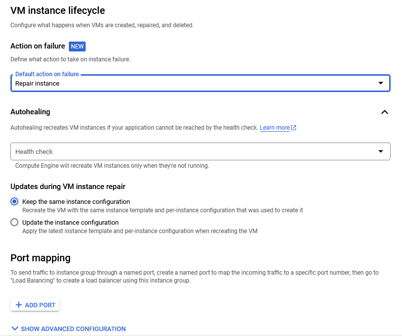

# Información general

Antes de comenzar a trabajar con GCP, debe tener en cuenta:

- Posee 300 dólares en un inicio para probar la aplicación.
- Google Cloud trabaja por zonas de despliegue. Esto quiere decir si usted despliega una aplicación en Europa, el acceso desde Estados Unidos será un poco más lento.
- Siempre tenga en cuenta los gastos que va haciendo dentro de la plataforma. Aunque existe un apartado llamado Billing que le permite llevar un histórico de los gastos realizados y crear alertas.
- Google shell o la consola de comandos es gratis y funciona tanto desde el sitio web como la pc de mesa.

Si tiene duda que servicio de google cloud seleccionar para ejecutar su aplicación, puede ver el siguiente video: https://www.youtube.com/watch?v=2tLXKCgqwLY

# Compute Engine (máquinas virtuales)

En este apartado se trabaja mediante máquinas virtuales. Debe tener en cuenta que el cobro dentro de este apartado es por minuto y por cada CPU virtual que se le asigne a la máquina a crear. Además, puedes crear una máquina virtual que use GPU para realizar cálculos pesados; este apartado está pensado para ML/IA.

Veamos la pantalla principal:


Para crear una nueva máquina virtual, presionamos el botón _Crear Instancia_ y nos aparecerá un formulario con diferentes campos. Vamos a ir viéndolo parte por parte:


- Nombre: Definimos el nombre que le daremos a nuestra máquina virtual.
- Región: En que región vamos a desplegar nuestra máquina virtual.
  - Podemos seleccionar entre varias regiones, tenga en cuenta que el acceso de una región externa a la seleccionada será lento. Por lo que es mejor utilizar la más cercana a su público principal.
- Zona: Dentro de cada región existe una zona de despliegue. Esto puede utilizarlo para mantener diferentes instancias de una misma aplicación en una misma región.
- Configuración de la máquina: En este apartado comenzamos a declarar las propiedades que tendrá nuestra computadora.
  - Primeramente debemos seleccionar el propósito general de nuestra máquina y las propiedades que va a tener.
  - El propósito de la máquina está bastante bien explicado dentro de la plataforma aunque la idea pivota en dos sentidos. El primero es Máquina de uso general o lo mismo, pero optimizando memoria o procesador. Del otro lado está la GPU que son computadoras que poseerán GPU para realizar cálculos intensivos.


- El próximo paso es seleccionar el tipo de máquina a utilizar según la familia seleccionada en el paso anterior.
  - Dentro podemos encontrar una gran variedad de configuraciones.
  - Tenga en cuenta que mientras mayor sea la propiedad de la pc, más dinero tendrá que pagar por hora de uso.
- Política de disponibilidad: Dentro podemos encontrar varias opciones interesantes:
  - Modelo de aprovisionamiento: Podemos seleccionar entre mantener nuestra máquina corriendo de forma indefinida o una máquina que sea capaz de detenerse en caso de ocurrir errores o problemas internos.
    - Como extra, existe la versión SPOT que son máquina efímeras o interrumpibles para trabajo con tiempo definido, pero solo están disponibles en cuando terminas los 300 dólares de prueba.
    - Además, este tipo de modelo, viene con descuento en su uso.
  - Establecer un límite de tiempo para la VM: Nos permite definir el tiempo de vida de una máquina virtual. De esta forma podemos crear una máquina virtual estándar que sea capaz de eliminarse a los 30 días poro ejemplo.
  - Reinicio automático: nos permite definir si queremos que la máquina virtual se reinicie en caso de ocurrir un error que la pare por completo.


- Ahora entramos con las configuraciones avanzadas y vamos a comenzar hablando de _Contenedor_ que nos permite usar la máquina virtual como una imagen de docker.
- Disco de arranque: Define el disco duro a utilizar para el sistema operativo. Además nos permite seleccionar el SO a instalar.

> Jugamos un poco con las configuraciones y nos dió un presupuesto de 24 280.14 dólares mensuales. Intentamos utilizar las opciones más caras, aunque de seguro es posible que se encarezca más.

> Tenga en cuenta que no puede cambiar los recursos de una máquina virtual sin apagarla con antelación.

- Creemos plantillas

GCP también ofrece la capacidad de crear plantillas a partir de una instancia creada, de esta forma, el proceso de creación es más rápido a la hora de trabajar. Tenga en cuenta que puede tener la cantidad de plantillas almacenadas que desee, pero Google le cobrará por cada uso que tenga la plantilla.

Para crear una plantilla debemos ir a `Compute Engine` en el menú principal y dentro seleccionamos `Instance templates`:


Y esto nos lleva a la siguiente pantalla donde podremos crear una plantilla de instancia:


Vamos a presionar el botón azul con el nombre `Create Instance Template`:


Como pueden observar, los pasos a seguir son idénticos a los vistos anteriormente en la creación de la máquina virtual. La diferencia que aquí no se creará la instancia de la máquina virtual, sino la plantilla para crear esas instancias.

- Hablemos de IPs

Por defecto, las máquinas virtuales que creemos, tendrá una IP dinámica asignada. Y esto no es malo, pero imagina que apagas la máquina virtual y al iniciarla de nuevo cambia la ip. Esto nos inutilizará el acceso a la máquina que hemos creado.

Para poder resolver este problema, tenemos que crear una dirección IP estática. Veamos como podemos hacer esto:

- Vamos a `VPC network` y dentro seleccionamos la opción de `Ip addresses`
- Dentro se nos brindan dos opciones:

  - `Reserve External Static Ip Address`: Nos permite declarar una IP externa al contenedor de forma estática.
  - `Reserve Internal Static Ip Address`: Lo mismo que la anterior, pero en este caso estaríamos creando la ip interna.

  

- En este caso seleccionaremos la opción de crear una IP externa.
- Dentro, encontraremos un simple formulario que nos pedirá información sobre la dirección a crear:
   - `Name`: Nombre que le daremos a la ip a crear. - `Description`: Descripción de la ip a crear. - `Network Service Tier`: Aquí podemos seleccionar por donde viajará el tráfico que venga o salga de nuestra ip. - `Premium`: La mejor de las dos, ya que permite que el acceso sea manejado por el sistema de google más cercano al usuario. - `Standard`: El tráfico es manejado mediante el servidor correspondiente a la zona donde se encuentra desplegada la aplicación. - `IP Version`: Define la versión de la IP a utilizar. En la opción `standard` solo está disponible `IPv4`, mientras que en premium, es posible seleccionar cualquiera de la presentes. - `Type`: Esto tiene que ver con lo que se hablaba en el apartado de `Network Service Tier`. La ip de tipo `standard` solo estará disponible para la región donde se despliegue la aplicación. El caso de `Global`, podremos acceder desde cualquier parte del mundo. - `Region`: Seleccionamos a la región que pertenecerá la IP. - `Attached to`: A quien se le asignará la ip. Aquí podemos seleccionar cualquiera de los elementos que tengamos creados que trabajen por ip. Puede ser un `load balancer` o una `virtual instance`.

> Tenga en cuenta que las ip no asignadas se cobrarán por encima del precio original.

- Vamos a añadir un script de inicio

Cuando estemos creando una instancia de una máquina virtual, tenemos la opción de agregar un script que se ejecutará al inicio de la misma. Esto nos permite quitarnos carga a la hora de trabajar con la máquina virtual, ya que desde un inicio vendrá poblada con los software que nos interesa utilizar. Para el siguiente ejemplo, instalaremos apache al inicio de la máquina virtual.

- Durante el proceso de creación, nos dirigimos a `Advanced options`
- Dentro buscamos la opción de `Management`
  
- Dentro del campo `automation` pegamos o escribimos el script de inicialización:

```bash
#!/bin/bash
apt update
apt -y install apache2
echo "Hello world from $(hostname) $(hostname -I)" > /var/www/html/index.html
```

- Terminamos nuestras configuraciones, guardamos y esperamos que se termine de inicializar la máquina virtual.

# Cloud Shell

Para acceder al `shell` de GCloud nos dirigimos al icono a la izquierda de las notificaciones. Presionamos y estamos listos para usar la línea de comando desde el navegador. También podemos vincular nuestra línea de comando en la pc con nuestro proyecto en la nube y así trabajar local cómodamente.

\*\* https://cloud.google.com/sdk/gcloud/reference

> gcloud GROUP SUBGROUP ACTION ...
> Group -> grupo de herramientas. config por ejemplo
> SUBGROUP -> parte del subarbol del grupo seleccionado
> ACTION -> Accion que vamos a realizar

`gcloud init` -> Inicializar gcloud en la consola de google cloud
`gcloud config list `-> Ver las configuraciones que estamos utilizando en el momento

`gcloud config list project` -> muestra la informaci'on para un parametro de configuracion en especifico
`gcloud config configurations list` -> listar los diferentes archivos de configuracion que tengamos.
`gcloud config configurations activate my-default-configuration` -> Activar un archivo de configuraci'on en espec'ifico
`gcloud config configurations describe my-second-configuration` -> Describir un archivo de configuraci'on que tengamos almacenado
`gcloud config configurations create NAME` -> create a new configuration y la activa
`gcloud config set compute/zone Value` -> Modificar el valor de un parametro de configuracion en especifico
`gcloud config unset compute/zone` -> Eliminar el valor de una configuracion

`gcloud compute instances list` -> muestra las instancias de cloud compute
`gcloud compute instances create NAME` -> Crear una instancia de google compute -> Es lo que hicimos al principio del curso

- `--machie-type TYPE`
- `--custon-cpu # --custom-memory #MB --custom-vm-type n2`
- `--image IMAGE_NAME`
- Existen otras. Puedes usar gcloud compute instance create `--help`

`gcloud compute instances describe my-first-instance-from-gcloud` -> Información de la instancia creada
`gcloud compute instances delete my-first-instance-from-gcloud` -> Elimina una instancia creada
`gcloud compute zones list`
`gcloud compute regions list`
`gcloud compute machine-types list`

`gcloud compute machine-types list --filter zone:asia-southeast2-b` -> Nos permite mostrar todos los tipos de maquinas que cumplan con un filtro asignado
`gcloud compute machine-types list --filter "zone:(asia-southeast2-b asia-southeast2-c)" `-> Lo mismo que lo anterior, pero ahora el filtro es multiple

> Filtros para listar
> `gcloud compute zones list --filter=region:us-west2 `-> Filtar por region
> `gcloud compute zones list --sort-by=region` -> Ordenar por region
> `gcloud compute zones list --sort-by=~region`
> `gcloud compute zones list --uri` -> Nos mostrará las url asociadas con las zonas

> describir
> `gcloud compute regions describe us-west4` -> Nos permite describir una region.
> `gcloud compute images describe ubuntu-1604-xenial-v20210203` -> Nos permite describir una imagen en específico. En este caso la de ubuntu

> Comandos para crear instance templates
> `gcloud compute instance-templates list`
> `gcloud compute instance-templates create instance-template-from-command-line`
> `gcloud compute instance-templates delete instance-template-from-command-line`
> `gcloud compute instance-templates describe my-instance-template-with-custom-image`

> Comandos para trabajar con instance group.
> `gcloud compute instances create my-test-vm --source-instance-template=my-instance-template-with-custom-image` ->  Nos permite crear una instancia a partir de un `template`.
> `gcloud compute instance-groups managed list` -> Muestra todos los grupos de instancia creados.
> `gcloud compute instance-groups managed delete my-managed-instance-group` -> Elimina un grupo de instancia.
> `gcloud compute instance-groups managed create my-mig --zone us-central1-a --template my-instance-template-with-custom-image --size 1` -> Crea un `group instance`, selecciona un `template`, una zona y la cantidad de réplicas internas. 
> `gcloud compute instance-groups managed set-autoscaling my-mig --max-num-replicas=2 --zone us-central1-a` -> Permite modificar el grupo de instancia creado (se usa el nombre), en este caso se están añadiendo opciones de auto scaling.
> `gcloud compute instance-groups managed stop-autoscaling my-mig --zone us-central1-a` -> permite detener el auto escalado. Debemos especificar la zona que utiliza nuestro instance group.
> `gcloud compute instance-groups managed resize my-mig --size=1 --zone=us-central1-a` -> permite aumentar las instancias de un group instance.
> `gcloud compute instance-groups managed recreate-instances my-mig --instances=my-mig-85fb --zone us-central1-a` -> Nos permite eliminar las instancias actuales y volverlas a crear. El flag instances hace referencia a las instancias que se van a recrear.
> `gcloud compute instance-groups managed delete my-managed-instance-group --region=us-central1` -> Eliminar una instancia de una región en específico.

- SQL

```shell
gcloud sql connect INSTANCE-NAME
```

- App Engine

``` shell
cd default-service
gcloud app deploy # Nos permite desplegar un servicio en app engine
gcloud app deploy --version=v3 --no-promote # desplegar una versión específica y no ejecutarla
gcloud app deploy --version=v2 # Desplegar la aplicacion asignandole una version en especifico

gcloud app services list # Lista todos los servicios creados en nuestra aplicación
gcloud app versions list # Lista todas las versiones de los servicios de la app
gcloud app instances list # Lista las instancias que se están ejecutando
gcloud app versions list
gcloud app regions list
gcloud app versions list --hide-no-traffic # Mostrar las versiones pero ocultar las que no tengan tráfico

gcloud app browse # Muestra la url de la aplicación actual
gcloud app browse --version=v3 # Buscar la url de una versión en específica
gcloud app browse --service=my-first-service # Especificar de que servicio queremos obtener la url
gcloud app browse --service=my-first-service --version=20210215t075851

gcloud app services set-traffic --splits=v3=.5,v2=.5 # Dividir el tráfico del servicio entre dos versiones
gcloud app services set-traffic --splits=v3=.5,v2=.5 --split-by=random # Dividir el tráfico del servicio entre dos versiones. El split by permite definir como se va a repartir el trafico. En este caso es de forma aleatoria.
gcloud app services set-traffic s1 --splits v2=1 --migrate # El flag migrate nos permite migrar de forma graduar hacia v2. s1 es el servicio


gcloud app open-console --version=v2 # Abrir en consola una versión en específico

gcloud app describe --version=v2 # Nos brinda información sobre una versión en específico

gcloud app version migrate v2 --service="myService" # migrar el tráfico a la versión 2 el servicio myServicio

```

- Kubernetes

```bash
gcloud config set project my-kubernetes-project-304910 # establecer el proyecto a usar
gcloud container clusters get-credentials my-cluster --zone us-central1-c --project my-kubernetes-project-304910 # Conectarse a un cluster para un proyecto en específico en una zona específica

kubectl create deployment hello-world-rest-api --image=in28min/hello-world-rest-api:0.0.1.RELEASE  # Desplegar imagen
kubectl get deployment # Mostrar despliegues
kubectl expose deployment hello-world-rest-api --type=LoadBalancer --port=8080 # Exponer el despliegue a la red externa
kubectl get services # Obtener servicios
kubectl get services --watch
curl 35.184.204.214:8080/hello-world # Llamada a un servicio
kubectl scale deployment hello-world-rest-api --replicas=3 # Escalar un despliegue a una antidad en especifica
gcloud container clusters resize my-cluster --node-pool default-pool --num-nodes=2 --zone=us-central1-c # Aumentar el tamaño del cluster que se está utilizando
kubectl autoscale deployment hello-world-rest-api --max=4 --cpu-percent=70 # auto escalado con Kubernetes
kubectl get hpa # Show de acuto scaling rules
kubectl create configmap hello-world-config --from-literal=RDS_DB_NAME=todos # Crear el archivo de configuración para las variables de entorno no confidenciales
kubectl get configmap # Obtener todos los config map que tengamos
kubectl describe configmap hello-world-config # Muestra la info de un configmap en especifico
kubectl create secret generic hello-world-secrets-1 --from-literal=RDS_PASSWORD=dummytodos  # Crear el archivo de configuración para las variables de entorno confidenciales
kubectl get secret # lo mismo de arriba
kubectl describe secret hello-world-secrets-1 # lo mismo de arriba
kubectl apply -f deployment.yaml # aplicar un archivo de despliegue
gcloud container node-pools list --zone=us-central1-c --cluster=my-cluster # Mostrar los nodos dado una serie de filtros
kubectl get pods -o wide # Obtener la información de todos los pods que tenemos en el cluster.

 gcloud container clusters update CLUSTER_NAME --enalbe-autoscaling --min-nodes=1 --max-nodes=10 # Permite decirle a Gcloud que queremos que se active el auto escalado en el cluster. 

kubectl set image deployment hello-world-rest-api hello-world-rest-api=in28min/hello-world-rest-api:0.0.2.RELEASE
kubectl get services
kubectl get replicasets
kubectl get pods
kubectl delete pod hello-world-rest-api-58dc9d7fcc-8pv7r # Eliminar un pod
  
kubectl scale deployment hello-world-rest-api --replicas=1
kubectl get replicasets
gcloud projects list
  
kubectl delete service hello-world-rest-api # eliminar servicio
kubectl delete deployment hello-world-rest-api # eliminar deployment
gcloud container clusters delete my-cluster --zone us-central1-c # eliminar cluster
```
- Cloud run

```shell
gcloud run deploy SERVICE_NAME --image IMAGE_URL --revision-suffix v1 # Crear un despliegue de un servicio
gcloud run revision list
gcloud run services update-traffic SERVICE_NAME --to-revisions=v2=10,v1=90
```

- Cloud Functions

```shell
gcloud functions deploy NOMBRE_FUNCIÓN # Nos permite desplegar una función que tengamos creada.
# Flags.
--docker-registry # Definimos en que registro guardaremos nuestra imagen de docker (container-registry o artifact-registry).
--docker-repository # Repositorio para almacenar las imágenes. Ex. projects/${PROJECT}/locations/${LOCATION}/repositories/${REPOSITORY}.
--gen2 # Usar las funciones de segunda generación. Por defecto, si no aparece esta opción, se tomará la primera generación.
--runtime # Básicamente en que lenguaje vamos a crear nuestra función.
--service-account # Definimos que service account va a utilizar para obtener los permisos.
--timeout # Tiempo de espera para finalizar la función.
--max-instances # número de instancias máximas que se pueden tener de la función.
--source # Código fuente para usar en la función. El origen puede ser un archivo zip almacenado en el cloud storage, un repositorio online o un archivo local del sistema.
--trigger-OPTION # Las OPTIONS son: bucker, http, topic y event-filters. 
```

# Instance Groups

Los grupos de instancias es una agrupación de diferentes máquina virtuales que a criterio del administrador cumplan con ciertas características (misma imagen por ejemplo). Los grupo de instancia nos permiten administrar de forma global varias instancias simultáneamente.

Existen dos tipos de `instance group`

- `Managed`: Máquinas virtuales idénticas creadas usadas mediante las plantillas.
  - Características: Auto escalado, recuperación automática y posibilidad de administrar las liberaciones.
- `Unmanaged`: Diferentes configuraciones dentro de un mismo grupo.

  - No permite el auto escalado, la recuperación automática y otros servicios presentes para grupos de tipo `Managed`
  - Preferiblemente no usarla al no ser que sea estrictamente necesario.

- Comencemos viendo como crear un `Managed Instance Group`

**Requisitos**

- Tener creado un `instance template`

**Cómo funciona el auto escalado?**

- Número mínimo de instancias.
- Número máximo de instancias.
- Reglas de auto escalado según uso de la CPU, carga del balanceador de carga u otras métricas.
- Tiempo de espera para comprobar las reglas de auto escalado.
- Control de escalado.
- Configurar el chequeo de salud

**Cómo crear un instance group**

- Primero nos dirigimos al menú lateral de `Compute Engine`
- Seleccionamos la opción `Instance groups`


- Nos aparecerá un dashboard en el cual podemos presionar el botón `Create instance group`.
- Se pueden crear tres tipos de `Instance Group`
   - `Managed Instance Group (stateless)` -> Si no nos interesa que se almacenen estados o datos en la máquina virtual, se debe utilizar esta. - `Managed Instance Group (stateful)` -> Si la máquina virtual poseerá una base de datos o necesita almacenar datos de forma permanente, debemos mantener el estado. - `Unmanaged Instance Group` -> Agrupar instancias de máquinas virtuales sin o muy pocas características comunes
- Después de seleccionar el tipo de instancia a crear, podemos llenar el formulario, aunque no es obligado tener un orden en específico:

 - `Name`: Nombre que le pondremos al grupo. - `Description`: Nos permite introducir una breve descripción de la instancia a crear. - `Instance Template`: Esta opción es propia de _managed instance group_. En este caso debemos seleccionar que `template` queremos utilizar para agrupar. - `Number of instances`: Numero de instancias que tendrá el grupo. - `Location`: Nos permite definir la región y la zona donde se utilizará el grupo. Además, podemos agregar multiples zonas.
 - `Actions on failure`: Que hacer en caso que falle alguna instancia. - `Autohealing`: En este apartado podemos definir el chequeo de seguridad. - Este apartado tiene una ventana de configuración externa, bastante sencilla e intuitiva. - `Updates during VM instance repair`: En caso de fallo, podemos reparar con la misma configuración que tenía la instancia o actualizarla. - `Port mapping`: Nos permite mapear el puerto externo con el interno para poder crear un sistema de balanceo de carga.

- Presionamos create y ya tenemos creado un `instance group`.

> Las opciones de auto-scaling solo se encuentran disponibles dentro de `stateless`


**Tipos de formas existentes para aplicar actualizaciones**

- `Rolling update`: Actualización gradual de las instancias.
  - Podemos definir la estrategia a seguir para la actualización.
  - Podemos definir si queremos utilizar una nueva plantilla para la actualización.
  - Nos permite definir cuando queremos hacer la actualización.
- `Rolling Restart/replace`: De forma graduar de reinician las instancias para actualizarse o se van remplazando.

Para aplicar los `updates`:

- Ir a `Instance Groups`.
- Buscar la instancia que queremos modificar.
- `Update VMS`: En esta opción podemos acceder al formulario para actualizar las `VM`
  - Dentro podemos cambiar la `instance template` que vamos a utilizar.
  - Nos permite definir una estrategia para la actualización de las imágenes. Incluso, podemos definir de las instancias, cuantas se actualizan y el resto se mantendrá en el `template` viejo.
  - Además podemos definir si la actualización será:
    - `Automática`: El nombre lo indica.
    - `Selective`: Esta actualización solo se aplicará cuando se reemplace, refresque o reinicia la instancia. Solamente si no es un proceso de auto reparación.

En el caso que queramos realizar un `restart/replace`:

- Ir a `Instance Groups`.
- Buscar la instancia que queremos modificar.
- Seleccionamos la opción `Restart/Replace VMs`
- Dentro seleccionamos entre `restart` o `replace`
- Para evitar que el sistema completo se quede sin instancias, podemos seleccionar cuantas instancias aplicar el `restart` o `replace`.

# Load Balancer

Los balanceadores de carga se encargan de distribuir el tráfico entre instancias de una o varias regiones.

Vamos a ver como crear un balanceador de carga:
- Desde el menú lateral en la pantalla principal, buscamos la opción de `Network services`

> Este elemento no sale al inicio, por lo que debemos buscarlo en el apartado de otros servicios.
- Dentro, iremos directamente a parar al `Load balancing`

-  Presionamos la opción `Create load balancer` y nos aparecerá la siguiente pantalla:

  - Google nos brinda tres opciones para crear un balanceador de carga según el protocolo que queramos utilizar:
    - HTTP/S.
    - TCP/SSL.
    - UDP/Múltiples protocolos.

> Si desea conocer un poco sobre el balanceador de carga a utilizar, puede fijarse en la siguiente imagen
> 
  
- Para probar, utilizaremos HTTP:

  - Aquí nos dan dos configuraciones, la primera es para que queremos utilizar el load balancer. En caso de querer usarlo para manejar el tráfico de internet a los servidores internos, se debe seleccionar la primera opción; en caso contrario, estaría creando un balanceador de carga encargado de manejar la comunicación entre los servidores internos.
  - La segunda opción se basa en seleccionar el tipo de balanceador. Esto lo que hace es delimitar el alcance del balanceador. Puedes leer las recomendaciones en cada uno de los casos y ver cual es el que se ajusta más a tus necesidades.
- Posteriormente, pasamos a la configuración de los componentes del balanceador de carga:

- Comencemos configurando el frontend. 
  - Aquí definimos la ip que será utilizada para el balanceo de carga
  - Por defecto, podemos dejar la configuración existente, pero es posible cambiarla.
  

- Pasemos al backend.
  - Aquí definimos los servicios que estarán utilizando el balanceo de carga.
  - Tenemos que crear un backend service o utilizar uno ya creado.
    
  - Los datos iniciales que piden son información básica, pero lo que nos interesa principalmente es el `tipo de backend`. Mediante este podemos seleccionar que apartado de Google Cloud estará utilizando el balanceador.
  - Por defecto viene en `Group instance`, pero podemos cambiarlo a nuestro gusto. Este cambio hace que el formulario se modifique.
  - Seguido del `tipo de backend`, tenemos el protocolo que se utilizará. Como seleccionamos un balanceador de carga de tipo HTTP, será el que aparezca por defecto. Pero podemos cambiar entre `HTTP`, `HTTPS` y `HTTP/2`.
  - `Cloud CDN`. Habilitar esta opción, nos permitirá guardar en cache archivos estáticos que no se actualicen constantemente para acelerar el acceso al servicio.

- Reglas de host y rutas
  - Piensa en esto como un api gateway.
  - Aquí definimos las rutas que tomaremos a nuestros servicios backend.
  - Esto es muy útil cuando se esté trabajando con arquitectura de microservices.
  

- Características de los Load Balancing


- Cuando usar un balanceador de carga?

  - Solo queremos que las instancias sin errores reciban el tráfico
    - Configura el health check del balanceador.
  - Alta disponibilidad de la aplicación
    - Configura la aplicación para ejecutarse en multiples regiones y accede mediante el balanceador
  - Quieres que las peticiones sean redirigidas según el microservicio utilizado
    - Crea un balanceador de carga con reglas de enrutamiento.
  - Quieres enrutar el trafico a diferentes instancias que se encuentran en múltiples regiones.
    - Utiliza External HTTP(S) Load Balancer
  - Usar SSL en el trafico no HTTP(S) y balancear la carga
    - Utiliza SSL Proxy Load Balancer

# Administremos servicios (Managed Services)

Términos:
- IaaS: Infraestructura como servicio.
- CaaS: Contenedor como servicio.
- PaaS: Plataforma como servicio.
- FaaS: Función como servicio.

GPC brinda varios servicios dentro de su infraestructura y cada uno pertenece a una categoría en específico (IaaS, etc). A continuación mostramos algunos de los componentes más importantes y a que categoría pertenecen:

- Compute Engine: Máquinas virtuales de propósito general.
  - IaaS.
- Google Kubernetes Engine: Permite crear cluster de Kubernetes para administrar nuestras aplicaciones.
  - CaaS.
- App Engine: Permite construir aplicaciones en una plataforma que te permite una administración total de forma amigable.
  - PaaS.
- Cloud Functions: Permite construir aplicaciones basadas en funciones y dirigidas por eventos.
  - FaaS.
- Cloud Run: Permite ejecutar aplicaciones contenerizadas sin la necesidad de la creación manual de un cluster.
  - CaaS.

# App Engine

Este componente de `Google Cloud` nos provee de múltiples herramientas para la administración de nuestra aplicaciones. Soporta una amplia variedad de lenguajes de forma nativa, pero es posible crear aplicaciones en cualquier lenguaje siempre y cuando se proporciones el run-time necesario. Permite la conexión con diferentes base de datos basadas en la nube y solo sobra por los recursos utilizados, no por el tráfico.

Como característica posee la capacidad de realizar de forma automática el auto escalado y el balanceo de carga. Administra el proceso de actualización de las aplicaciones y la capacidad de monitorear su estado de salud.

Existen dos tipo de entornos dentro de `App Engine`:

- `Standard`: Permite la compilación de las aplicaciones directamente. Por lo que podemos subir nuestro código y `App Engine` se encargará de compilarlo y ejecutarlo por nosotros.

- `Flexible`: La aplicación será ejecutada en un contenedor de docker.


Ahora veamos cuál es la estructura de los componentes dentro de `App Engine`.

- Una **aplicación** por proyecto.
- Una **aplicación** posee múltiples **servicios**.
- Cada **servicio** puede poseer multiples **versiones**.
- Cada **versión** puede tener diferentes **instancias**.
- Diferentes **versiones** pueden estar ejecutándose al mismo tiempo.

## Veamos app engine

- Comencemos accediendo a `App Engine`. En el campo de búsqueda escribimos `app engine`


- Presionamos la opción que evidentemente nos llevará a donde queremos. Es `App Engine` por cierto.

- Una vez dentro, veremos el siguiente dashboard:


Demos paso a ver como se crea una aplicación:

- En el dashboard presionamos `create application`
- Esto nos llevará a un menú de dos pasos:
  - Paso 1:
  
    - `Select a region`: De esta forma seleccionamos la región donde desplegaremos nuestra aplicación. Siempre tenga en cuenta desplegarla cerca de su público objetivo.
    - `Identity and API access`: Nos permite seleccionar un `service account`. Recuerde que los `service account` nos permiten definir los permisos que posee una cuenta.
  - Paso 2:
  
    - `Resources`: En este apartado definimos el lenguaje de programación y el entorno a utilizar.
    - `Deploy with Google Cloud SDK`: Este paso es importante y solo se puede realizar desde la consola de la computadora. Ya que debemos subir nuestra aplicación al `app engine`. (Nosotros lo haremos directamente desde la nube)

Ya con esto tenemos creada la aplicación que corresponde a nuestro proyecto. Para probar, comencemos por subir una aplicación de prueba. Para abrir el `shell` presionamos el ícono `>_` y esperamos que inicie la consola.

Para esta prueba, creamos una sencilla app de `python`, pero lo puede hacer en cualquier lenguaje de los soportados. La estructura que utilizaremos es la siguiente:


  
- Tenga en cuenta que debe crear el archivo `app.yaml` para indicarle al `App Engine` que runtime se debe utilizar. Aquí también pueden ir otras configuraciones a ser leídas por este componente de GCP.

Comencemos ejecutando el comando `gcloud app deploy` para desplegar la aplicación que acabamos de crear.


Cuando vamos a la consola de `App Engine`, dentro del menú de `Services`, aparecerá el servicio que acabamos de crear:


Pasemos a ver las versiones de un servicio creado pero desde la consola. Pero antes voy a hacer un cambio a la aplicación y volver a hacer deploy para así tener dos servicios.

- `gcloud app deploy --version v2` -> para desplegar una nueva versión pero con un tag definido por nosotros mismo
- `gcloud app services list`:


Cuando tenemos más de una versión de un servicio, es posible distribuir el tráfico entre ellas. Para hacerlo por la consola, tenemos que utilizar el siguiente comando:

- `gcloud app services set-traffic --splits=v3=.5,v2=.5 --split-by=random`

De forma automática, el tráfico entre dos versiones será dividido. El flag split by nos permite definir la estrategia de división del tráfico a seguir. Si queremos hacerlo mediante la consola, debemos dirigirnos al menú de `versions` y seleccionar `split traffic`:


Ahora vamos a desplegar un segundo servicio, pero esta vez la vamos a asignar un nombre. Vamos a mantener la aplicación anteriormente creada, similar en todos los sentidos, menos en el `app.yaml`. Ahora vamos a agregar una configuración llamada `service: NAME`


Resultado:


## App yaml

Este archivo es bastante importante ya que nos evita tener que introducir de forma manual algunas de las configuraciones que pueden ser realizadas de forma automática mediante un archivo. Si vienen de trabajar con docker, esto es una especie de docker compose que le dice a la consola de gcloud las instrucciones que debe seguir para agregar metadata al despliegue. Veamos algunas propiedades y para que sirven:

```yaml
runtime: python28 # Define el runtime utilizado para compilar la app.
api_version: 1 # Especificamos la versión del despliegue.
instance_class: F1
service: NAME_HERE # Nombre del servicio a ser desplegado.
#env: flex # Si queremos desplegar en flex. Sin esto se despliega en standard

inbound_services:
- warmup

env_variables: # Permite crear las variables de entorno para usar en la app
  ENV_VARIABLE_NAME: "value"

handlers: # Scripts a ejecutar en url específicas
- url: /
  script: home.app

# Escalados. Usar solo uno
automatic_scaling: # Definimos las reglas de escalado automático 
  target_cpu_utilization: 0.65 # Escalar cuando la cpu tenga un % de uso mayor o igual a 65%
  min_instances: 5 # Instancias mínimas
  max_instances: 5 # Instancias máximas
  max_concurrent_request: 50 
#basic_scaling: # Escalado básico
  #max_instances: 5 # Instancias máximas
  #idle_timeout: 10m
#manual_scaling # Escalado manual
  #instances: 5 # cantidad de instancias
```

Si quieren conocer más a fondo las configuraciones, pueden visitar la siguiente página: https://cloud.google.com/appengine/docs/standard/reference/app-yaml?tab=node.js#top

## Como manejar la separación de tráfico

Anterior mente vimos que teníamos opciones para separar el tráfico de un servicio con múltiples versiones. Entre las opciones disponibles se encuentran:

- `IP`: Se basa en usar rangos o ip específicas para acceder a los servicios
- `Cookies`: Se basa en la cookie `GOOGAPPUID` de las peticiones para definir a que servicio se debe enviar.
- `Random`: El servicio se asigna de forma random

## Trabajos cronometrados

Para crear un cron, debemos primero inicializar un archivo llamado `cron.yaml`. Dentro podremos crear las diferentes acciones que queramos ejecutar. A continuación le mostramos un ejemplo sencillo:

```yaml
cron:
- description: "algo aquí"
  url: /task/summary
  schedule: every 24 hours
```

> Para más información, visite https://cloud.google.com/appengine/docs/flexible/scheduling-jobs-with-cron-yaml

Para desplegarlo, puedes utilizar el siguiente comando `gcloud app deploy cron.yaml`. Por defecto, los cron ejecutan una url cada cierto tiempo (`schedule`); por lo que dentro de nuestra aplicación, deben estar expuestos dichos endpoints para su ejecución.

## Dispatch and queue

Existe otra configuración que podemos agregar a nuestro `App engine` que se llama `dispatch.yaml`, aquí de forma manual, podemos configurar las rutas de acceso a nuestros servicios. Las especificaciones de estas configuraciones las puede ver en https://cloud.google.com/appengine/docs/standard/reference/dispatch-yaml?tab=node.js. Para desplegarlo, simplemente escribimos en la consola `gcloud app deploy dispatch.yaml`. Veamos un ejemplo:

```yaml
dispatch:
- url: "*/mobile/*" # url statica o patrón que debe seguir la petición para enrutarla hacia un servicio
  service: mobile-frontend # Que servicio vamos a utilizar
- url: "*/work/*"
  service: static-backend
```

Otra configuración que podemos realizar es el manejo de las colas. Este mecanismo es similar al uso de `Nats` o `Kafka` para la comunicación entre microservices. En `App Engine` existen dos tipos de cola, `Push` y `Pull`. Por defecto existe una cola de tipo `Push` llamada default; pero es obligatorio usar el archivo `queue.yaml` para crear una cola `Pull`. Ojo, también se puede configurar colas `Push` extras en el `queue.yaml` pero se recomienda hacerlo en un `deploy` aparte de las colas de tipo `Pull`. 

> Si quieres crear colas de tipo `PUSH` directo en la consola, puedes dirigirte a la siguiente dirección: https://cloud.google.com/tasks/docs/queue-yaml

Veamos un ejemplo de `queue.yaml`:

```yaml
queue:
- name: queuename # Nombre de la cola
  rate: 1/s
  retry_parameters:
    task_retry_limit: 7
    task_age_limit: 2d
```

## Desventajas
- Solo se puede tener un proyecto dentro de app engine.
- Es especifica de una región, por lo que no posee una alta disponibilidad.

## Ventajas
- Puedes tener múltiples servicios con diferentes versiones ejecutándose a la vez.
- Se pueden realizar despliegues sin compromiso en la disponibilidad.

# Google Kubernetes Engine (GKE)

Este servicio nos permite administrar servicios de Kubernetes directo en la nube. Nos permite minimizar operaciones dentro del ecosistema de Kubernetes como el reparado y actualizado automático. Además, provee la capacidad de auto escalado para los `Pods` y los `Clusters`. Como un extra podemos decir que provee el soporte para la persistencia de datos en HDD y SSD.

En las versiones recientes de `Google Cloud` existe un nuevo modo dentro de `GKE`, este se llama `Autopilot` y lo que hace es simplificar el proceso de administración, pero posee un cobro basado en la cantidad de `pods`. Veamos otras características de este modo:
- Creado para reducir los costos de operaciones en la ejecución de `cluster` de Kubernetes.

Comencemos creando un `cluster` de `Kubernetes`.

- Shell
  - `gcloud container clusters create` -> Crea el estándar por defecto

- Consola
  - Nos dirigimos al menú `Kubernetes Engine`
  
  - La primera vez que accedamos nos pedirá que activemos la `API` de `Kubernetes`
  - En el apartado de clúster seleccionamos el proyecto que vamos a utilizar (solo si no lo tenemos seleccionado)
  
  - Una vez totalmente adentro, podemos seleccionar la opción `crear`
  
  - Seleccionada esta opción, el sistema nos mostrará un formulario tomando como opción predeterminada el `Autopilot`.

- Configuración `Autopilot`.
  
  - `Nombre`: Nombre que recibirá el clúster.
  - `Región`: Donde desplegaremos el clúster.

  - `Red`: Podemos seleccionar cualquiera de las redes creadas dentro de `Google Cloud`
  - `Subred del nodo`: Lo mismo de lo anterior pero esta vez la red a utilizar para conectar los nodos del cluster
  - `Acceso a la red IPv4`: Podemos seleccionar si es un cluster público o privado, en dependencia de lo que queramos.
  - `Rango de direcciones del pod predeterminado del clúster`: Podemos definir los rangos de direcciones. Para más información del tema de subred, pude ver el siguiente link: https://www.freecodecamp.org/news/subnet-cheat-sheet-24-subnet-mask-30-26-27-29-and-other-ip-address-cidr-network-references/ 
  - `Habilitar acceso global...`: Esto nos permite acceder a nuestro sistema privado (panel de control) desde cualquier región o zona que nos encontremos.
  - `Habilitar las redes...`: En este caso solo permite que las redes autorizadas por GCP (definidas por el usuario) accedan al panel de control.

  - Aquí podemos realizar diferentes configuraciones con respecto a la seguridad, automatización de mantenimiento, etc.
  - Esto lo veremos más a fondo en otro momento.

  - La flota es un sistema de agrupación de clusters para una mejor configuración y mantenimiento.

- Configuración `Estándar`.

  - `Nombre`: Nombre que recibirá el clúster.
  - `Zonal` o `Regional`: Aquí decidimos si desplegaremos nuestro clúster para una región o una zona en específico.
  - `Versión`: Decidimos si google se encargará de actualizar nuestro panel de control o lo hacemos de forma manual cuando lo necesitemos.

  - Aquí encontraremos diferentes opciones para crear configurar los nodos, desde la capacidad del nodo a utilizar hasta la seguridad que queremos que tenga.

  - Mismas configuraciones vistas en el apartado `Autopilot`

> Ojo con el precio del clúster ``standard``. A la derecha de los formularios, podremos encontrar los gastos que tendremos:


> Por cuestiones de precio y presupuesto, no crearemos los clusters para trabajar, pero si veremos algunos temas internos.

## Trabajando en el cluster

- Conectarse a un cluster:
  - `gcloud container clusters get-credentials MY_CLUSTER --zone ZONA --project MY_PROYECTO`
- Creemos nuestro primer despliegue
  - `kubectl create deploy NAME --image=IMAGE`

- Vamos a crear un cluster `Autopilot` rápido para inspeccionar sus propiedades:

- Para acceder al cluster, presionamos sobre el nombre y nos saldrá la siguiente pantalla:

  - Además de la información vista en pantalla, poseemos varias configuraciones rápidas y pestañas de monitoreo.
- Cuando tengamos creados deployments dentro del clúster, podremos ir al apartado de `carga de trabajo`. Dentro podremos ver la información correspondiente a los elementos de nuestro clúster (servicios, deployments, etc).

> un ejemplo de lo anterior es:


> En caso que despliegues un elemento usando el archivo deployment yml, puedes especificar el POOL añadiendo la propiedad `nodeSelector`.
> `nodeSelector: cloud.google.com/gke-nodepool:POOL_NAME`

# Google functions

Las funciones de googles son pedazos de código escritos para cumplir una acción en específico, bastante similar a las lambdas de amazon. Las google functions son ejecutadas utilizando un sistema basado en eventos y pueden ser escritas en cualquiera de los lenguajes soportados por `GCP`. La ventaja de usar este tipo de arquitectura es que no debemos preocuparnos por el servidor, solo la lógica del negocio, ya que Google se encargará de escalar nuestras funciones de ser necesario. Lo malo es que se nos cobrará por números de invocaciones, tiempo de ejecución y recursos que utilicemos. 

Veamos como crear una función:
- Comencemos por buscar en el menú la opción `Cloud Functions`:

- Una vez dentro encontraremos el siguiente `Dashboard` donde presionaremos la opción `create function`

- Una vez presionemos `Create Function` y es la primera vez que accedemos, nos saldrá el siguiente modal pidiendo que habilitemos las ``APIs`` correspondientes:

- Una vez habilitemos las ``APIs``, pasaremos al formulario de configuración de la función:

  - `Environment`: Podemos seleccionar entre las funciones de primera o segunda generación. Tenga en cuenta que la segunda generación posee más opciones que configuración que la primera.
  - `Function name`: En este apartado añadimos el nombre que tendrá nuestra función.
  - `Region`: La región donde desplegaremos nuestra aplicación.
  - `Trigger`: Mediante este apartado podemos definir la acción que desencadenará nuestra función. Por defecto, se seleccionó una petición HTTPs; pero podemos cambiarla según nuestras necesidades.

  - Este apartado es sumamente importante ya que dentro podremos definir los recursos y configuraciones directas de nuestra función.
  - En la imagen se muestra las configuraciones correspondientes al aprovisionamiento de nuestra función.
  - Igual podemos jugar con las configuraciones de la conexión y seguridad.
- Una vez terminado el primer paso, podemos pasar al código de nuestra función:

  - Esto es bastante similar a los lambda de ``AWS``. En el lado izquierdo tenemos el proyecto con nuestro package json donde estarán nuestras dependencias y a la derecha tenemos la función que vamos a utilizar.
  - Si presionamos la opción de probar y esperamos un poco, se nos abrirá el terminal de google.
  - Después de esperar que se instalen una serie de elementos, podemos presionar la opción ``RUN TEST`` y a continuación mostramos el resultado.
  

  De esta forma podemos crear nuestras funciones dentro de google cloud.

# Encriptacion

Antes de comenzar a indagar en el uso de la encriptación dentro de Google Cloud, debemos ver los estados que poseen los datos dentro de esta plataforma:
- En descanso (rest): Datos almacenados en dispositivos o en backups (base de datos y archivos almacenados por ejemplo).
- En movimiento (motion): Datos que están siendo transferidos a trabes de la red. Estos datos pueden ser entre nuestro dispositivo y la nube o una comunicación directa entre diferentes servicios.
- En uso (use): Datos manejados por google cloud que todavía no se encuentran persistentes.

Ahora hablemos de los tipos de llaves que existen para la encriptación:
- Llaves simétricas: La misma llave utilizada para le encriptación, es usada para desencriptar los datos.
- Llaves asimétricas: Se tienen dos llaves, una pública y otra privada. La primera se utilizar para encriptar la información y la segunda para desencriptarla.

Dentro de Google Cloud existe un servicio llamado `Key Management Service`. Este nos permite la creación de llaves de encriptación de los dos tipos vistos anteriormente. Además, permite controlar su uso dentro de los servicios de GCP y las aplicaciones que queramos. POsee una API para el encriptado y el desencriptado de la información que enviemos. 

Es necesario conocer que las aplicaciones que trabajan con encriptado dentro de Google Cloud permiten diferentes tipos de encriptación:
- `Google managed key`: Dejamos que google decida la llave a utilizar para el proceso de encriptación.
- `Customer managed key`: Nos permite seleccionar cualquiera de las llaves creadas en `Key Management Service`.
- `Customer supplied key`: Podemos utilizar las llaves que tengamos On premise.

> Tenga en cuenta que según el tipo de llave que se cree, google aplicará una taza de cobro.

# Almacenamiento

Antes de comenzar tenemos que entender la diferencia entre `Block Storage` y `File Storage`. Comencemos por el primero:
- Son discos duros que se añaden a la computadora
- Normalmente un solo bloque de almacenamiento puede conectarse a un servidor virtual.
- Puedes tener una servidor virtual conectado a multiples bloques de almacenamiento.
- Son usados mayormente como DAS (Direct attached storage) o SAN (Storage area network)
Mientras que el segundo se basa en:
- Son archivos compartidos a uno o más computadora a través de la red.

En google cloud, se brindan las siguientes opciones por cada uno de los tipos de almacenamientos vistos:
- Block Storage:
  - Disco persistente (persistent disks): Bloque de almacenamiento a través de la red
    - zona: Los datos se replican solamente en esa zona
    - region: Los datos se replican en múltiples zonas de la misma región

  - SSD local: Bloque de almacenamiento que se encuentra donde mismo está el servidor utilizado.

- File Storage
  - Filestore: Almacén de archivos de alto rendimiento.

Los almacenamiento de tipo bloque pueden ser seleccionados directamente dentro de la creación de un servidor. Para poder usar el `File Storage`, debemos activar su API. Para ello hacemos:
- Vamos al menú lateral y dentro buscamos el apartado de `Storage` y dentro `FileStore`

- La primera vez que accedamos tendremos que habilitar la api correspondiente:

- Una vez dentro, veremos la siguiente interfaz:


Vamos a intentar crear una instancia de `Filestore`:
- En el dashboard visto anteriormente presionamos el botón `Create Instance`
- Dentro veremos el siguiente formulario:

  - Vamos a saltarnos los dos primeros campos que son bastantes sencillos y pasemos a ``Instance type``
  - `Instance Type` nos permite seleccionar entre (Basic, Enterprise, Zonal) para la creación de ficheros. En dependencia de cual seleccionemos, serán las opciones que aparecerán para la creación.
  - Vamos a seleccionar `Basic`
  
  - `Storage type`: Debemos seleccionar el tipo de disco duro donde queremos guardar la información (HDD o SSD). Según se seleccione, la capacidad puede variar.
  - `Allocate capacity`: Capacidad que tendrá el disco duro. A mayor capacidad, mayor será el pago.
  - `Choose where to store your data`: En que zona y region vamos a tener nuestro `file store` creado.
  - `Set up connections`: Opciones de red para acceso al `file store`.
  - `VPC network`: Definimos a que virtual private cloud network pertenece.
  - `Allocated IP range`: Definiremos que rango de IP serán usados para utilizar el `file store`.
  - `Configure your file share`: configuración directa de propiedades simples para compartir los archivos almacenados.
  
Hablemos un poco ahora del Block Storage (SSD y HDD)

HDD:
- No dependen de de la máquina virtual a la que se acoplen, por lo que puede ser reutilizado
- Puedes reutilizarlo en otra máquina virtual de ser necesario
- Permite la persistencia de información.

SSD: 
- Dependen de la máquina virtual a la que se acoplen.
- Los datos son temporales debido a la anterior limitante.
- Provee baja latencia
- Los datos se encriptan automáticamente, pero no se puede seleccionar la llave de encriptación.
- Podemos seleccionar entre un SSD de tipo NVMe o SCSI
- SOlo puede ser utilizado en una máquina virtual