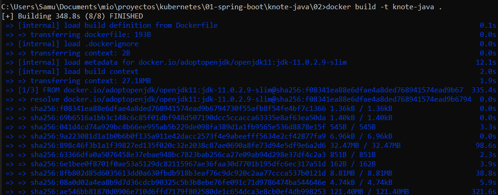

# Sobre este tutorial

Para este tutorial seguimos los pasos de la página web https://learnk8s.io/spring-boot-kubernetes-guide. En este caso nos olvidamos por completo del proceso de implementación de la aplicación de Spring Boot ya que no es objetivo. Aquí estaremos trabajando con los componentes de Kubernetes.

# Descargando el proyecto base

Pueden dirigirse a este repositorio en github https://github.com/learnk8s/knote-java/tree/master y seleccionar que descargar. En mi caso yo pase directo a descargar la rama 2 que ya viene con la aplicación y archivo docker. A partir de aquí, podemos comenzar a trabajar el tema de Kubernetes.

> Ojo, para trabajar con Kubernetes y las imágenes de docker hay dos formas. La primera es que siempre las descargue de internet o que intente utilizar las que poseemos en nuestro docker. Para este ejemplo usaremos las imágenes de la aplicación y la de mongo offline.

# Pasos para crear la imagen de docker de la app

- Instalar las dependencias
    - mvn clean install -> Esto nos dio el error [001](#001)
- Construir imagen de la aplicación
    - docker build -t knote-java .
        - -t -> cace referencia al tag o nombre que le vamos a poner
        - . -> hace referencia a donde se encuentra el archivo docker file. Si lo tenemos en otro lugar, debemos dar la dirección.
    
    
    
    > Este proceso puede tardar un poco de tiempo así que tenga paciencia. Una vez terminado puede comprobar su docker:

    

Ya con esto tenemos el primer paso de este tutorial vencido.

> Si quieres probar la imagen, puedes usar los siguientes comandos:

- Crear el red interna

``` bash
docker network create knote
```

> Recuerden que cuando varias apps están dentro de una misma red de docker, pueden conectarse sin ningún problema.

- Run mongo

``` bash
docker run --name=mongo --rm --network=knote docker.uclv.cu/mongo
```

> Ojo, en al final de la sentencia de mongo yo pongo `docker.uclv.cu/mongo` debido a que la imagen que tengo descargada posee ese `name`. Si ponen mongo solo, el intentará buscar la última versión disponible y si no la encuentra, intentará descargarla.
  
- Run app
``` bash
docker run --name=knote-java --rm --network=knote -p 8080:8080 -e MONGO_URL=mongodb://mongo:27017/dev knote-java
```

Con los dos contenedores en ejecución, podemos visualizar nuestra aplicación en el navegador:


# Kubernetes

> Para aprender varios conceptos de Kubernetes y como funcionan sus diferentes componentes, puede dirigirse a la carpeta `Kubernetes` de este mismo repositorio. Dentro encontrará una serie de tutoriales que pueden ser de ayuda para iniciar en este mundo.

Vamos para lo que importa. En este apartado estaremos viendo como llevar a Kubernetes nuestra app Dockerizada. Comencemos creando nuestro componentes:

- NameSpace:

``` yml
apiVersion: v1 # Versión de la api de kubernetes que se va a utilizar
kind: Namespace # Tipo de componente a crear
metadata: # Datos de información del componente a crear
  name: knote-test # Nombre que tendrá el namespace
```

Este archivo es bastante sencillo. Los datos más importantes son `kind` y `name`. El primero define el tipo de componente a crear por kubernetes una vez que sea cargado. El segundo define el nombre que recibirá dicho componente. Sin más dilaciones, probemos a ver que pasa:

- Abrimos una consola en la carpeta donde se encuentra el archivo yml a cargar
- Escribimos en la consola: `kubectl apply -f ./01-knote-namespace.yml`.
    - `apply` nos permite cargar y ejecutar un archivo yml dentro de Kubernetes.
    - `-f` nos permite definir un archivo local de la máquina para utilizar.
    - `./01-knote-namespace.yml` dirección y nombre de nuestro archivo.
- Presionamos enter y si todo sale bien, veremos esto:

- Por si acaso comprobemos que sea verdad. Para ello ejecutamos el comando `kubectl get namespace`. 
    - Este comando muestra todos los namespace creados.
    
    - Dentro aparece nuestro namespace `knote-test`.

- Deployment

``` yaml
apiVersion: apps/v1 # La versión cambia según el Kind que utilicemos, vea: https://matthewpalmer.net/kubernetes-app-developer/articles/kubernetes-apiversion-definition-guide.html
Kind: Deployment # Decimos que estaremos creando un deployment
metadata:
  name: knote # Nombre del componente
spec: # Especificaciones del componente
  replicas: 1 # Cantidad de replicas a crear del componente
  selector: # Como otros componentes pueden seleccionar a este
    matchLabels: # Labels para la selección
      app: knote # Key - value.
  template: # Plantilla para crear el contenedor
    metadata: # Datos de información del componente
      labels:
        app: knote # Aquí podemos poner tantos como queramos, lo que en el matchlabels solo pueden existir los que estén presente en este apartado.
    spec: # Especificaciones del contenedor
      containers: # Similar a un contenedor de docker
      - name: app # Nombre del contenedor
        image: knote-java # Imagen de docker a utilizar
        ports:
          - containerPort: 8080 # Puerto que expone la aplicación internamente
        env: # Variables de entorno que utiliza
          - name: MONGO_URL
            value: mongodb://mongo:27017/dev
        imagePullPolicy: IfNotPresent # Política de descarga de la imagen.
```

Vamos a explicar una serie de conceptos importantes que no se describieron directamente en el código:
- Versiones de la api -> https://matthewpalmer.net/kubernetes-app-developer/articles/kubernetes-apiversion-definition-guide.html. Pueden acceder al link anterior para ver los tipos de api que deben usar.
- `imagePullPolicy` -> Este parámetro define la forma en que la imagen de docker será invocada. Internamente posee tres valores:
    - `IfNotPresent` -> Descargará la imagen del docker hub si no existe en nuestro docker local.
    - `Always` -> Siempre, sin importar que suceda, se descargará de internet la imagen.
    - `Never` -> Nunca descarga la imagen de internet. Simplemente utiliza la que esté dentro de Kubernetes. 
- `Selectors` y `Labels`-> Puede que la explicación de este tema no quede totalmente clara en el código. Los selectores permiten exponer el componente a otros servicios; es decir, facilita a otros servicios la aplicación de restricciones y/o funcionalidades sobre un componente en especifico. Los labels son etiquetas por el que se puede identificar el componente. Puedes tener tantos selectores como labels tengas creados, pero nunca tendrás un selector que posea un valor no presente en el label.
    - Como mínimo debes tener un Selector y un Label.

> No ejecutaremos la aplicación todavía, ya que necesitamos otros componentes fundamentales para la ejecución.

- Service

> Los services permiten que la aplicación sea accesible a otros pods (deployments) o a aplicaciones fuera del ecosistema de Kubernetes. Existen tres tipos de servicios principales:

    - `ClusterIp` -> Este tipo de servicio expone una aplicación internamente para que otros pods puedan acceder a ella. Ninguna aplicación fuera de Kubernetes tendrá acceso. Este es el tipo de servicio por defecto.
    - `NodePort` -> Este permite exponer la aplicación mediante una IP y puerto fija a los componentes externos a Kubernentes
    - `LoadBalancer` -> Crea un sistema de balance de carga que permite exponer un puerto de acceso a una aplicación. Internamente si la aplicación posee replicas, se encargará de redirigir la petición.

> Load Balancer

```yml
apiVersion: v1 # Version de la api
kind: Service # Tipo de componente
metadata: # Datos generales
  name: knote-lb # Nombre del componente
spec: # Especificaciones
  selector: # Definimos los componentes a seleccionar
    app: knote # Key value de los componentes a seleccionar. Estos valores se encuentran dentro de matchLabel
  ports: # Puerto a exponer
    - port: 80 # Puerto de acceso externo al contenedor
      targetPort: 8080 # Puerto de destino. Normalmente el que expone la aplicación.
  type: LoadBalancer # Tipo de servicio
```

> Cluster Ip -> Este es el service a utilizar en mongo

```yml
apiVersion: v1
kind: Service
metadata:
  name: mongo
spec:
  selector:
    app: mongo
  ports:
    - port: 27017
      targetPort: 27017
```

Aquí no se define el tipo de servicio debido a que por defecto es `clusterIp`.

> Node Port -> No lo vamos a usar aqui

```yml
apiVersion: v1 # Version de la api
kind: Service # Tipo de componente
metadata: # Datos generales
  name: knote-lb # Nombre del componente
spec: # Especificaciones
  selector: # Definimos los componentes a seleccionar
    app: knote # Key value de los componentes a seleccionar. Estos valores se encuentran dentro de matchLabel
  ports: # Puerto a exponer
    - port: 3033 # Puerto de acceso externo al contenedor
      targetPort: 8080 # Puerto de destino. Normalmente el que expone la aplicación.
      name: http # Port name
  type: NodePort # Tipo de servicio
```

- PersistentVolumeClaim

Este tipo de componente es bastante interesante. Veremos su uso cuando nos adentremos en mongo. El propósito de este componente es crear un espacio en disco duro para persistir los datos; es decir, si eliminamos o cambiamos el pod, los datos no se perderán.

```yml
apiVersion: v1 # Version de la api
kind: PersistentVolumeClaim # Tipo de componente
metadata: # Datos generales
  name: mongo-pvc # Nombre del componente
spec: # Especificaciones
  accessModes: # Tipos de acceso permitidos al volumen
    - ReadWriteOnce
  resources: # Lista de recursos
    requests: # Recursos que vamos a pedir
      storage: 256Mi # Reservar 256 mb de espacio en el disco duro
```

Este componente solo será utilizado si es llamado por el deployment u otro componente que lo necesite. Dentro de poco veremos como funciona.

- Mongo

Hasta ahora hemos estado creando un archivo por cada componente que queríamos crear. Esto no está mal, pero nos obliga a tener que ejecutar la acción de aplicar por cada archivo. Pues es posible en un solo archivo yml ubicar todos los componentes que queramos crear, de esta forma, solo tendríamos que ejecutar el archivo una sola vez. Para ello nos podemos apoyar en la configuración realizada para mongo:

```yml
apiVersion: v1
kind: PersistentVolumeClaim
metadata:
  name: mongo-pvc
spec:
  accessModes:
    - ReadWriteOnce
  resources:
    requests:
      storage: 256Mi
--- 
apiVersion: v1
kind: Service
metadata:
  name: mongo
spec:
  selector:
    app: mongo
  ports:
    - port: 27017
      targetPort: 27017
---
apiVersion: apps/v1
kind: Deployment
metadata:
  name: mongo
spec:
  selector:
    matchLabels:
      app: mongo
  template:
    metadata:
      labels:
        app: mongo
    spec:
      containers:
        - name: mongo
          image: mongo
          ports:
            - containerPort: 27017
          volumeMounts: # Con este bloque estamos definiendo un volumen interno 
            - name: storage # Nombre del volumen interno del contenedor
              mountPath: /data/db # Path dentro del contenedor para montarlo
      volumes: # Volúmenes que vamos a utilizar
        - name: storage # Tomamos el mismo nombre puesto en volume Mounts
          persistentVolumeClaim: # Decimos que utilizaremos el volumen de persistencia creado anteriormente
            claimName: mongo-pvc # Le ponemos el nombre dado al volumen de persistencia
```

Para separar una configuración de otra podemos auxiliarnos de `---`; internamente Kubernetes reconocerá esos caracteres como división entre componentes. Practicamente todo lo que se muestra en el código anterior lo hemos ido viendo durante el tutorial, pero debemos adentrarnos en `volumeMounts` y `volumes`.

- `VolumeMounts` -> Nos permite declarar un volumen dentro de nuestro contenedor para la salva de los datos.
- `Volumes` -> Nos permite definir los volúmenes a utilizar por nuestro contenedor.
    - Este sistema trabaja mediante un nombre y el tipo de volumen a utilizar. El primero (`nombre`) se obtiene de los valores declarados en `volumeMounts`.
    - El tipo de volumen a utilizar en este caso es `persistentVolumeClaim` y fue declarado al inicio del archivo mongo.yml y visto anteriormente en este documento.

# Desplegando la aplicación

Con todos los archivos ya creados, comencemos el proceso de despliegue. Vamos a comenzar por pongo ya que es el más sencillo.

> Recuerde que el namespace se creó al principio de este documento.

Ejecutemos el siguiente comando:

- `kubectl apply -n knote-test -f 01-mongo.yml`
    - `-n` -> Nos permite definir el namespace donde vamos a desplegar el componente
    - `-f` -> Define el archivo a utilizar


> Vamos a comprobar que todo esté ejecutándose correctamente:
> `kubectl -n knote-test get all` -> Obtener todos los componentes del namespace knote-test
> 

Vamos ahora para knote:

- `kubectl apply -n knote-test -f 01-knote-service-loadbalancer.yml`
- `kubectl apply -n knote-test -f 01-knote-deployment.yml`

> Volvamos a comprobar
> `kubectl -n knote-test get all`
> 

Contodo desplegado, vamos a nuestro navegador y accedemos a `localhost:3033`:


# Errores encontrados

## 001

Error:

> Failed to execute goal org.apache.maven.plugins:maven-compiler-plugin:3.8.1:compile (default-compile) on project knote-java: Fatal error compiling: java.lang.IllegalAccessError: class lombok.javac.apt.LombokProcessor (in unnamed module @0x2f14b0f6) cannot access class com.sun.tools.javac.processing.JavacProcessingEnvironment (in module jdk.compiler) because module jdk.compiler does not export com.sun.tools.javac.processing to unnamed module @0x2f14b0f6

Solución

> Cambiar la versión de lombok utilizada. En nuestro caso usamos  <version>1.18.28</version>
