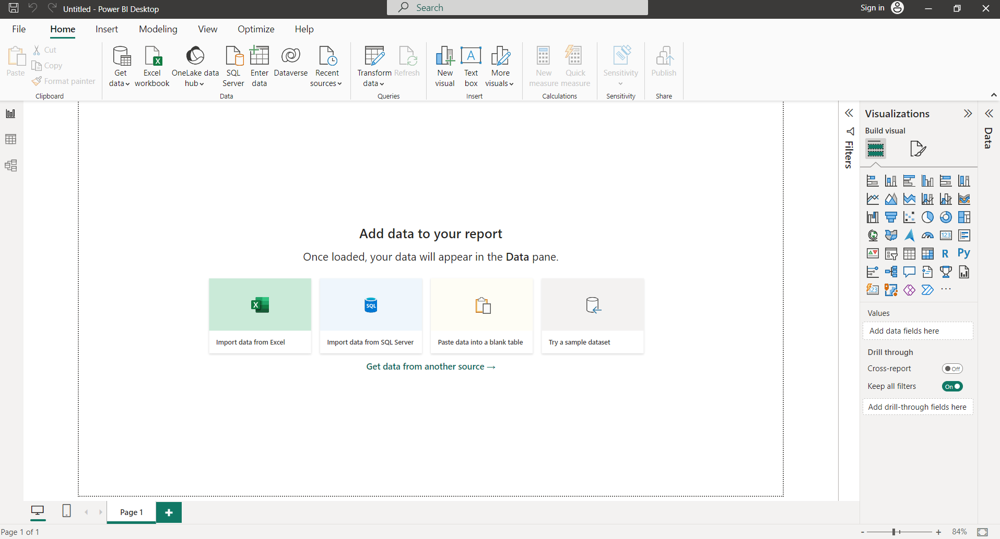
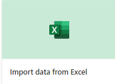
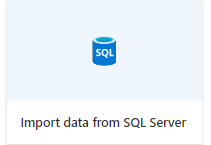
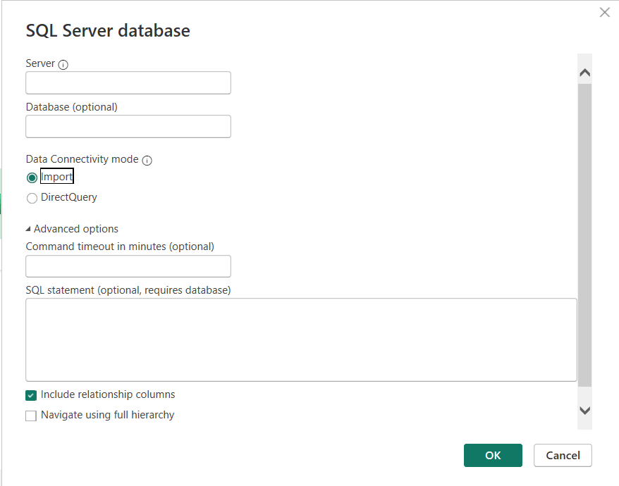
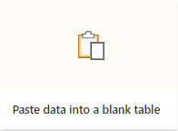
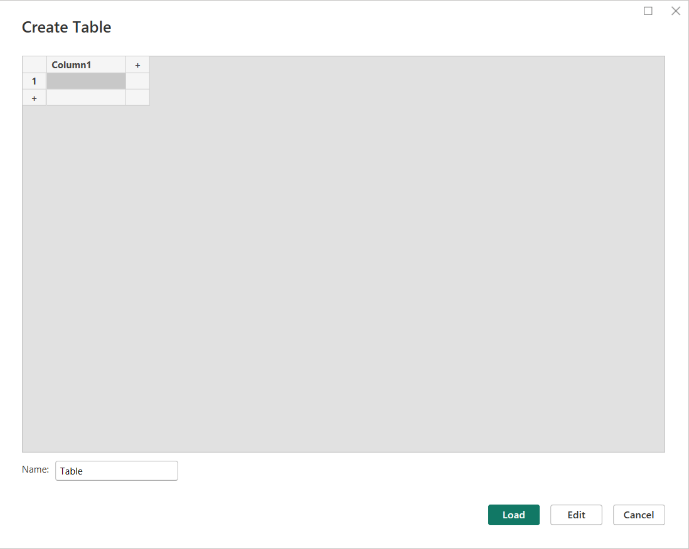
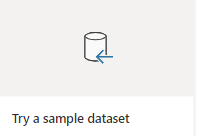
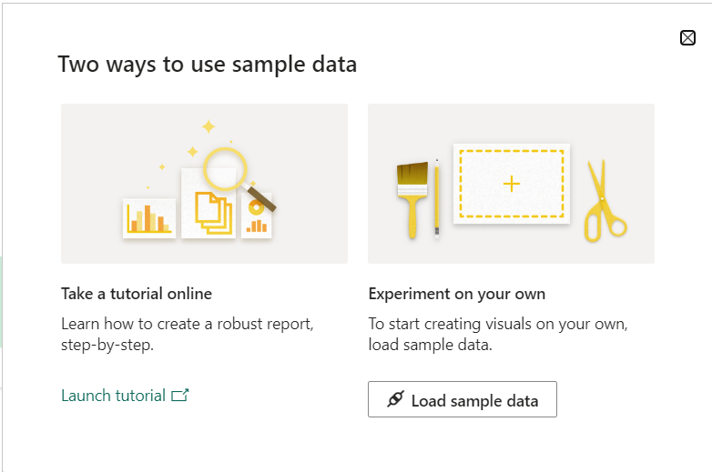

# PowerBi

Power BI es una herramienta de visualización de datos desarrollada por Microsoft. Permite a los usuarios conectarse a diversas fuentes de datos, transformar y modelar los datos, y crear informes y paneles interactivos para visualizar y analizar los datos. Power BI ofrece capacidades de análisis avanzadas, como la creación de gráficos, tablas dinámicas, mapas interactivos y cuadros de mando personalizados. También permite compartir y colaborar en informes y paneles con otros usuarios, tanto dentro como fuera de la organización. Power BI está disponible tanto como una aplicación de escritorio como en línea, lo que permite a los usuarios acceder a sus informes y paneles desde cualquier dispositivo.

# Productos

1. Power BI Desktop: Es una aplicación de escritorio gratuita que permite a los usuarios conectarse a diversas fuentes de datos, modelar y transformar los datos, y crear informes y paneles interactivos. Power BI Desktop ofrece capacidades avanzadas de análisis y visualización, como la creación de gráficos, tablas dinámicas y mapas interactivos.

2. Power BI Pro: Es una suscripción mensual que ofrece características adicionales para colaborar y compartir informes y paneles con otros usuarios. Con Power BI Pro, los usuarios pueden publicar sus informes en el servicio en línea de Power BI y compartirlos con colegas dentro de la organización. También pueden colaborar en tiempo real en informes y paneles y acceder a contenido compartido por otros usuarios.

3. Power BI Premium: Es una opción de licencia basada en capacidad que proporciona recursos dedicados para el rendimiento y la escalabilidad de Power BI. Con Power BI Premium, las organizaciones pueden compartir informes y paneles con usuarios internos y externos sin necesidad de licencias individuales de Power BI Pro. También ofrece características adicionales, como la capacidad de publicar informes paginados y ejecutar análisis avanzados con Azure Analysis Services.

4. Power BI Mobile: Es una aplicación móvil gratuita disponible para dispositivos iOS y Android. Permite a los usuarios acceder a sus informes y paneles de Power BI desde cualquier lugar y en cualquier momento, lo que les permite estar al tanto de los datos importantes mientras están en movimiento.

5. Power BI Report Server: Es una solución local que permite a las organizaciones alojar sus informes y paneles de Power BI en sus propios servidores locales. Power BI Report Server ofrece mayor control y seguridad sobre los datos, ya que los informes y paneles se mantienen dentro del entorno de la organización.

# Descargar

> Nosotros descargaremos la versión desktop para probar.

# Interfaz gráfica (Desktop)

En la zona central de la imagen anterior, podemos observar diferentes métodos de entrada de datos:
- **Import data from excel** 
    - Esta opción nos permite importar datos desde un excel. Literalmente, cargamos el excel dentro de la aplicación. Más adelante veremos como funciona
- **Import data from SQL Server** 
    - Nos permite definir una conexión hacia nuestra base de datos de SQL Server para la obtención de los datos.

- **Paste data into a blank table** 
    - Dicha opción nos permite introducir datos manuales para crear una tabla. Esto nos puede servir para pruebas manuales o introducir datos de prueba como nomencladores.

- **Try a sample dataset** 
    - Esta opción es utilizada para cargar datos de prueba dentro de nuestra aplicación. Estos datos nos permitirán probar las funcionalidades de la app.

# Interfaz gráfica (Online)

# Tips de uso
- Para importar mejor los datos, es preferible crear una tabla (definirla) en el excel primero. Así evitamos realizar muchas transformaciones en la importación.

# Desventajas de PowerBi
- A pesar de ser un buen sistema para crear reportes y gráficas, es bastante similar a un excel con menos funciones.
- Una de sus principales desventajas es la incapacidad de crear funciones por celda; por lo tanto, la función se cálculo que se cree, solo se le puede aplicar a la columna.

# Ventajas
- Es bastante bueno graficando y creando filtros de datos.
- Desde un excel puede traer información pre-calculada y almacenarla como dato estándar (sin el cálculo)