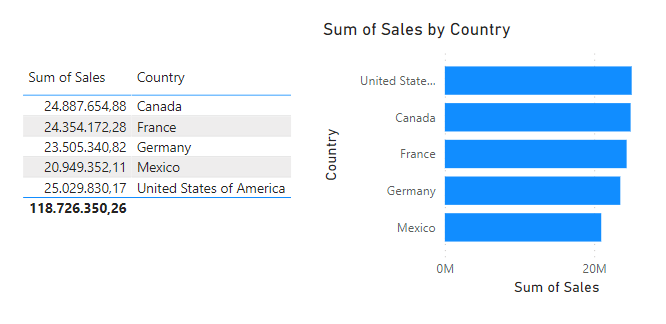

# PowerBi

Power BI es una herramienta de visualización de datos desarrollada por Microsoft. Permite a los usuarios conectarse a diversas fuentes de datos, transformar y modelar los datos, y crear informes y paneles interactivos para visualizar y analizar los datos. Power BI ofrece capacidades de análisis avanzadas, como la creación de gráficos, tablas dinámicas, mapas interactivos y cuadros de mando personalizados. También permite compartir y colaborar en informes y paneles con otros usuarios, tanto dentro como fuera de la organización. Power BI está disponible tanto como una aplicación de escritorio como en línea, lo que permite a los usuarios acceder a sus informes y paneles desde cualquier dispositivo.

# Productos

1. Power BI Desktop: Es una aplicación de escritorio gratuita que permite a los usuarios conectarse a diversas fuentes de datos, modelar y transformar los datos, y crear informes y paneles interactivos. Power BI Desktop ofrece capacidades avanzadas de análisis y visualización, como la creación de gráficos, tablas dinámicas y mapas interactivos.

2. Power BI Pro: Es una suscripción mensual que ofrece características adicionales para colaborar y compartir informes y paneles con otros usuarios. Con Power BI Pro, los usuarios pueden publicar sus informes en el servicio en línea de Power BI y compartirlos con colegas dentro de la organización. También pueden colaborar en tiempo real en informes y paneles y acceder a contenido compartido por otros usuarios.

3. Power BI Premium: Es una opción de licencia basada en capacidad que proporciona recursos dedicados para el rendimiento y la escalabilidad de Power BI. Con Power BI Premium, las organizaciones pueden compartir informes y paneles con usuarios internos y externos sin necesidad de licencias individuales de Power BI Pro. También ofrece características adicionales, como la capacidad de publicar informes paginados y ejecutar análisis avanzados con Azure Analysis Services.

4. Power BI Mobile: Es una aplicación móvil gratuita disponible para dispositivos iOS y Android. Permite a los usuarios acceder a sus informes y paneles de Power BI desde cualquier lugar y en cualquier momento, lo que les permite estar al tanto de los datos importantes mientras están en movimiento.

5. Power BI Report Server: Es una solución local que permite a las organizaciones alojar sus informes y paneles de Power BI en sus propios servidores locales. Power BI Report Server ofrece mayor control y seguridad sobre los datos, ya que los informes y paneles se mantienen dentro del entorno de la organización.

# Descargar

> Nosotros descargaremos la versión desktop para probar.

# Interfaz gráfica (Desktop)

## Zona central

En la zona central de la imagen anterior, podemos observar diferentes métodos de entrada de datos:
- **Import data from excel** 
    - Esta opción nos permite importar datos desde un excel. Literalmente, cargamos el excel dentro de la aplicación. Más adelante veremos como funciona
- **Import data from SQL Server** 
    - Nos permite definir una conexión hacia nuestra base de datos de SQL Server para la obtención de los datos.

- **Paste data into a blank table** 
    - Dicha opción nos permite introducir datos manuales para crear una tabla. Esto nos puede servir para pruebas manuales o introducir datos de prueba como nomencladores.

- **Try a sample dataset** 
    - Esta opción es utilizada para cargar datos de prueba dentro de nuestra aplicación. Estos datos nos permitirán probar las funcionalidades de la app.

## Zona derecha

Pasando de la zona central a la derecha, podemos observar una serie de iconos que representan las diferentes gráficas que podemos utilizar; entre otras funciones que veremos a continuación:

- **Filters**: La primera opción que vemos en esta zona, es la capacidad de crear filtros de datos, ya sea para la página actual o para todas las que creemos. Los filtros se basan den campos que seleccionemos del apartado **Data**. Actualmente no poseemos nada aquí, pero más adelante veremos como funciona.

- **Visualizations**: Aquí podemos ver una serie de gráficos que podemos utilizar para representar los datos de nuestra aplicación. Incluso podemos utilizar tablas para mostrarlos.

- **Data**: De este lado nos saldrán todas las tablas que hayamos importado a la app y los campos que componen la misma. Veamos un ejemplo de esta sección ya con datos:

## Zona inferior

Esta puede que sea la zona más sencilla de la aplicación. Aquí solamente encontraremos la capacidad de crear diferentes hojas de trabajo y cambiar la forma de visualizar nuestro reporte (Movil o Escritorio):

## Zona Izquierda

Este apartado nos permite cambiar entre 3 vistas diferentes: Gráfica, Tabla, Relaciones. A continuación veremos cada una de ellos; aunque la primera la vimos en el apartado anterior:

- **Vista de reporte (Report View)**
    - Esta vista nos permite ver diferentes gráficos que creemos a partir de los datos. A continuación mostramos un ejemplo, más adelante veremos diferentes gráficos:

- **Vista de tabla (Table View)**
    - Esta vista nos permite ver las tablas que hayamos importado dentro de power bi. Este apartado es un poco más complejo y lo veremos más adelante en detalle.

- **Vista de relación (Model View)**
    - Nos permite visualizar las tablas como un diagrama de base de datos, ver las relaciones entre cada uno de los modelos. Además, nos permite modificar los comportamientos entre tablas y datos de las mismas.

## Zona Superior

En esta zona tenemos la barra de herramientas. Esta nos da acceso directo a diferentes funciones dentro de la aplicación. Algunas funciones estarán deshabilitadas en dependencia en que vista estemos o que elemento tengamos seleccionado:

Estos elementos los iremos viendo según la necesidad de nuestro ejemplo. No podemos abarcar todas las funcionalidades, si lo hacemos, nunca terminaríamos este pequeño tuto.

# Interfaz gráfica (Online)

> Visual general

> Create. 

Esta opción es un poco limitada para la versión online. Por lo menos para la gratis. Los datos permitidos son importar datos de una BD o introducirlos manualmente.

> Browser

Nos permite ver reportes compartidos entre compañeros de trabajo o los creados por el usuario actual anteriormente.

> OneLake data hub

Me permite ver todos los datos que se hayan creado en la organización a la que está vinculada la cuenta.

> Apps

Nos permite agregar aplicaciones de terceros para la creación de `Dashboards`. Para agregar un `dashboard`, presionamos el botón `get app`.

> Metrics

Nos permite crear métricas para nuestro reporte. Esta funcionalidad también está disponible en la app de escritorio. Las métricas, nos permiten realizar acciones complejas que después pueden ser reutilizadas en funciones de `Power Bi`.

> Monitoring View

Nos permite visualizar los cambios sobre los datos de nuestro reporte.

# Importemos datos de una tabla

Vamos a probar ahora la importación de una tabla de excel y veremos algunos errores que pueden surgir. En algunos casos estos errores deberemos resolverlos directamente en el excel.

Comencemos seleccionando la opción de `import data from excel` y para estos datos, utilizaremos las siguientes tablas de excel:

> Sheet 1

> Sheet 2

> Sheet 3

Para importar presionamos la opción mencionada anteriormente y buscamos el archivo dentro de nuestra pc. Vean una cosa, cuando mostramos el ejemplo a usar del `sheet 1` vimos que existen datos aislados, bueno, `power bi` interpreta esos datos de la siguiente forma:

Vean como hay muchos datos null y columnas innecesarias. En algunos casos esos datos aislados pueden salir mediante cálculos de métricas, por lo que no deberían ir en la tabla a cargar.

> Recuerda que a pesar de la vista de tabla de excel, estas cargando base de datos; es decir, lo que necesitas importar son tablas lo más parecidas a una base de dato.

Presionamos el botón de `load` para cargar los datos y comenzar a trabajar o, `Transform Data` para realizar modificaciones, algo que haremos ahora, pero después de haber cargado los datos.

Con la tabla de valores nulos seleccionada:

Vamos a la barra de herramientas y en la pestaña de `Home` presionamos la opción `Transform Data`:

Al presionar esta opción, nos aparecerá una ventana con un montón de transformaciones a realizar sobre nuestra tabla:

Esta ventana está dividida en 4 partes:
- **Izquierda**: Tablas que tenemos en el proyecto.
- **Centro**: Tabla seleccionada actualmente.
- **Derecha**: Las acciones realizadas sobre la tabla. Es parecido a un historial.
- **Superior**: Barra de herramientas con todas las transformaciones.

En este caso solo mostraremos como eliminar todos los valores nulos. Lo demás lo deberemos aprender a medida que trabajemos.

Las acciones a realizar son:

- Seleccionar las columnas a utilizar.
    - Para ello vamos a la opción `Choose Columns` y desmarcamos aquellas que no queramos mostrar.
    
    
- Filtramos de la columna con más entradas nulas para que estas no aparezcan.

    
- Decirle que la ultima columna representa números. Esto lo hacemos para definir tipos de datos.

    

Una vez terminadas las transformaciones que queramos, debemos presionar la opción, de la barra de herramientas, `Close & Apply`

Terminado esto, la ventana principal intentará cargar los datos transformados y el resultado final será el siguiente:

## Vamos a conectar la sheet 1 y la sheet 3 mediante el país.

Vamos a la vista del modelo y al acceder nos llevamos una sorpresa:

Por defecto, el sistema es capaz de detectar conexiones entre diferentes `Sheets` por el nombre que posee la columna. En este caso ya el sistema detectó que tenemos dos columnas llamadas `Country` y por lo tanto deberían conectarse:

En caso que esta relación no exista, solo tenemos que arrastrar el campo que tendrá la relación sobre su contra parte en la otra tabla:

Después de creada la relación usamos las propiedades para definir el tipo de cardinalidad que tendrá:

## Vamos a añadir una columna y una medida

En Power BI, una columna se refiere a un campo de datos en una tabla o consulta que contiene valores individuales para cada fila. Las columnas se utilizan para almacenar datos específicos, como nombres, fechas, números, etc. Las columnas son estáticas y no se pueden agregar ni eliminar durante la visualización de datos.

Por otro lado, una medida (measurement) es una función que realiza cálculos sobre los datos de una columna o varias columnas. Las medidas se utilizan para resumir y analizar los datos de una manera significativa. Pueden realizar operaciones matemáticas, como sumas, promedios, conteos, etc., y también pueden incluir lógica condicional para realizar cálculos más complejos.

La principal diferencia entre una columna y una medida es que una columna almacena datos individuales para cada fila, mientras que una medida realiza cálculos sobre esos datos para resumirlos y obtener información más relevante. Además, las medidas son dinámicas y se pueden agregar o eliminar según sea necesario durante la visualización de datos en Power BI.

En la tabla `Sheet 1` vamos a crear una columna que represente el valor a ganar a partir del `Feed` de `Sheet 3` y `Price` de `Sheet 1`. Para ello nos dirigimos a la vista de `Table View`. Ahí, seleccionamos la opción `New Column` y esto nos habilitará un campo de creación de formula; el primer valor es el nombre de la columna y después del igual, podemos añadir las fórmulas.

Ahora, añadimos los siguientes valores:

`CALCULATE(CALCULATE(SUM(Sheet1[Price]) * CALCULATE(SELECTEDVALUE(Sheet3[Feed]), FILTER(Sheet3, Sheet3[Country] ==  SELECTEDVALUE(Sheet1[Country])))) / 100)`

Yo soy un novato en esto, a lo mejor existe una forma más sencilla para realizar esta operación que es sacar la ganancia a partir de un %. Vamos a explicar las funciones usadas:

- `CALCULATE`: Nos permite crear fórmulas matemáticas.
- `SUM`: Permite sumar los valores de una columna.
- `SELECTEDVALUE`: Nos ayuda a seleccionar valores de una tabla
- `FILTER`: Puede ser utilizado de forma normal o junto al calculate. Nos permite crear filtros de tablas.

> Ojo, esto puede ser más sencillo, yo estoy comenzando ahora y encontré esta forma de trabajarlo. Puede que más adelante pueda mejorar esta función.

Ahora creemos un valor medible (`measure`) para calcular la ganancia final del precio del producto más el feed:

`CALCULATE(SUM(Sheet1[Price]) + SUM(Sheet1[GAIN]))`

Para crear el `measure` podemos utilizar la barra de herramientas o con clic derecho sobre nuestro `Sheet` y creamos un `new measure`.

## Creando una gráfica

Vamos directo a la `Report View`. Y primero vamos a añadir una tabla para mostrar los datos:

Por defecto la tabla sale vacía y queda de nuestra parte construir los datos. Ojo, la tabla se va construyendo según seleccionemos las columnas, por lo tanto, es posible que existan agrupaciones dentro de la tabla:

En el apartado `columns` vamos agregando cada una de las columnas que queramos. Incluso podemos añadir datos de otra tabla. Veamos un ejemplo quitando la columna `Product` y otro con esa columna para que vean lo que les digo.

> Sin `product`

> Con `product`

> Agregando Country y Feed de `Sheet 3`

Vamos a agregar un gráfico de barra:

Como podemos ver el gráfico es bastante complejo. Por el eje de las X seleccionamos la columna `Country` para dividir los datos que vamos a mostrar. Para mostrar (eje y) seleccionamos el valor calculado `Measure` y como leyenda los productos de la tabla.

Bastante sencillo no??

# Salvar los datos

Primero vamos a salvarlo en formato `pbix` mediante el botón `publish` para poder compartirlo con otros trabajadores o simplemente realizar una salva del proyecto para posteriormente volverlo a cargar:

O podemos simplemente exportarlo a PDF mediante `File` -> `Export` -> `PDF`.

# Tips de uso
- Para importar mejor los datos, es preferible crear una tabla (definirla) en el excel primero. Así evitamos realizar muchas transformaciones en la importación.

# Desventajas de PowerBi
- A pesar de ser un buen sistema para crear reportes y gráficas, es bastante similar a un excel con menos funciones.
- Una de sus principales desventajas es la incapacidad de crear funciones por celda; por lo tanto, la función se cálculo que se cree, solo se le puede aplicar a la columna.
- La carga de datos debe realizarse en forma de tabla, por lo que datos aislados no se deben tener en cuenta para su carga.

# Ventajas
- Es bastante bueno graficando y creando filtros de datos.
- Desde un excel puede traer información pre-calculada y almacenarla como dato estándar (sin el cálculo)
- Las tablas a mostrar en el reporte de forma automática agrupa por resultados.

# Ventaja no muy ventajosa
- Aunque arriba dijimos que no podemos trabajar directamente con las celdas. En parte esto es mentira, pero solo en parte. Es posible mediante el uso de `DAX`. Pero esto es muy complejo para personas que recién comiencen a trabajar con esta herramienta. 
