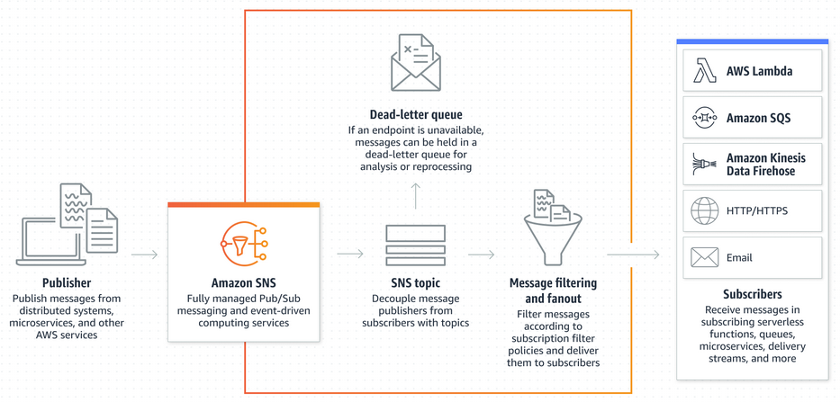
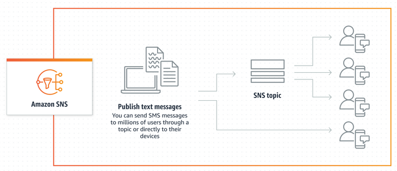
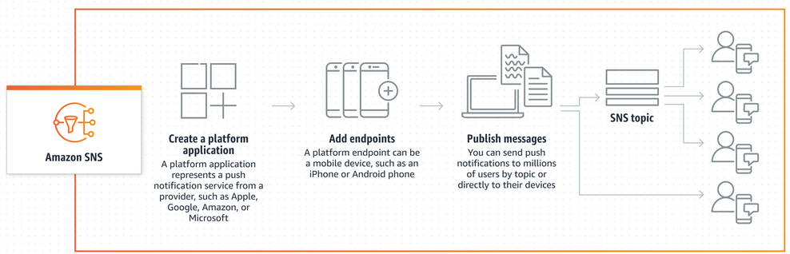

# AWS SNS

Amazon SNS (Amazon Simple Notification Service) es un servicio de mensajería y notificaciones en la nube ofrecido por Amazon Web Services (AWS). Permite a los desarrolladores enviar mensajes a través de diferentes canales, como correo electrónico, SMS, notificaciones push y mensajes de texto a dispositivos móviles.

Amazon SNS proporciona una forma fácil de enviar notificaciones a usuarios o suscriptores en tiempo real. Los desarrolladores pueden utilizarlo para enviar alertas, actualizaciones de estado, notificaciones de eventos y otros mensajes importantes a sus usuarios.

Este sistema de amazon funciona de dos formas, A2A o A2P. El primero hace referencia a la conexión `app to app` y nos permite comunicarnos con el `SQS` (Simple Queue Service). Su función principal es posee una estructura publicador - suscriptor entre los diferentes lambdas que tengamos creados. La segunda forma es A2P o app to peer. Este funciona como un sistema de mensajería estándar, tenemos una serie de clientes que queremos enviarles mensajes cada cierto tiempo o para enviarnos notificaciones de errores.

Veamos de forma gráfica como amazon nos explica este tipo de interacción:

- Estructura `publicador/suscriptor` o A2A



- A2P (SMS)



- A2P (Mobile push)



> Este último utiliza los software de notificación del teléfono para hacer llegar el mensaje.

# Comencemos

Para este tomaremos de base de estudio un proyecto ya creado y que utiliza esta tecnología de aws. Más adelante, pondremos un ejemplo propio y lo probaremos. Pero comencemos carroñando un poco de código en internet para ver como funciona esta parte de AWS.

> Proyecto para el estudio:
> https://github.com/adnanrahic/lambda-sns-dlq-error-handling/blob/master/serverless.yml
>
> Sitio web donde se explica el funcionamiento general
> https://aws.plainenglish.io/serverless-with-aws-triggering-lambda-with-sns-messaging-b262a2ccb841

## De que va esto

El proyecto es algo sencillo, posee una función inicial que recibe un número por una petición post. Este es el único endpoint disponible dentro de nuestra app. Las otras dos funciones declaradas en el `serverless.yml` serán ejecutadas mediante la cola de eventos. Si, amazon nos permite utilizar una cola de eventos mediante `SQS`.

Todas las funciones que serán utilizadas mediante la cola de mensajes serán asíncronas. La asincronizidad nos permitirá la ejecución no bloqueante de código en nuestro backend (`serverless`). Otro tema que indica el sitio es la diferencia entre utilizar el `invoke lambda` y el `SQS`. El primero debe utilizarse mayormente en llamadas no asíncronas y en funciones que necesiten esperar por la respuesta de otra (no es que se rompa el sistema por usar esto en funciones asíncronas, pero es considerado un anti patrón). El segundo es más utilizados en comunicación entre funciones asíncronas y que no necesitas esperar por un resultado para poder seguir trabajando.

Bueno, seguimos. La función principal desencadenará el cálculo de un factorial mediante un evento hacia una cola en `SQS`. La función de calculo se encargará de la lógica del negocio y creará logs en `cloudwatch` para posteriormente revisarlos. En caso que exista algún error en el proceso, el sistema utilizará una segunda cola para el proceso de logs y manejo de errores. 

> El autor indica que el uso del `SQS` para el manejo de errores es una buena práctica.
>
> Ojo, eso lo dice el autor, queda a consideración del programador si seguir esta indicación o no.

## Muéstrame el código

Dejando ya la introducción a este documento, comencemos viendo el código propuesto; iniciemos por nuestro archivo `serverless.yml`:

> El código en el repo de github posee la dependencia `serverless-pseudo-parameters` ya depreciada. Debido a esto hicimos algunos cambios para evitar problemas. Si te preguntas que hacía esta librería, te decimos que brindaba acceso rápido a variables propias de aws como la `region` o el `accountId`. Hoy día estas variables ya vienen directamente incrustadas en serverless, por lo que se hace innecesario el uso de este plugin.

```yml
service: lambda-sns-dlq-error-handling

custom:
  secrets: ${file(secrets.json)}

plugins:
  - serverless
  - serverless-offline

provider:
  name: aws
  runtime: nodejs8.10
  stage: dev
  region: eu-central-1
  profile: ${self:custom.secrets.profile, 'dev'}
  memorySize: 128
  environment:
    accountId: '${aws:accountId}'
    region: ${self:provider.region}
  iamRoleStatements:
    - Effect: "Allow"
      Resource: "*"
      Action:
        - "sns:*"

functions:
  init:
    handler: init.handler
    events:
      - http:
          path: init
          method: post
          cors: true
  calculate:
    handler: calculate.handler
    events:
      - sns: calculate-topic
    onError: arn:aws:sns:${aws:region}:${aws:accountId}:dlq-topic
  error:
    handler: error.handler
    events:
      - sns: dlq-topic
```

Destripemos un poco el `yml`:

1. Datos base

```yml
service: lambda-sns-dlq-error-handling

custom:
  secrets: ${file(secrets.json)}

plugins:
  - serverless
  - serverless-offline
```

Estos datos son básicos en un archivo yml. El primero (`service`) es el nombre de nuestro servicio de aws. El segundo (`custom`), nos permite definir propiedades personalizables dentro de nuestro archivo de `serverless`; en este caso estamos cargando un archivo en formato `json` con datos importantes para el negocio. El último, pero no menos importantes son los `plugins` que instalemos dentro de nuestra app.

2. Proveedores

```yml
provider:
  name: aws
  runtime: nodejs8.10
  stage: dev
  region: eu-central-1
  profile: ${self:custom.secrets.profile, 'dev'}
  memorySize: 128
  environment:
    accountId: '${aws:accountId}'
    region: ${self:provider.region}
  iamRoleStatements:
    - Effect: "Allow"
      Resource: "*"
      Action:
        - "sns:*"
```

De la misma forma que mencionamos anteriormente, las 5 primeras propiedades del apartado `provider` son estándar en nuestras aplicaciones `serverless`. Seguimos con `memorySize`, que nos permite definir un tamaño de memoria global para nuestras funciones `lambda`. `Environment` permite crear variables de entornos para utilizar en nuestro código o dentro del archivo `yml`.

Por último tenemos el `iamRoleStatements`. Este posee un papel muy importante dentro de `aws` ya que define que permisos debe tener nuestra app para poder ejecutarse. En este caso estamos definiendo que la acción a realizar es permitir (`allow`), el acceso a los recursos globales que provea la acción a realizar y por último, definimos las acciones que podemos realizar con el rol requerido. En este caso utilizamos `sns:*`, donde `sns` define el servicio `aws` a utilizar en nuestra app y el `*` es un comodín que define `todos`; en este caso, los subservicios disponibles.

3. Funciones

```yml
functions:
  init:
    handler: init.handler
    events:
      - http:
          path: init
          method: post
          cors: true
  calculate:
    handler: calculate.handler
    events:
      - sns: calculate-topic
    onError: arn:aws:sns:${aws:region}:${aws:accountId}:dlq-topic
  error:
    handler: error.handler
    events:
      - sns: dlq-topic
```

El proceso de crear funciones es bastante sencillo. Si todavía no sabes como funciona, te invito a ver el tutorial sobre [Serverless](https://github.com/BadiaValdes/docs/blob/doc/nodeJs/serverless.md). Saltemos para el elefante rosa que salta a la vista. Los eventos de las dos últimas funciones no son HTTP!. Pues si, no todos los eventos deben ser http y no todas las funciones declaradas poseerán eventos. Pero vamos al grano, el evento que estamos utilizando es el `SNS`. La función lambda `calculate`, será ejecutada después que un mensaje del `SNS` sea emitido. Cuál mensaje? te estarás preguntando, pues el que se le define al costado. En este caso hablamos del `calculate-topic`. Es decir, la función calculate, solo se ejecutará cuando el `SNS` de `AWS` envíe un mensaje con el título `calculate-topic` a la cola de mensajes de `SQS`.

Este mismo comportamiento puede ser visto en la función error que aparece debajo. Pero fijémonos un momento en el `onError` de `calculate`. Este no llama a una función, sino a una cadena de texto bastante larga. Esto es debido a que también podemos enviar mensajes directamente dentro de nuestro archivo `yml`. Para enviar un mensaje mediante SNS debemos seguir la siguiente estructura:
- **ARN**: `arn:aws:sns`
- **Region**: `:${aws:region}`
- **AccountId**: `:${aws:accountId}`
- **Topic**: `:dlq-topic` -> Título del mensaje.

El cuerpo del mensaje a enviar es manejado por `AWS` que en este caso es el error que se envíe desde `calculate`.

Sabiendo esto, debes preguntarte (o puede que no), ¿cómo creo las colas de mensaje para `SNS`? La respuesta más sencilla es no, no debes crearlas. Si quieres indagar un poco más, te diré que `AWS` crear en tiempo de `despliegue` las colas que declaremos en los eventos del `API Gateway`.

Terminado nuestro archivo `serverless.yml` podemos dar paso a las funciones.

## Funciones

Comencemos por el principio, la función encargada de desencadenar todo el proceso `init.js`:

```js
'use strict'

const aws = require('aws-sdk')
const sns = new aws.SNS({ region: 'eu-central-1' })

function generateResponse (code, payload) {
  console.log(payload)
  return {
    statusCode: code,
    body: JSON.stringify(payload)
  }
}
function generateError (code, err) {
  console.error(err)
  return generateResponse(code, {
    message: err.message
  })
}
async function publishSnsTopic (data) {
  const params = {
    Message: JSON.stringify(data),
    TopicArn: `arn:aws:sns:${process.env.region}:${process.env.accountId}:calculate-topic`
  }
  return sns.publish(params).promise()
}

module.exports.handler = async (event) => {
  const data = JSON.parse(event.body)
  if (typeof data.number !== 'number') {
    return generateError(400, new Error('Invalid number.'))
  }

  try {
    const metadata = await publishSnsTopic(data)
    return generateResponse(200, {
      message: 'Successfully added the calculation.',
      data: metadata
    })
  } catch (err) {
    return generateError(500, new Error('Couldn\'t add the calculation due an internal error. Please try again later.'))
  }
}
```

Bastantes funciones verdad, pues no teman, la mayoría son funciones `auxiliares`, solo la última, llamada `handler`, es la que se encarga de enviar el mensaje. Pero expliquemos cada una de las funciones e importaciones, es más divertido de esta forma:

1. Imports

```js
const aws = require('aws-sdk')
const sns = new aws.SNS({ region: 'eu-central-1' })
```

La primera línea de código en el fragmento anterior es la más importante. `aws-sdk` es una colección de herramientas de `aws` que nos da acceso a una serie de funcionalidades dentro del ecosistema. En este caso estaremos utilizando la funcionalidad SNS (`aws.SNS`); su objetivo es proveernos acceso a todas las funcionalidades que podemos `realizar` en el SNS de aws. Al crear la instancia de esta clase, debemos pasar una serie de propiedades para su creación; en general ninguna es requerida, pero siempre es bueno que definas las región donde estés trabajando.

> `aws-sdk` es un all in one tools y por lo tanto, posee funciones que no son necesarias para el proyecto, por lo que puede conllevar a un aumento en el espacio requerido. En ejemplos anteriores, hemos utilizado `aws-sdk`, pero importando solamente lo que necesitemos. Si quieres usar este acercamiento, deberás instalar:
> `npm install @aws-sdk/client-sns`
>
> Configuración:
> 
> ```js
>   const { SNSClient, ListTopicsCommand } = require("@aws-sdk/client-sns");
>   const client = new SNSClient({ region: "REGION" });
> ```
>
> Esta es la librería que usaremos en nuestro propio ejemplo al final de este documento.

2. Funciones generadores

```js
function generateResponse (code, payload) {
  console.log(payload)
  return {
    statusCode: code,
    body: JSON.stringify(payload)
  }
}
function generateError (code, err) {
  console.error(err)
  return generateResponse(code, {
    message: err.message
  })
}
```
Este grupo de funciones quise llamarlas así debido a que su único objetivo es tomar un `payload` o datos de entrada y crear una respuesta estructurada. De esta forma, `aws` podrá devolvernos de forma correcta nuestro resultado final. Pues ya, más nada que ver aquí, pasemos a la siguiente función.

3. Publicando el mensaje

```js
async function publishSnsTopic (data) {
  const params = {
    Message: JSON.stringify(data),
    TopicArn: `arn:aws:sns:${process.env.region}:${process.env.accountId}:calculate-topic`
  }
  return sns.publish(params).promise()
}
```

Esta función es la encargada de enviar el mensaje. Si, esta es la encargada de enviar un mensaje al `SNS` de `aws`. Como se puede observar, es una función bastante sencilla, se crea un parámetro con los datos a utilizar y mediante la instancia de `SNS` creada al inicio del script, publicamos nuestro mensaje. 

Veamos la estructura de params:
- **Message**: Define el cuerpo del mensaje a enviar. Por aquí pasaremos los datos a utilizar dentro de nuestra otra función.
- **TopicArn**: Introducimos el `arn` de `aws` que apunte al título de la cola de mensajes `SQS` creado; en este caso `calculate-topic`. La estructura general es idéntica a la vista en `serverless.yml`, pero mejor repetirnos que olvidarnos:
    - **ARN**: `arn:aws:sns`
    - **Region**: `:${process.env.region}` -> Variable de entorno. Declarada en serverless.yml.
    - **AccountId**: `:${process.env.accountId}` -> Variable de entorno. Declarada en serverless.yml.
    - **Topic**: `:dlq-topic` -> Título del mensaje.

> Para acceder a las variables de entorno utilizamos le prefijos `process.env` y terminamos con el nombre de la variable a capturar.

> Para realizar el la publicación de nuestro mensaje con la alternativa mostrada anteriormente, podemos utilizar los siguientes scripts:
>
> ```js
> import { SNSClient, PublishCommand } from "@aws-sdk/client-sns";
> // ...
> const command = new PublishCommand(input);
> const response = await client.send(command);
> ```
> 
> El valor de input depende de lo que quieras hacer. Para más información, vea https://docs.aws.amazon.com/AWSJavaScriptSDK/v3/latest/clients/client-sns/classes/publishcommand.html

4. Función principal

```js
module.exports.handler = async (event) => {
  const data = JSON.parse(event.body)
  if (typeof data.number !== 'number') {
    return generateError(400, new Error('Invalid number.'))
  }

  try {
    const metadata = await publishSnsTopic(data)
    return generateResponse(200, {
      message: 'Successfully added the calculation.',
      data: metadata
    })
  } catch (err) {
    return generateError(500, new Error('Couldn\'t add the calculation due an internal error. Please try again later.'))
  }
}
```

Como el nombre en este punto indica, esta es la función encargada de desatar el caos dentro de nuestra aplicación. A grandes rasgos es una función normal de `aws`. Posee una primera validación para mostrar un error si el valor pasado desde el front no es un número y posteriormente se encarga de realizar el proceso de publicación. Como no sabemos si el proceso dará error o no, debemos envolverlo dentro de un `try - catch`. El sistema espera por la respuesta de nuestro publicador mediante el `await` y devuelve el resultado final dentro de la variable metadata.

> Si. Podemos usar el `await` para esperar por las respuestas de las acciones asíncronas. Es casi como convertir una función que debería ejecutarse de forma asíncrona y convertirla en síncrona. No, no es una mala práctica, simplemente debemos tener una forma de mostrar los datos de funciones que llamen a promesas.

Pasemos a ver los otros dos archivos que faltan.

## Los destinatarios

- `Calculate.js`

```js
'use strict'

module.exports.handler = async (event) => {
  const { number } = JSON.parse(event.Records[0].Sns.Message)
  const factorial = (x) => x === 0 ? 1 : x * factorial(x - 1)
  const result = factorial(number)

  console.log(`The factorial of ${number} is ${result}.`)
  return result
}
```

- `Error.js`

```js
'use strict'

module.exports.handler = async (event) => {
  console.error(event)
}
```

Si, los dos archivos no son la gran cosa, pero que esperaban, algo muy complicado. El segundo casi ni tenemos que explicarlo, su única línea de código nos dice todo lo que queremos saber. Y el primero casi grita por si mismo, solo tenemos una línea de código que es nueva para nosotros:

`const { number } = JSON.parse(event.Records[0].Sns.Message)`

Como ya sabemos, todas las funciones lambda reciben como parámetro una variable llamada evento, dicha variable posee todos los datos necesarios para trabajar como es el `body`, `header`, etc. En este caso estamos accediendo a una variable (arreglo) llamada `Records`. Dentro de dicha variable encontraremos datos como nuestro mensaje. La propiedad `Sns` de la variable `Record` posee todos los datos del mensaje enviado y en este pedazo de código; específicamente, estamos accediendo al cuerpo del mensaje mediante la propiedad `Message`.

Pues ya, esto esto es todo, así de fácil es utilizar el SNS de `aws` para la comunicación entre las lambdas. El creador del post, utiliza la herramienta [Dashbird](https://dashbird.io/register/) para dar seguimiento a la ejecución de los lambdas. De esta forma, puede observar en que escenarios da error y donde es que estos suceden.

## Mientras más mejor.

En todo lo  visto anteriormente, intentamos explicar la forma de utilizar `SNS` para la comunicación entre diferentes funciones `lambdas`. Ahora queremos ir un paso más lejos y enviar correos electrónicos mediante `SES` (simple email service). Para ello vea el documento [SES.md](./ses.md)

# Nuestro ejemplo 