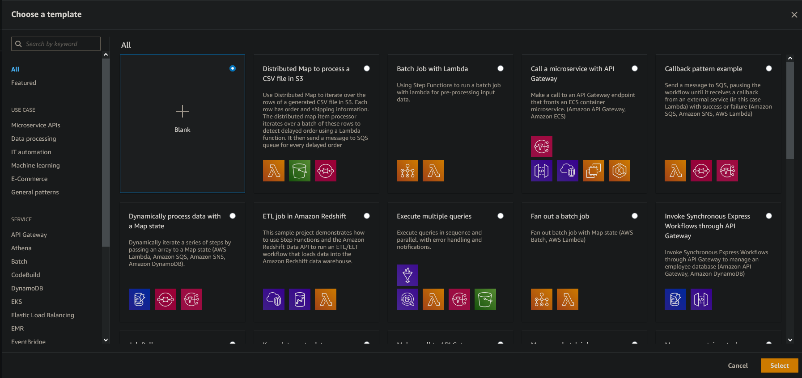
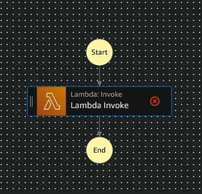
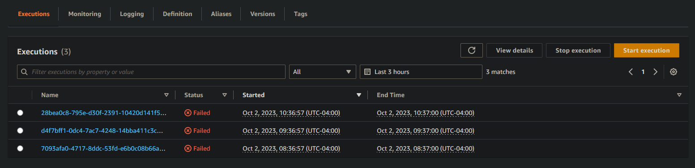
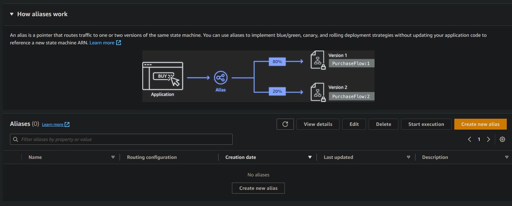
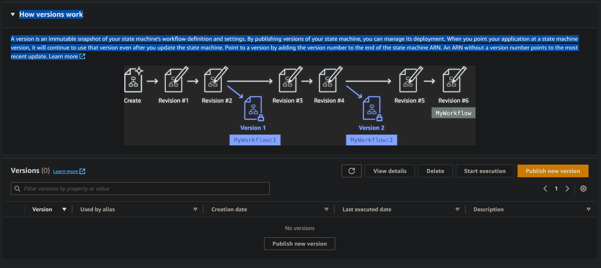

# Step Functions

> Para este tutorial se asume que posee conocimiento basico de aws. Si desea comenzar a aprender desde cero, puede ver el tutorial [Serverless](https://github.com/BadiaValdes/docs/blob/doc/nodeJs/serverless.md)

Las Step Functions en AWS son un servicio de orquestación de flujo de trabajo sin servidor que permite coordinar y secuenciar múltiples servicios de AWS, así como también servicios externos, para crear aplicaciones escalables y resilientes. 

Estas funciones permiten definir y ejecutar fácilmente flujos de trabajo que constan de múltiples pasos o tareas, donde cada paso puede ser una función de Lambda, un contenedor de Docker, una tarea ECS (Elastic Container Service), un proceso EMR (Elastic MapReduce), entre otros servicios.

Además, las Step Functions ofrecen características como la capacidad de agregar lógica condicional, manejar errores y reintentar automáticamente pasos fallidos, lo que facilita la creación de flujos de trabajo complejos y robustos.

En resumen, las Step Functions en AWS brindan una forma sencilla y eficiente de orquestar y administrar flujos de trabajo con múltiples pasos y servicios, permitiendo crear aplicaciones escalables y resilientes.

# Acceder

Comencemos accediendo a nuestra consola de aws:

Dentro podemos ver varios apartados encargados de mostrarnos información sobre nuestra cuenta; ya sean datos de nuestras aplicaciones, el costo y uso de nuestras aplicaciones o aplicaciones ejecutadas recientemente. Exactamente en ese punto, veremos las aplicaciones que hemos utilizado, los que nos permitirá un acceso directo para la próxima vez que accedamos a nuestra consola:

En caso que no tengamos el acceso directo de las step functions, podemos dirigirnos al campo de búsqueda y escribir `Step Functions`:

Accedemos al resultado que posee el nombre de `Step Functions` y nuestra consola nos redirigirá al apartado de creaciones de este tipo de funciones:

En el medio de la consola podemos ver todas las step functions que se han creado hasta el momento:

Conociendo la distribución básica, podemos pasar a crear una step function para nuestro proyecto.

# Creando

Para crear una `Step Function` o `State Machine` podemos presionar en el botón `create state machine`:

Al presionar sobre el mismo, AWS nos preguntará que plantilla queremos utilizar para la creación de nuestra función:

En nuestro caso usaremos la primera opción (`Blanck` o `Vacia`). Una vez seleccionada la plantilla a utilizar, presionamos el botón select en la esquina inferior derecha. Esta acción nos mostrará un panel donde podremos realizar el diseño visual de nuestra `step function`:

## Trabajando con la gui

Vamos a ver las diferentes partes que componen la interfáz de creación de `Step functions`:

- Parte superior

Aquí encontraremos:

1. El nombre de nuestra función:

> Si presionamos el icono del lapiz, podemos cambiar el nombre de nuestra función.

1. Modos de trabajo

Aquí dentro podemos cambiar entre dos modos de trabajo y ver la configuración de nuestra función. Los modos de trabajo se dividen en `Design` o `Diseño` y `Code` o `Código`. El primero es el que aparece por defecto cuando accedemos al apartado de `Step Functions`, mientras que el segundo es una división entre la parte visual y el código generado hasta el momento:

El tercer modo es de configuración. Nos permite modificar algunos valores como el nombre (visto anteriormente) entre otros como:
- Tipo de maquina de estado `Type`.
- Permisos disponibles para la función `Permission` (Sin esto configurado correctamente, la función no se ejecutará)
- Los logs. En este caso definimos el nivel de los logs que queremos enviar el cloud watch.
- Información adicional como tags.

Este es un ejemplo de configuración de una step function fincional:

1. Por último tenemos el estado actual de nuestra función. Cancelar o crear la función para terminar procedimiento y mediante el botón de acciones podemos exportar nuestra step function.

- Zona izquierda (Componentes)

En esta zona podemos encontrar todos los componentes para la creación de nuestras maquinas de estado. Al inicio de esta sección veremos un apartado llamado `Most Popular` donde encontraremos componentes como `lambda` para invocar nuestras funciones.

- Zona Central

Vista anteriormente, esta zona es la encargada de mostrarnos como va quedando nuestra `Step function` de forma visual. En un inicio solo posee el estado de **inicio** y **final**. Si queremos añadir un componente, seleccionamos de la **zona** **izquierda** (en este caso lambda) y la arrastramos a algun espacio libre dentro del flujo:

> El primer componente que pongamos en el flujo será nuestro estado inicial.

- Zona Derecha

En este lugar encontraremos las configuraciones de nuestros componentes. Por ejempolo, veamos como configurar nuestro componente `lambda`:

Entre las diferentes configuraciones de nuestro `lambda` tenemos:

1. `Configuración` o `Configuration`

Aquí veremos las configuraciones propias de nuestro lambda. En este apartado podemos cambiar:
- `Name`: nombre de nuestra lambda
- `Integration type`: Podemos seleccionar entre:
    - `Optimized`: Optimiza cada llamada de nuestras funciones para enviar la información necesaria.
    - `AWS SDK`: Esto hace que cada llamada hacia el lambda sea similar a una llamada HTTP con los headers y todo.
- `Api parameters`: Nos permitirá configurar todas los parámetros funcionales de nuestra lambda:
    - `Function name`: Aquí seleccionaremos la función a utilizar. Podemos seleccionarla de forma dinámica o utilizar la función `Enter name` y agregar el nombre de forma manual. Un ejemplo es: `arn:aws:lambda:eu-west-1:178934116267:function:aws-node-dynamodb-team-1-dev-hello`. Sin importar que seleccionemos, debajo aparecerá un botón que nos permitirá ir a la función que seleccionemos .
    
    - `Payload`: Nos permite definir los datos de entrada que serán utilizados por la función. Existen 3 posibilidades dentro de esta opción. 
        - `Use state input as payload`: Utilizar los datos que provengan de la maquina de estado (estado anterior) como datos de entrada.
        - `Enter payload`: Puedes definir los datos de entrada de la función.
        - `No payload`: No utilizará datos de entrada para trabajar.
    - `Additional Configuration`: En este apartado encontraremos configuraciones adicionales que se pueden aplicar sobre nuestro lambda:
        - `Wait for callback`: Nos permite decidir si la función actual espera por la invocación desde una función externa.
        - `IAM role for cross-account access`: Podemos asignar un rol secundario para acceder a recursos compartidos.
        - `Next State`: Definimos el estado a continuación de nuestro componente actual.

1. `Input` o `Entrada`

En este apartado, podemos filtrar los datos de entrada que provengan de los estados anteriores o mejor dicho, del estado anterior.

1. `Output` o `Salida`

Similar al anterior, pero en este caso podemos filtrar los datos de salida de nuestro componente acutal.

1. `Error Handling` o `Manejador de errores`

Este nos permite definir la forma de manejar los errores dentro de nuestra función. Podemos cambiar desde las cantidad de veces que podemos repetir la misma función si falla, capturar errores hasta definir el `time out` de nuestra función.

Veamos un ejemplo con un poco más de funciones dentro de nuestro estado:

Uno mucho más complejo puede ser:

## Terminando

Una vez que tengamos nuestra `step function` ya creada, podemos presionar el botón crear.

# Probar nuestra Step Function

> Para este ejemplo usaremos una step function creada por el equipo de estudio `TEAM 1`.

Una vez creado volvemos a listado de step functions. 

Mediante el campo de búsqueda arriba del listado de `step functions`, podemos introducir el nombre de nuestro `lambda` para acceder a los detalles:

Dentro podemos encontrar:

- Información general

- Acciones

1. `Edit` o `Editar`: Nos permite volver a la pantalla de diseño de las `Step functions`
1. `Actions` o `Acciones`: De manera similar al vsito anteriormente, podemos seleccionar como exportar nuestra `step function`
1. `Start Execution` o `Iniciar ejecución`: Nos permite ejecutar nuestra función.

Si presionamos esta útlima opción, nos aparece la siguiente ventana:

Dentro, podemos definir el nombre de nuesta ejecución (para identificarla). Si queremos que la fución se ejecute de forma sincrona o asíncrona y por último los datos de entrada para nuestra `Step function`. Presionamos `Start function` y pasaremos a una nueva ventana donde se nos mostrará la ejecución de nuestra función (Resultado e información adicional):

- Información específica:

Dentro de las informaciones específicas de nuestra `Step function` tenemos los siguientes `tabs`:

1. `Execution`: Vista en la imagen anterior, nos brinda información de las ejecuciones de nuestra función.
2. `Monitoring`: Nos permite ver métricas sobre nuestra `Step function`. Las métricas varian entre cantidad de veces ejecutadas hasta cuantas veces se ejecutó de forma satisfactoria.

3. `Logging`: Nos permite ver todos los logs generados por las funciones dentro de `Step Function`

4. `Definition`: Nos permite ver de forma sencilla el código y el grafo de nuestra `Step function`

5. `Alias`: Permite crear nombres que apunten a diferentes versiones una una step function.

6. `Versions`: Permite crear versiones de una step function.

7. `Tags`: Nos permite asiganar etiquetas a nuestras `Step functions` para poseer un acceso y filtrado rápido.
