<style>
/* Enable smooth scrolling */
@media screen and (prefers-reduced-motion: no-preference) {
  html {
    scroll-behavior: smooth;
  }
}

/* Style the button */
.top-link {
  transition:       all .25s ease-in-out;
  position:         fixed;
  bottom:           0;
  right:            0;
  display:          inline-flex;
  color:            #000000;
  cursor:           pointer;
  align-items:      center;
  justify-content:  center;
  margin:           0 2em 2em 0;
  border-radius:    50%;
  padding:          .25em;
  width:            1em;
  height:           1em;
  background-color: #F8F8F8;
}
</style>

<a class="top-link hide" href="#curso-de-serverless">↑</a>

# Curso de serverless

1. [Qué es serverless?](#qué-es-serverless)
1. [Qué debemos instalar?](#qué-debemos-instalar)
1. [Creando un proyecto](#creando-un-proyecto)
1. [Iniciando nuestro proyecto](#iniciando-nuestro-proyecto)
1. [Estructura del proyecto](#estructura-del-proyecto)
1. [Estructura de serverless.yml](#estructura-de-serverlessyml)
1. [Estructura de un método básico](#estructura-de-un-método-básico)
1. [Como iniciar nuestra app](#como-iniciar-nuestra-app)
1. [Agreguemos nuevos endpoints](#agreguemos-nuevos-endpoints)
1. [Serverless con dynamo](#serverless-con-dynamo)
1. [Utilizando dynamoDb en código](#utilizando-dynamodb-en-código)
1. [Encadenando llamadas](#encadenando-llamadas)
1. [Middlewares y manejo de errores](#middlewares-y-manejo-de-errores)
1. [Logs](#logs)
1. [Comandos](#comandos)
1. [Proyectos de interes](#proyectos-de-interes)
1. [Bibliografia](#bibliografia)
1. [Errors](#errors)
    1. [Error 1](#error-01)
    1. [Error 2](#error-02)
    1. [Error 3](#error-03)
    1. [Error 4](#error-04)
    1. [Error 5](#error-05)
1. [Estructura de la variable event (Llamada http)](#estructura-de-la-variable-event-llamada-http)
1. [Codigo alternativo](#codigo-alternativo)
    1. [Update variante 1](#update-item-1)
    1. [Update variante 2](#update-item-2)

## Qué es serverless?

Serverless es un modelo de computación en la nube en el que el proveedor de la nube se encarga de aprovisionar y gestionar los servidores, y el cliente sólo paga por el tiempo de uso. Esto significa que los desarrolladores no tienen que preocuparse por la infraestructura subyacente, y pueden centrarse en escribir código.

## Qué debemos instalar?
- Nodejs (https://nodejs.org/en/download)
- (Recomendado) nvm --> Control de versiones de node
    - (windows) https://github.com/coreybutler/nvm-windows
    - (Linux) https://github.com/nvm-sh/nvm
    - (mac) https://tecadmin.net/install-nvm-macos-with-homebrew/
- serverles
  - `npm install -g serverless`

## Creando un proyecto

> Hace falta vpn para poder realizar esta acción.

Comenzamos abriendo la consola de comando ya sea global o en el directorio en que nos encontremos parados. Una vez abierta, introducimos el comando perteneciente a serverless (`sls` o `serverless`):

- Escribimos uno de los dos comandos de arriba:
```bash
C:\Users\Samu\Documents\mio\proyectos\node_js\serverless>sls
```
- Presionamos enter y nos saldrán los diferentes proyectos que podemos utilizar:
```bash
? What do you want to make? (Use arrow keys)
> AWS - Node.js - Starter
  AWS - Node.js - HTTP API
  AWS - Node.js - Scheduled Task
  AWS - Node.js - SQS Worker
  AWS - Node.js - Express API
  AWS - Node.js - Express API with DynamoDB
  AWS - Python - Starter
  AWS - Python - HTTP API
  AWS - Python - Scheduled Task
  AWS - Python - SQS Worker
  AWS - Python - Flask API
  AWS - Python - Flask API with DynamoDB
  Other
```
- En nuestro caso seleccionamos el primero y presionamos enter. El próximo paso es introducir el nombre de nuestra app:
```bash
? What do you want to call this project? test-project
```
- Introducimos el nombre y esperamos que se descargue nuestro proyecto:
```bash
┬ Downloading "aws-node" template
```
- Con la instalación terminada nos pedirá si queremos acceder al serverless dashboard. Nosotros decidimos que no.
```bash
? Do you want to login/register to Serverless Dashboard? (Y/n)
```
- Por último, preguntará si queremos utilizar nuestras credenciales de AWS. En este caso seleccionamos `Skip`
  - Esta petición solo sale si no tenemos configurada una cuenta de aws en el pc (`aws config`). En mi caso tengo una cuenta dummy creada en el pc por lo que se me hace la siguiente pregunta:
```bash
? Do you want to deploy now? (Y/n) n
```

## Iniciando nuestro proyecto

Accedemos mediante consola al proyecto acabado de crear:

> `cd ./test-project`

Y una vez dentro, instalamos la dependencia `serverless-offline` que nos permitirá realizar pruebas locales

- npm
    - `npm install serverless-offline --dev-save`
- yarn
    - `yarn add serverless-offline -D`

## Estructura del proyecto
Casi todas las aplicaciones que creemos tendrán una estructura similar a la que se mostrará a continuación (archivos principales):

```    
> test-app
    > index.js --> Almacena los códigos de la app
    > serverless.yml --> Configuración de serverless.
```

## Estructura de serverless.yml

```yml
service: serverless-api-project
frameworkVersion: '3'

provider: # Proveedor del servicio/ donde lo vamos a almacenar
  name: aws
  runtime: nodejs18.x

# Tenemos que agregar esto
plugins: # Todos los plugins que utilicemos se deben añadir en esta sección
 - serverless-offline

functions: # las funciones de acceso a nuestra app. Esto funciona como una especie de Gateway
  api: # Nombre de la función del api gateway
    handler: index.handler # Encargado de manejar la petición
    events: # Eventos esperados
      - httpApi: # Evento tipo http (Accediendo a la función mediante una llamada http)
          path: / # Path o dirección url de acceso a la función
          method: get # Tipo de petición a realizar
```

## Estructura de un método básico
```js
module.exports.handler = async (event) => {
  return {
    statusCode: 200,
    body: JSON.stringify(
      {
        message: "Go Serverless v3.0! Your function executed successfully!",
        input: event,
      },
      null,
      2
    ),
  };
};
```
- `module.exports`: nos permitirá exportar un arrow function que será usado en el serverless.yml para llamar la función a acceder desde el navegador.
- `event`: posee una serie de datos del evento que desencadenó la función.
- `return`: debe ser un json con la estructura statusCode y body. Se pueden agregar más cosas pero esas dos son las escenciales.

## Como iniciar nuestra app

Sencillo. 

Vamos a la consola y nos paramos en nuestro proyecto. Acto seguido escribimos la siguiente línea:

- `serverless offline`

Y... ya. Servidor corriendo.

## Probando por primera vez

Ahora vamos a probar la función creada por defecto en nuestra aplicación serverless. Como se mencionó anteriormente, ejecutamos el comando `serverless offline` y este nos mostrará en consola lo siguiente:

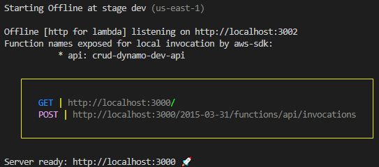

Como podemos observar, el cuadro amarillo nos dice los `endpoints` o puntos de acceso http disponibles. Estos puntos vienen en pares (el tipo de petición y uno de tipo POST - el segundo siempre), nosotros utilizaremos el primero para realizar las llamadas http; en este caso estamos hablando de `http://localhost:3000/`.

Conociendo esta información podemos ir directamente a realizar la llamada `http`. Para este caso decidimos utilizar `Postman`, pero sientete libre de usar cualquier otro software como `Insomnia` o llamadas mediante consola con `curl`.

Para la llamada de postman seleccionaremos el método `GET` y como url `http://localhost:3000/`:

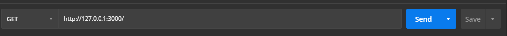

Presionamos el botón send y nos dirigimos al body para ver el resultado:

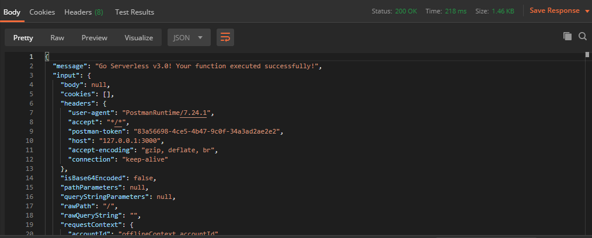

## Agreguemos nuevos endpoints

Para esta parte vamos a separar las funciones. Dejaremos en index la función de prueba de inicio y crearemos aparte un archivo para manejar items. 

Para ello creamos una carpeta llamada `item` y dentro separaremos en diferentes archivos `js` las acciones a realizar:

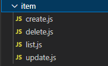

Antes de pasar a ver los códigos, vamos a añadir en apartado de `functions` dentro del archivo `serverless.yml` los siguientes `endpoints`:

```yml
getItems:
  handler: ./item/list.getItems
  events: # Que eventos se pueden realizar
    - httpApi: # Eventos tipos http
        path: /items/ # Path de acceso al evento
        method: get # Metodo que acepta el evento http
createItem:
  handler: ./item/create.createItem
  events:
    - httpApi:
        path: /item/
        method: post
updateItem:
  handler: ./item/update.updateItem
  events: # Que eventos se pueden realizar
      - httpApi: # Eventos tipos http
          path: /items/{id} # Path de acceso al evento. El {id} es la variable que se obtiene mediante la url (PathParametter)
          method: put # Metodo que acepta el evento http
deleteItem:
  handler: ./item/delete.deleteItem
  events:
    - httpApi:
        path: /item/{id}
        method: delete
```

La diferencia con el enpdoint base visto en el apartado anterior radica en el update; específicamente en path, donde podemos observar el uso de `{id}`. Esto hace referencia a una variable de path, accesible mediante la variable event en la función. Veamos entonces como quedó el archivo `serverless.yml` después de agregar la información anterior:

```yml
service: serverless-api-project
frameworkVersion: '3'

provider:
  name: aws
  runtime: nodejs18.x
  region: us-east-1
  httpApi:
    cors: true
  
plugins:
  - serverless-offline

functions:
  getItems:
    handler: ./item/list.getItems
    events: # Que eventos se pueden realizar
      - httpApi: # Eventos tipos http
          path: /items/ # Path de acceso al evento
          method: get # Metodo que acepta el evento http
  createItem:
    handler: ./item/create.createItem
    events:
      - httpApi:
          path: /item/
          method: post
  updateItem:
    handler: ./item/update.updateItem
    events: # Que eventos se pueden realizar
        - httpApi: # Eventos tipos http
            path: /items/{id} # Path de acceso al evento. El {id} es la variable que se obtiene mediante la url (PathParametter)
            method: put # Metodo que acepta el evento http
  deleteItem:
    handler: ./item/delete.deleteItem
    events:
      - httpApi:
          path: /item/{id}
          method: delete
  api: # Nombre de la función del api gateway
    handler: index.handler # Encargado de manejar la petición
    events: # Eventos esperados
      - httpApi: # Evento tipo http (Accediendo a la función mediante una llamada http)
          path: / # Path o dirección url de acceso a la función
          method: get # Tipo de petición a realizar
```


Habiendo terminado las configuraciones pertinentes, podemos pasar a ver las funciones (*handlers*) creados por cada archivo:

```js
// data
module.exports = class Data {
  static items = [];
}

// Al inicio de cada archivo
const items = require('../config/data').items

// list.getItems
module.exports.getItems = async (event) => {
    return {
        statusCode: 200,
        body: JSON.stringify(items),
    };
}

// create.createItem
module.exports.createItem = async (event) => {   
    const element = JSON.parse(event.body); 
    items.push(element);
    return {
        statusCode: 200,
        body: JSON.stringify(items)
    };
}

// update.updateItem
module.exports.updateItem = async (event) => {
    try{
        const id = event.pathParameters.id;
        const body = JSON.parse(event.body);
        
        items = items.map(data => {
            if(data.id == id){
                for (const key in body) {
                    if (Object.hasOwnProperty.call(data, key)) {
                        data[key] = body[key];                
                    }
                }
            }
            return data;
        })

        return {
            statusCode: 200,
            body: JSON.stringify(items)
        };
    } catch(e){
        return {
            statusCode: 404,
            body: JSON.stringify({
                message: "Algunos datos no fueron enviados",
                error: e.message
            })
        };
    }
}

// delete.deleteItem
module.exports.deleteItem = async (event) =>  {
    let body = null;
    try{
    const id = parseInt(event.pathParameters.id);

    items = items.map(data => data.id != id);
    
    body = {
      message: "Dato eliminado correctamente",
    }
  }
  catch(e){
    logs.writeLog(e);
    body = {
      title: "Hubo un error en el proceso de eliminación datos",
      message: e,
      items: []
    }
  }
    return {
      statusCode: 200,
      body: JSON.stringify(
        body,
        null,
        2
      ),
    };
  }
```

Ahora pasemos a la parte divertida. Vamos a probar si nuestros `endpoints` están funcionando correctamente. Comencemos iniciando el servidor `serverless offline`:

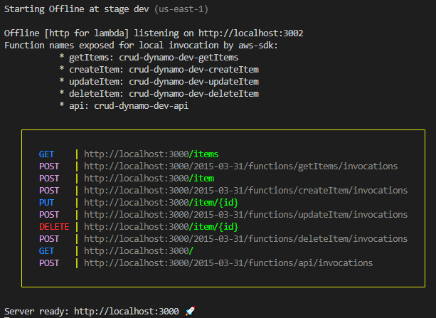

> Como agregamos más `enpoints` al apartado de `functions` dentro de `serverles.yml`, el recuadro es mucho más grande comparado con el visto anteriormente.

Comencemos con la llamada al endpoint create:

- Petición:
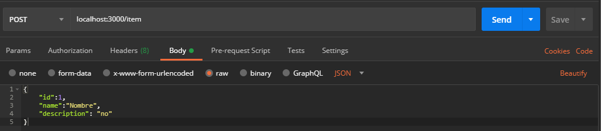
- Respuesta:
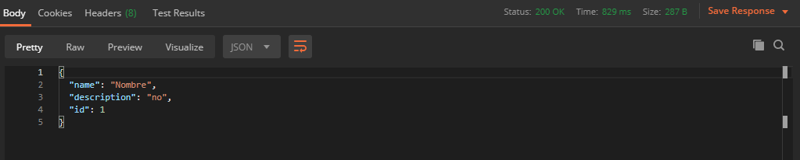

El siguiente es el listar:
- Petición:
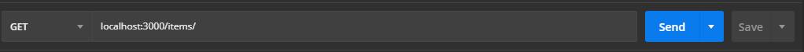
- Respuesta:
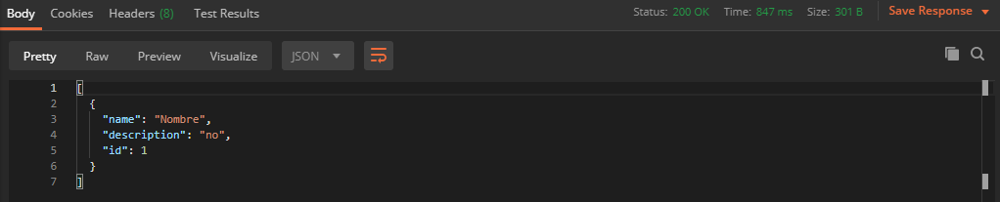

Pasemos al update:
- Petición:
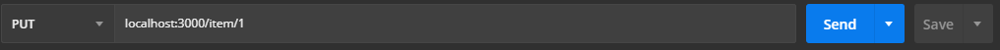
- Respuesta:
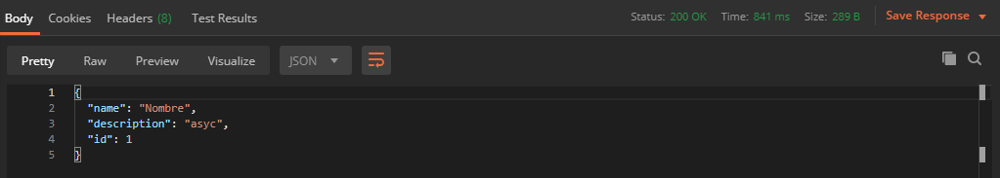

Terminemos con el delete:
- Petición:
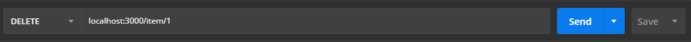
- Respuesta:
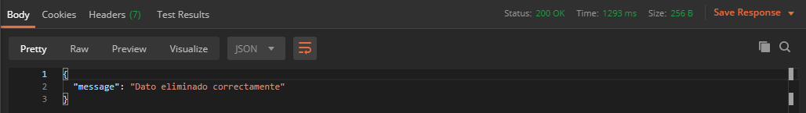

> Debemos aclarar que hicimos un poco de trampa en las pruebas. Todas las pruebas realizadas estaban utilizando una `base de datos`. Mencionamos esto debido a que pueden pensar que la variable `item` (global) almacenaría toda la información de los items que creemos. Pero tristemente no es así. Cuando un `lambda` se deja de ejecutar automaticamente se cierra el proceso (archivo ejecutado), por lo tanto, los datos almacenados en variables son eliminados.

## Serverless con dynamo

> Para esta parte de la documentación se supone que ya se tiene instalado lo básico de serverless en la computadora

Comencemos por instalar el plugin para trabajar con dynamo local:
- `yarn add serverless-dynamodb-local -D`
- `npm i serverless-dynamodb-local --dev-save`

Posteriormente agregamos a `serverless.yml` el plugin:
```yml
plugins:
  - serverless-offline
  - serverless-dynamodb-local
```

Con esto agregado, el archivo `serverless.yml` queda de la siguiente forma:

```yml
service: crud-dynamo
frameworkVersion: '3'

provider:
  name: aws
  runtime: nodejs18.x
 
plugins:
  - serverless-dynamodb-local
  - serverless-offline
  
functions:
  #...
```

El siguiente paso es la instalación local de dynamo. Abrimos una consola de comando y nos paramos dentro de la carpeta de la aplicación `cd PATH/TO/FOLDER`. Acto seguido escribimos la siguiente línea de comando:

- `sls dynamodb install`

> Esto puede levantar un error [error_01](#error-01)

De esta forma ya tenemos instalado un jar local de dynamoDb. En caso que queramos eliminarlo podemos utilizar la siguiente línea de comando:

- `sls dynamodb remove`

Para iniciar el servidor de dynamodb usamos:

- `sls dynamodb start`

> Este comando puede dar uno de los siguientes errores [error-02](#error-02) o [error-03](#error-03)

Si queremos correr las migraciones del esquema:

-  `sls dynamodb start --migrate`

Además, podemos utilizar la línea de comando para cambiar algunas propiedades como son el puerto o cargar una semilla; pero si queremos evitarnos este trabajo, podemos crear una serie de configuraciones en `serverless.yml`:

```yml
custom:
  dynamodb:
    stages: # Estados donde usaremos dynamodb local
      - dev
    start: # Comando start
      # docker: true # Usamos esta opción si tenemos dynamo en docker
      port: 8000 # Puerto por donde va a levantar
      inMemory: true # Se guardarán los datos en memoria
      heapInitial: 200m # Tamaño a utilizar en la memoria al levantar
      heapMax: 1g # Máximo tamaño que puede alcanzar la memoria de dynamo db
      migrate: true # realizar las migraciones por defecto
      seed: true # Utilice una semilla para poblar la bd
      convertEmptyValues: true # Convertir los valores vacios a null
``` 

Quedando de la siguiente forma el archivo `serverless.yml`:

```yml
service: crud-dynamo
frameworkVersion: '3'

provider:
  name: aws
  runtime: nodejs18.x
 
plugins:
  - serverless-dynamodb-local
  - serverless-offline

custom:
  dynamodb:
    stages: # Estados donde usaremos dynamodb local
      - dev
    start: # Comando start
      # docker: true # Usamos esta opción si tenemos dynamo en docker
      port: 8000 # Puerto por donde va a levantar
      inMemory: true # Se guardarán los datos en memoria
      heapInitial: 200m # Tamaño a utilizar en la memoria al levantar
      heapMax: 1g # Máximo tamaño que puede alcanzar la memoria de dynamo db
      migrate: true # realizar las migraciones por defecto
      seed: true # Utilice una semilla para poblar la bd
      convertEmptyValues: true # Convertir los valores vacios a null
  
functions:
  #...
```

Ahora, con esto solo tenemos la configuración, pero no tenemos definido un esquema de trabajo de base de datos. Para ello añadimos la siguiente configuración en `serverless.yml`:

> Esto tiene un error, ver aclaración de abajo.

```yml
resources: # Apartado para declarar recursos
  Resources: # Recursos a utilizar 
    itemTable: # Nombre del recurso
      Type: AWS::DynamoDB::Table # Tipo de recurso
      Properties: # Propiedades para ese recurso
        TableName: itemTable # Nombre de la tabla
        AttributeDefinitions: # Definición de los atributos de la tabla
          - AttributeName: name # Nombre del atributo
            AttributeType: S # Tipo de
          - AttributeName: id
            AttributeType: 'N'
          - AttributeName: description
            AttributeType: S
        KeySchema: # Llaves del esquema
          - AttributeName: id # Campo de llave
            KeyType: HASH # Tipo de llave
        ProvisionedThroughput: # Capacidad que va a brindar
          ReadCapacityUnits: 1  # Cantidad de lecturas
          WriteCapacityUnits: 1 # Cantidad de escrituras
```

> Esto va a dar el siguiente error validación: [error_04](#error-04)

Los tipos de atributos (`AttributeType`) permitidos por DynamoDB son:

- All number types | N (number type)
- Strings | S (string type)
- Boolean | BOOL (boolean type), 0 or 1.
- ByteBuffer | B (binary type)
- Date | S (string type). The Date values are stored as ISO-8601 formatted strings.
- Set collection types | SS (string set) type, NS (number set) type, or BS (binary set) type.

Los tipos de llave (`KeyType`) permitidos son:

- HASH - partition key
- RANGE - sort key

En caso que queramos agregar una semilla de datos, debemos agregar la siguiente configuración:

```yml
custom:
  dynamodb:
  # ...

    seed: # Semilla a introducir
      domain: # Tipo de semilla
        sources: # Origen de la semilla
          - table: itemTable # Tabla de la semilla
            source: [./seed/initial.json] # Semilla
```

```json
[
    {
        "id": 1,
        "name": "1",
        "description": "1"
    },
    {
        "id": 2,
        "name": "2",
        "description": "2"
    },
    {
        "id": 3,
        "name": "3",
        "description": "3"
    },
    {
        "id": 4,
        "name": "4",
        "description": "4"
    }
]
```

Habiendo terminado las configuraciones básicas para poder utilizar dynamodb en nuestro proyecto, el archivo `serverless.yml` queda de la siguiente forma:

```yml
service: crud-dynamo
frameworkVersion: '3'

provider:
  name: aws
  runtime: nodejs18.x
 
plugins:
  - serverless-dynamodb-local
  - serverless-offline

custom:
  dynamodb:
    stages: # Estados donde usaremos dynamodb local
      - dev
    start: # Comando start
      # docker: true # Usamos esta opción si tenemos dynamo en docker
      port: 8000 # Puerto por donde va a levantar
      inMemory: true # Se guardarán los datos en memoria
      heapInitial: 200m # Tamaño a utilizar en la memoria al levantar
      heapMax: 1g # Máximo tamaño que puede alcanzar la memoria de dynamo db
      migrate: true # realizar las migraciones por defecto
      seed: true # Utilice una semilla para poblar la bd
      convertEmptyValues: true # Convertir los valores vacios a null
    seed: # Semilla a introducir
      domain: # Tipo de semilla
        sources: # Origen de la semilla
          - table: itemTable # Tabla de la semilla
            source: [./seed/initial.json] # Semilla

resources: # Apartado para declarar recursos
  Resources: # Recursos a utilizar 
    itemTable: # Nombre del recurso
      Type: AWS::DynamoDB::Table # Tipo de recurso
      Properties: # Propiedades para ese recurso
        TableName: itemTable # Nombre de la tabla
        AttributeDefinitions: # Definición de los atributos de la tabla
          - AttributeName: id
            AttributeType: 'N'
        KeySchema: # Llaves del esquema
          - AttributeName: id # Campo de llave
            KeyType: HASH # Tipo de llave
        ProvisionedThroughput: # Capacidad que va a brindar
            ReadCapacityUnits: 1  # Cantidad de lecturas
            WriteCapacityUnits: 1 # Cantidad de escrituras
  
functions:
  #...
```

Cuando ejecutemos el comando de inicio de la base de datos (`sls dynamodb start`), veremos los siguiente en consola:

```bash
Dynamodb Local Started, Visit: http://localhost:8000/shell
DynamoDB - created table itemTable
```

Pero nos queda ahora la siguiente duda, ¿cómo puedo ver la base de datos de forma gráfica? Para resolver este problema, podemos auxiliarnos de la herramienta `dynamodb-admin`. Para instalarla ejecutamos el siguiente comando:

- `npm install -g dynamodb-admin`

El siguiente paso es ir a las variables de entorno y agregar:
- Variable: DYNAMO_ENDPOINT
- Valor: http://localhost:8000

Para iniciar el GUI para dynamo escribimos en nuestra consola:
- `dynamodb-admin`
- Este nos proporcionará el siguiente punto de acceso: `http://:::8001`

El entorno gráfico proporcionado por esta herramienta es el siguiente:

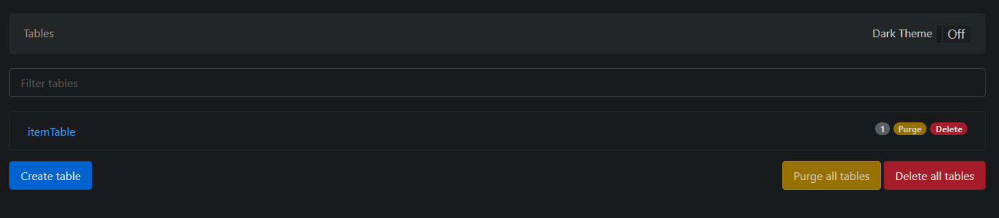

> El seed no he logrado que funcione. Nada más lo haga, agrego.

## Utilizando dynamoDb en código

> Para este apartado debemos instalar en nuestra app
> - `aws-sdk` (Si queremos acceso a todas las funcionalidades)
> Si queremos optimizar el peso de la app:
> - `@aws-sdk/client-dynamodb`
> - `@aws-sdk/lib-dynamodb`
> Para instalar recuerde que puede usar:
> `yarn add LIBRERIA`
> `npm i LIBRERIA`
> Para iniciar servelress junto a la base de datos usamos el siguiente comando:
> `serverles offline start`

Comencemos creando un archivo llamado `dynamo.js` que contendrá la conexión a base de datos y sea reutilizable por toda la app. Comencemos por la importación de las librerías:

```js
const {DynamoDBClient} = require('@aws-sdk/client-dynamodb')
const { DynamoDBDocumentClient } = require("@aws-sdk/lib-dynamodb");
```

En este caso se optó por instalar las dependencias que son necesarias para trabajar directamente; de esta forma nos ahorramos un poco de peso en la aplicación. Para nuestro trabajo debemos importar:
- `DynamoDBClient` -> Es el cliente de acceso a la base de datos de dynamo
- `DynamoDBDocumentClient` -> Permite simplificar el trabajo con los tipos de datos de dynamo

Pasemos ahora a crear la conexión:

```js
const dataConnection = {
    region: 'localhost', // Aquí pondremos la región de aws que estemos utilizando
    endpoint: 'http://localhost:8000', // El endpoint de conección a base de datos
    accessKeyId: 'DEFAULT_ACCESS_KEY',  // la clave de acceso a aws
    secretAccessKey: 'DEFAULT_SECRET' // el secreto para acceder con la llave
}
```

En este caso estamos creando una variable que posee los parámetros de conexión a utilizar. Más adelante cuando pasemos a producción, podemos cambiar los datos de acceso a la base de datos.

> Antes de continuar con la documentación, probamos el proyecto y nos dio un error de certificados: [error_03](#errors)

Terminada la importación y declarar la variable de configuración podemos comenzar a crear la instancia de acceso a la base de datos. Para hacer la conexión reusable, implementamos el patrón singleton. Además utilizaremos la variable de entorno `IS_OFFLINE` para no cambiar nuestro código de producción a desarrollo; esa variable de entorno se encargará de ello por nosotros ya que en dependencia de cómo iniciemos serverless, su valor será `true` o `false`.

```js
let connection = null;

module.exports.connectionDB = () => {
    if(connection) return connection;
    const client = process.env.IS_OFFLINE ? new DynamoDBClient(dataConnection) : new DynamoDBClient();
    connection = DynamoDBDocumentClient.from(client);  
    return connection;
}
```

El archivo de configuración de base de datos queda de la siguiente forma:

```js
const {DynamoDBClient} = require('@aws-sdk/client-dynamodb')
const { DynamoDBDocumentClient } = require("@aws-sdk/lib-dynamodb");

const dataConnection = {
    region: 'localhost', // Aquí pondremos la región de aws que estemos utilizando
    endpoint: 'http://localhost:8000', // El endpoint de conección a base de datos   
    accessKeyId: 'AWS_ACCESS_KEY_ID',  // needed if you don't have aws credentials at all in env
    secretAccessKey: 'DEFAULT_SECRET' 
};

let connection = null;

module.exports.connectionDB = () => {
    if(connection) return connection;
    const client = process.env.IS_OFFLINE ? new DynamoDBClient(dataConnection) : new DynamoDBClient();
    connection = DynamoDBDocumentClient.from(client);  
    return connection;
}
```

El siguiente paso es comenzar a utilizar la conexión a la base de datos en los endpoints. Comencemos por buscar todos los datos almacenados en la base de datos:

> En todos los archivos se tuvieron que realizar las siguientes importaciones:
> ```js
> const database = require('../config/dynamo').connectionDB;
> const logs = require('../config/log');
> const messages = require('../config/message');
> const options = require('../config/constant');
> ```
> Los archivos que no se ven dentro de este documento pueden encontrarlos en el repositorio:
> - https://github.com/BadiaValdes/serverless-test-project
> o puede dirigirse a [códigos complementarios](#codigos-complementarios)
>
> La unica importación que varia en ada uno de los ficheros es:
> `const { LIBRERIA } = require("@aws-sdk/lib-dynamodb");`
> Ya que la función `Command` (función de acción sobre la base de datos) a utilizar depende de la acción que se va a realizar. 

> Los comandos nos permiten realizar operaciones sobre dynamo de forma sencilla y legible. La idea es sustituir la palabra `LIBRERIA` anterior por uno de los comandos listados a continuación. 
> - PutCommand -> Utilizar este cuando queramos crear o actualizar un dato en la base de datos
> - GetCommand -> Utilizar este cuando queramos obtener uno o mas dato de la base de datos
> - DeleteCommand -> Si queremos eliminar un elemento, este es nuestro comando.
> - QueryCommand -> Nos permite realizar un query a la base de datos.
>
> Un ejemplo de esta importación para la obtención de datos en la base de datos es la siguiente:
> `const { GetCommand } = require("@aws-sdk/lib-dynamodb");`

Primero veremos la operación crear:

```js
module.exports.createItem = async (event) =>  {
    let body = null;
    let itemData = JSON.parse(event.body);
    console.log(event);
    try{
    const {Items} = await database().send(new PutCommand({TableName: options.tableName, Item: itemData}));
    body = {
      message: "Dato creado correctamente",
      items: Items
    }
  }
  catch(e){
    logs.writeLog(e);
    body = {
      title: "Hubo un error en el proceso de creación de datos",
      message: e,
      items: []
    }
  }
    return {
      statusCode: 200,
      body: JSON.stringify(
        body,
        null,
        2
      ),
    };
  }
```

Gracias a la librería `DynamoDBDocumentClient` podemos utilizar una serie de comandos que nos permiten realizar de forma sencilla operaciones en la base de datos. El comando `PutCommand` nos permite actualizar y crear datos en base de datos. La idea es pasar como primer parámetro del comando el nombre de la tabla y como segundo le debemos enviar los datos que queramos insertar dentro de la variable `Item`.

El proximo en ver es el `getItems` encargado de buscar los datos en bd:

```js
module.exports.getItems = async (event) => {
    let body = null;
    try{
    const {Items} = await database().send(new ScanCommand({TableName: options.tableName,}));
    body = {
      message: "Todos los datos devueltos",
      items: Items
    }
  }
  catch(e){
    logs.writeLog(e);
    body = {
      title: "Hubo un error en el proceso de ",
      message: e,
      items: []
    }
  }
    return {
      statusCode: 200,
      body: JSON.stringify(
        body,
        null,
        2
      ),
    };
  }
```

 En este caso estamos utilizando `ScanCommand` que recibe el nombre de nuestra base de datos por parámetros. Esta operación nos permitirá traer todos los datos pertenecientes a nuestra tabla.

> Prueba del endpoint
- Petición:

- Respuesta:
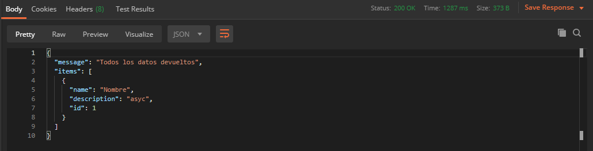

El próximo en ver será la operación de actualizar que trae implicita buscar un elemento:

```js
module.exports.updateItem = async (event) =>  {
    let body = null;
    try{
    let itemData = JSON.parse(event.body);
    const id = event.pathParameters.id;

    const {Item} = await database().send(new GetCommand({TableName: options.tableName, Key: {
        id: parseInt(id)
    }}))

    console.log(Item)

    Item.description = itemData.description;
    Item.name = itemData.name;

    await database().send(new PutCommand({TableName: options.tableName, Item}));
    body = {
      message: "Dato modificado correctamente",
      items: Item
    }
  }
  catch(e){
    logs.writeLog(e);
    body = {
      title: "Hubo un error en el proceso de creación de datos",
      message: e,
      items: []
    }
  }
    return {
      statusCode: 200,
      body: JSON.stringify(
        body,
        null,
        2
      ),
    };
  }
```

> La prueba es similar a la vista en el apartado [Agregar nuevos endpoints](#agreguemos-nuevos-endpoints)

> Se debe mencionar que si pasamos el `id` como parte del objeto del body o se lo añadimos tomandolo de la url, no es necesario realizar el `GetCommand` para obtener un valor. Ver los codigos alternativo [update item 1](#update-item-1) y [update item 2](#update-item-2)

Para la operación buscar utilizamos `GetCommand`, el cual recibe como primer parámetro la tabla con la que estemos trabajando. En este caso, debemos pasar un segundo parámetro `id` que representa el objeto a buscar. Pero hay que tener en cuenta una cosa. Tenemos que capturar de la url el `id` pero al realizar la operación `JSON.parse` todos los datos se convierten en `string`; por lo que debemos convertir el valor del `id` en `int` mediante el método `parseInt`.

Después de traer el dato de la base de datos y realizar las modificaciones pertinentes, debemos pasar a la actualización del objeto; para ello utilizamos el comando `PutCommand`. Este recibe como segundo parámetro el `Item` modificado.

Terminemos con el delete:

```js
module.exports.deleteItem = async (event) =>  {
    let body = null;
    try{
    const id = parseInt(event.pathParameters.id);

    await database().send(new DeleteCommand({TableName: options.tableName, Key: {
        id: id,
    }}));
    body = {
      message: "Dato eliminado correctamente",
    }
  }
  catch(e){
    logs.writeLog(e);
    body = {
      title: "Hubo un error en el proceso de eliminar datos",
      message: e,
      items: []
    }
  }
    return {
      statusCode: 200,
      body: JSON.stringify(
        body,
        null,
        2
      ),
    };
  }
```

Este último es bastante sencillo, solo tenemos recibir por el evento el  `pathParameters` y llamar el `DeleteCommand` con el `id` como `key`.


## Encadenando llamadas

> Para esta parte del tutorial debemos instalar
> - `@aws-sdk/client-lambda`

Vamos un poco más lejos en el estudio de las lambdas. En este apartado veremos cómo encadenar diferentes funciones lambda. De esta forma, podemos programar una vez y de ser necesario, realizar acciones encadenadas. Comencemos otorgando los permisos de accesos entre lambdas en nuestro archivo `serverless.yml`:

```yml
provider:
  #...
  iamRoleStatements:
      - Effect: Allow
        Action:
          - lambda:InvokeFunction
          - lambda:InvokeAsync
        Resource: "*"
```

En las acciones estamos especificando que podremos realizar las invocaciones encadenada de funciones (síncronas y asíncronas) lambda. Sin este permiso creado, aws prohibirá este comportamiento. Comencemos declarando los métodos que utilizaremos para encadenar:

> Método uno

```js
const { LambdaClient, InvokeCommand } = require('@aws-sdk/client-lambda');
const consta = require('../config/constant');
const client = new LambdaClient(consta.lambdaClientConfig);

module.exports.chain1 = async (event, context, callback) => {
    try{
    const key = event.pathParameters.id;
    const data = consta.infokeConfig;
    const input = {
        ...data,
        Payload: JSON.stringify(key)
    }
    const command = new InvokeCommand(input);
    console.log('here')
    const resp = await client.send(command);
    console.log(resp.Payload.transformToString('utf-8'));

    return {
        statusCode: 200,
        body: JSON.stringify(
          'nice',
          null,
          2
        ),
      };
} catch(e) {
    console.log(e)
}
}
```

Destripemos el método anterior. Comencemos por las importaciones:
- `const { LambdaClient, InvokeCommand } = require('@aws-sdk/client-lambda');`
  - `LambaClient` -> No permitirá crear nuestro cliente de lambda para realizar las peticiones.
  - `InvokeCommand` -> Forma parte de los diferentes comandos de la librerí `client-lambda`. Su función es invocar otra función lambda que definamos por parámetros.
- `const consta = require('../config/constant');`
  - Esta clase posee todas las configuraciones por defecto que utilizaremos para las pruebas.

A continuación, crearemos la instancia del cliente y mostraremos la configuración utilizada:
- `const client = new LambdaClient(consta.lambdaClientConfig);`
  - Configuración (Si no tenemos definida esta configuración nos podria dar un error similar a [error 06](#error-06)):
```js  
static lambdaClientConfig = {
        endpoint: "http://localhost:3002",
        region: "eu-est-1",
        credentials: {
            accessKeyId: 'DEFAULT_ACCESS_KEY',
            secretAccessKey: 'DEFAULT_SECRET',
          },
    }
```

> Es importante recalcar que, si no agregamos el parámetro de enpoint, de forma automática, se buscará la función en aws.

Entrando en el código principal de la lambda podemos ver las siguientes líneas:

> Configuración de `InvokeCommand`
```js
const input = {
  ...data,
  Payload: JSON.stringify(key)
}
```

Para la configuración básica la podemos encontrar en el archivo de configuración:

```js
static infokeConfig = {
  FunctionName: "crud-dynamo-dev-chain2", // Nombre de la funcion y estructura que debe seguir service-stage-function
  InvocationType: "RequestResponse" , // Tipos de invocaciones "Event" || "RequestResponse" || "DryRun",
  Payload: "BLOB_VALUE", // Datos que podemos enviar a la siguiente función.
}
```

> Invocación de la función

```js
const command = new InvokeCommand(input); // Declaramos el comando
const resp = await client.send(command); // Mandamos a ejecutarlo
```

Qué pasa si quiero cambiar un solo dato de la configuración del `InvokeCommand`. Esto no es problema, si queremos usar datos ya existentes y sobre escribir otros podemos utilizar como base nuestra configuración principal e introducir los datos nuevos:

```js
    const input = {
        ...data,
        Payload: JSON.stringify(key)
    }
```

Pasemos ahora a ver el segundo método:

```js
module.exports.chain2 = async (event, context, callback) => {
    try{
        if(event?.headers){
            console.log('HTTP')
            return {
                statusCode: 200,
                body: JSON.stringify('Hola Mundo')
            }
        } else {
            console.log('invoke')
        return +event + 1;
    }
  
    } catch(e){
        if(callback){
            callback(e, null);
        }
        console.log(e)
    }
}
```

Que podemos observar en este método. Lo primero que salta a la vista es un `if` preguntando sobre el header de la variable evento. Esto se hace debido a que tenemos que conocer si la llamada se realizó mediante un evento http o directamente por invocación. Cuando la llamada a la lambda se realiza por HTTP el objeto `event` contiene información de dicha petición como pueden ser los `headers`; en cambio, cuando proviene de una invocación, solo se envía el dato específico proporcionado por la función anterior.

El siguiente paso es agregar los endpoints a nuestro archivo `serverless.yml`:

```yml
#...
functions:
  #...
  chain1:
    handler: ./chain/chain1.chain1
    events: # Que eventos se pueden realizar
      - httpApi: # Eventos tipos http
          path: /chain1/{id} # Path de acceso al evento
          method: get # Metodo que acepta el evento http
  chain2:
    handler: ./chain/chain2.chain2
    events: # Que eventos se pueden realizar
      - httpApi: # Eventos tipos http
          path: /chain2/ # Path de acceso al evento
          method: get # Metodo que acepta el evento http
```

Al terminar todas las configuraciones nuestro archivo `serverless.yml` queda de la siguiente forma:

```yml
service: crud-dynamo
frameworkVersion: '3'

provider:
  #...
  
plugins:
  - serverless-dynamodb
  - serverless-offline
  
custom:
  #..

resources: # Apartado para declarar recursos
  #...
  iamRoleStatements:
    - Effect: Allow
      Action:
        - lambda:InvokeFunction
        - lambda:InvokeAsync
      Resource: "*"
       
functions:
  #...
  # Chain
  chain1:
    handler: ./chain/chain1.chain1
    events: # Que eventos se pueden realizar
      - httpApi: # Eventos tipos http
          path: /chain1/{id} # Path de acceso al evento
          method: get # Metodo que acepta el evento http
  chain2:
    handler: ./chain/chain2.chain2
    events: # Que eventos se pueden realizar
      - httpApi: # Eventos tipos http
          path: /chain2/ # Path de acceso al evento
          method: get # Metodo que acepta el evento http
```

Teniendo todo programado es hora de pasar a la parte práctica que tanto nos gusta. Vamos a iniciar el server y acceder a `Postman` en este caso. El ejemplo va a seguir la siguiente estructura:
1. Enviar una petición `GET` al endopint `http://localhost:3000/chain1/{id}`   
    1. Sustituir `{id}` por el número 12
1. Realizar la petición y ver como se devuelve el valor de la segunda `lambda`.

- Petición:
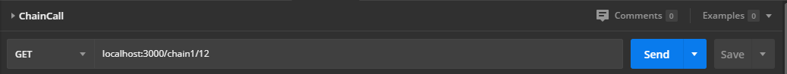
- Respuesta:
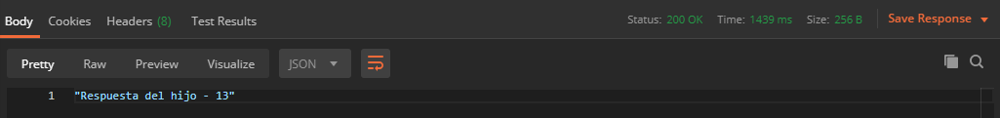

## Middlewares y manejo de errores

No es menos cierto que frameworks js como Express le permiten al programador abstraerse y solo pensar en la lógica del negocio en el programa principal, dejando procesos como validación, añadir tokens u otros similares a un mecanismo más general. Este mecanismo se llama middlewares y su función es mediar entre las peticiones recibidas o de salida con las funciones creadas. Para AWS poseemos una librería que nos permite la implementación de midddlewares, logrando una mejor separación del código y legibilidad.

> La librería se llama **middy**
> Para isntalarla usamos:
> `npm install --save @middy/core`
> Para agregar el manejo de errores añadimos:
> `npm install --save @middy/http-error-handler`
> Para más información de la librería pueden ir al sitio:
> https://middy.js.org/docs/intro/getting-started
>
> Para poder levantar errores de tipo HTTP (no vienen predefinido en js), podemos usar la siguietne librería: https://www.npmjs.com/package/http-errors. 
> Tenga en cuenta que mientras más librerías le adiciones al proyecto, este pesará mucho más y amazon cobra también por espacio de almacenamiento.

Veamos un ejemplo sencillo de su uso:

```js
const middy = require('@middy/core'); // Importación de librería middy
const httpErrorHandler = require('@middy/http-error-handler') // Middleware de middy
const createError = require('http-errors')

const throwError = (event) => {
    const id = parseInt(event.pathParameters.id)

    if(id < 10){
        throw createError(500, 'El número es menor que 10')
    } else if(id > 10 && id < 21){
        throw createError(400, 'El número es mayor que 10 y menor que 21')
    } else {
        throw createError[400]
    }
}

module.exports.middyWrapper = middy(throwError).use(httpErrorHandler());
```

En este código usamos `middy` para encapsular nuestra función dentro de la cadena de middlewares y posteriormente (mediante `use`) le añadimos el middleware de `httpErrorHandler`. Esto último nos permite abstraernos de la lógica de devolución de errores y permitir que dicho middleware se encarge de todo el procedimiento de formateo y devolución de la información. 

Pasemos a la fase de prueba:

- Petición
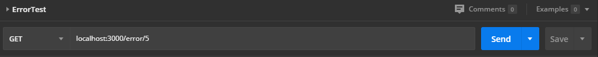

- Respuesta
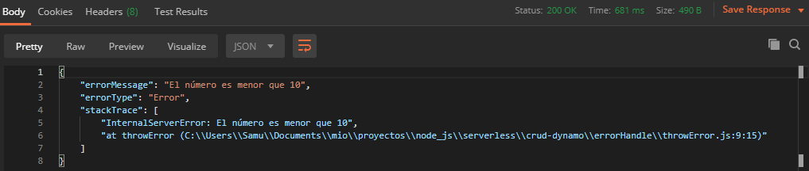

De esta forma podemos comprobar que el *middleware* está realizando su trabajo ya que el error omite algunos datos innecesarios para la respuesta. Ahora, no se asusten porque en la consola salga la siguiente información:

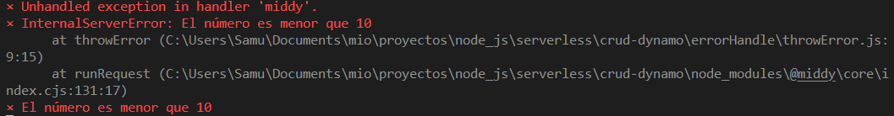

Esto no es un error en sí, sino una forma que `middy` posee para informarle al programador que hubo una excepción capturada por el *middleware*. Hablando de *middleware*, que pasaría si queremos crear nuestra propia función intermedia para realizar procesos de `logeo` por ejemplo. Para este ejemplo crearemos un archivo llamado `middleware.js` dentro de la carpeta `config` (donde almacenamos nuestros archivos de configuración). Dentro pondremos un *middleware* dirigido a modificar el valor del id si sobrepasa una cantidad específica, esto se realizaría antes de entrar al `handler`; el segundo *middleware* solo se ejecutará en caso que exista un error y su función es mostrarlo en consola.

```js
const inputValidationMiddleware = () => { // Declaro mi middleware
    return {
        before: async (handler) => { // Podemos tener tres tipos de llamadas del middleware before | after | onError
            const { httpMethod, pathParameters } = handler.event; // Desagregamos el objeto event del handler que estemos usando

            if(pathParameters.id > 100){ // Preguntamos si el id es mayor a 100
                pathParameters.id = 5; // Le asignamos el valor 5 al id
            }
            handler.event.pathParameters = pathParameters; // Asignamos el nuevo cuerpo al handler
        }
    }
}

const errorLogMiddleware = () => { // Declaro mi middleware
    return {
        onError: async (handler, next) => { // En este caso vamos a crear un middleware que se ejecute cuando exista un error
          const {error} = handler; // Sacamos el valor del error del handler

          // Lo imprimimos en la consola
          console.log("Error imprimido dentro del handler");
          console.log(error)

          // Modificamos la respuesta
          handler.response = {
            statusCode: error.statusCode || 500,
            body: JSON.stringify({
              message: 'Error en el middleware',
            }),
          }
        }
    }
}

// La exportación para nuestra comodidad la podemos hacer en formato de objeto
module.exports.middlewares = {
    inputValidationMiddleware,
    errorLogMiddleware,
}
```

Ahora solo nos toca agregar estos middlewares al código anterior:

```js
const middy = require('@middy/core'); // Importación de librería middy
const httpErrorHandler = require('@middy/http-error-handler') // Middleware de middy
const createError = require('http-errors')
const middlewares = require('../config/middleware').middlewares;

const throwError = (event) => {
    const id = parseInt(event.pathParameters.id)

    if(id < 10){
        throw createError(500, 'El número es menor que 10')
    } else if(id > 10 && id < 21){
        throw createError(400, 'El número es mayor que 10 y menor que 21')
    } else {
        throw createError[400]
    }
}

module.exports.middyWrapper = middy(throwError).use(httpErrorHandler())
.use(middlewares.errorLogMiddleware()) // Aqui añadimos el middleware para el mano de errores
.use(middlewares.inputValidationMiddleware()); // Este se encarga de validar que el dato esté correcto
```
Probemos a ver si de verdad se cumplen los dos middlewares:

- Petición
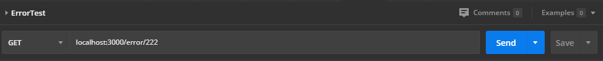

- Respuesta
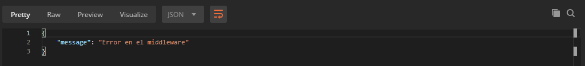

- Consola
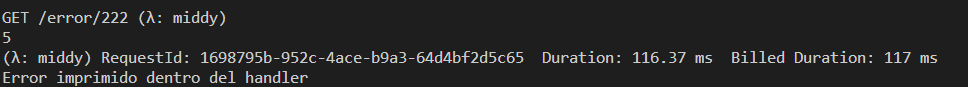

## Logs

Trabajemos ahora con los logs. Este apartado es bastante importante para el trabajo en aws ya que mediante los logs podemos verificar cualquier error que sea lanzado por nuestra aplicación. Pero antes de continuar debemos mencionar algunas prácticas que se deben seguir:

-	Configuración de Logs en tu Aplicación: Verificar que la aplicación este configurada para generar logs. 
-	Integración con CloudWatch: CloudWatch puede recibir logs de diversas fuentes, incluyendo instancias EC2, servicios como Lambda, contenedores, y más. La aplicación se puede configurar para enviar logs directamente a CloudWatch.
-	Configurar Agentes o Bibliotecas: Si la aplicación se está ejecutando en un servidor local, se puede instalar el agente de CloudWatch Logs. Este agente recopila y envía logs a CloudWatch. También existen bibliotecas y SDKs específicos para diferentes lenguajes que facilitan el envío de logs a CloudWatch.
-	Crear Grupos de Logs: Los grupos de logs permiten filtrar y buscar logs de manera más efectiva.
-	Configurar Retención de Logs: Definir cuánto tiempo mantener los logs. 
-	Configurar Métricas y Alarmas: Se puede configurar una alarma que avise cuando ciertos eventos ocurran con una cierta frecuencia.
-	Explorar y Buscar Logs: Desde el panel de CloudWatch en la consola de AWS se puede explorar y buscar logs directamente. También se puede utilizar la consola de CloudWatch Logs Insights para realizar consultas avanzadas.
-	Integración con otros Servicios: CloudWatch Logs se integra bien con otros servicios de AWS, como Lambda, Elastic Beanstalk, y más. Esto permite centralizar y analizar logs de múltiples fuentes.
-	Configurar Exportación de Logs:  El servicio CloudWatch se puede configurar para exportar logs, por ejemplo: a Amazon S3 o a Amazon Elasticsearch Service.
-	Automatizar y Personalizar: CloudWatch Logs puedes utilizarse junto con AWS CloudFormation o AWS CDK para automatizar la configuración de logs.

Sabiendo esto, vamos al grano. Existen muchas formas de crear logs en nuestra aplicación, pero la idea es que dichos logs sean capturados por `CloudWatch` para su posterior revisión y no hay que dejar de lado que debemos usar librerías ligeras para evitar recargar nuestra aplicación. 

Ahora se deben estar preguntando: si tiene que ser ligera, ¿Porqué no usamos console.log?. No es una mala idea, pero los mensajes por consola nativos de javascript no son totalmente compatibles con la plataforma `CloudWatch` y puede que perdamos información por el camino. Otra idea sería usar un software de tercero como `ELK` para el trabajo con logs, pero la idea de usar `aws` es debido que queremos abaratar costos; usar `ELK` demandaría alquilar un servidor de hosteo.

Después de investigar un poco sobre librerías para crear logs en `node.js` nos topamos con las tres siguientes:
- Winston
- Bunyan
- Pino

Las dos primeras son pesos pesados dentro de la categoría de generación de logs y `Pino` se ofrece como una alternativa ligera. Pero buscando en los paquetes oficiales de npm vimos que Pino tiene un peso de `681kb` en comparación a los `201kb` de `buyan` y los `268kb` de `winston`. Aunque puede que a simple vista `681kb` no parezca mucho, recuerden que esto es una aplicación y también estamos utilizando otras librerías que agregan peso a nuestra aplicación final; y no se puede olvidar que debemos crear la aplicación lo más ligera posible. No estoy diciendo que cambiemos rendimiento por ligereza, si tenemos una librería que pesa `1mb`, por ejemplo, y es la que nos resuelve el problema de la forma más óptima, bienvenida sea.

En nuestro caso decidimos utilizar `Bunyan`; por lo que comencemos por ver como se va a instalar:

> `yarn add bunyan`

> Existe un wrapper para esta librería dirigida directamente a aws
> `aws-bunyan` -> Pesa `283kb` -> https://www.npmjs.com/package/aws-bunyan

> En este caso voy a comprometer el peso de la app para usar el wrapper ya que en los ejemplos provistos en la página de npm permite logear información extra proporcionada por aws. Por lo tanto:
> `yarn add aws-bunyan`

> Una última aclaración antes de continuar. Si queremos realizar el proceso de logs totalmente manual; es decir, nosotros mismos enviar los logs a `cloudWatch`, podemos utilizar la librería:
> `@aws-sdk/client-cloudwatch-logs`

Para la parte de logs vamos a utilizar el archivo `logs.js` que se encuentra dentro de la carpeta `conf`. Veamos, antes de seguir, la estructura que tenía hasta el momento este archivo:

```js
module.exports = class Logs {
    static writeLog(e){
        console.log(e);
    }
}
```

La clase de logs no es la gran cosa y tampoco realizaremos muchos cambios. La idea es organizar el código ya que crear logs es bastante sencillo. Comencemos por agregar el siguiente método:

```js
static bunyanWriteLog(logInstance, level, message, extraInfo){
    logInstance[level](message, extraInfo);
}
```

Intentamos hacer genérico este método, eso lo explicaremos en un momento; comencemos por parámetros pasamos:
- `logInstance` -> Representa la instancia de la interfaz `ILogger` que veremos en un momento.
- `level` -> Representa el nivel del `log` que se quiere realizar. Para evitar errores creamos un objeto dentro de la clase `Constants` en el archivo `constants.js`:
> ```js
> module.exports = class Constants {
> //...
> static bunyanLogType = {
>   info: 'info',
>   debug: 'debug',
>   error: 'error',
>   setContext: 'setContext',
>   warn: 'warn',
> }
>}
> ```
- `message` -> Almacena el mensaje principal a mostrarse en el log.
- `extraInfo` -> En caso que queramos pasar un objeto para que aparezca en el log, esta es tu variable. **No pases texto, te lo convierte en objeto directamente**.

Para probar el uso de los logs utilizamos la función `errorLogMiddleware` dentro del archivo `middleware.js`:

```js
// importaciones nuevas
const { ILogger, logFactory } = require('aws-bunyan'); // Importación de la librería
const logs = require('./log') // Importación de la clase para manejar los logs

// Declaración de las variables para los logs
const logTypes = require('./constant').bunyanLogType // Esta variable posee los enum para los tipos de logs permititods

const logInstance = logFactory.createLogger('MiddlewareLogs') // Instancia de la clase logFactory de bunyan. Le pasamos por parámetros un nombre para identificar que clase o archivo lanzó el log.

//...

const errorLogMiddleware = () => { // Declaro mi middleware
    return {
        onError: async (handler, next) => { // En este caso vamos a crear un middleware que se ejecute cuando exista un error
          const {error} = handler; // Sacamos el valor del error del handler

          // Lo imprimimos en la consola mediante bunyan
          logs.bunyanWriteLog(logInstance, logTypes.error, 'Log from middleware using bunyan');
          logs.bunyanWriteLog(logInstance, logTypes.warn, 'Log from middleware using bunyan', {hola: "mundo"});

          // Modificamos la respuesta
          handler.response = {
            statusCode: error.statusCode || 500,
            body: JSON.stringify({
              message: 'Error en el middleware',
            }),
          }
        }
    }
}

//...
```

Terminado los códigos, llega la fase de prueba:

- Petición:
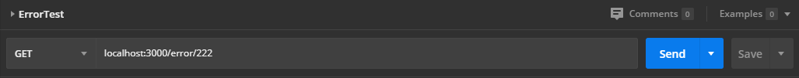

- Consola:
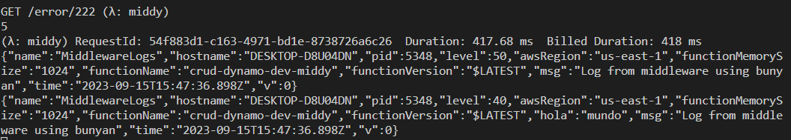

Como podemos ver en la respuesta de la consola, la decisión de usar bunyan como librería para el manejo de logs fue aceptada. Incluso podemos apreciar como en el log aparece información propia de la función lambda que estamos utilizando.

> Recuerde que todos los códigos los puede ver en el repositorio https://github.com/BadiaValdes/serverless-test-project

## Step Functions

Las Step Functions son un servicio de AWS (Amazon Web Services) que permite coordinar y orquestar de manera visual y fácilmente los componentes de una aplicación distribuida. Son una forma de modelar y automatizar flujos de trabajo complejos, donde se pueden definir estados, decisiones y acciones a realizar en cada paso del proceso.

Estas funciones se basan en el concepto de máquinas de estado finitas, donde se define un conjunto de estados y transiciones entre ellos. Cada estado puede realizar una tarea específica o tomar una decisión basada en los datos de entrada, y luego pasar al siguiente estado según la lógica definida.

Firma: Chat GPT

Para este apartado vamos a instalar la siguiente dependencia:
- `serverless-step-functions-offline`

También probaremos la siguiente dependencia:
- `serverless-step-functions-local`
- `serverless-step-functions` (Debe instalarse también)
- `serverless-offline-lambda` (Debe instalarse también)

Comencemos por la primera dependencia `serverless-step-functions-offline`:

> Buscando información

## Comunicación entre lambdas (`message broker`)


# Comandos
- `serverless offline` -> Iniciar proyecto 
- `serverless offline start` -> Iniciar proyecto y base de datos
- `serverless` o `sls` -> Crear un proyecto (en powershel sls no funciona ya que hace referencia a otro comando)
- `dynamodb-admin` -> iniciar GUI admin de dynamo
- `serverless dynamodb start` -> inicia base de datos dynamo local
- `aws config` -> configurar las credenciales de aws
- `npm uninstall dependencia` -> Desintalar una dependencia npm installada
- `npm install dependencia` -> Instalar dependencia
- `sls dynamodb remove` -> Remover dynamodb (La base de datos descargada) del poryecto

# Proyectos de interes
- https://github.com/halarcont/serverless-aws-crud-dynamodb/blob/main/src/addTask.js
- https://github.com/BadiaValdes/serverless-test-project (Proyecto por el que se está documentando)

# Bibliografia

### Pagina Oficial
- https://www.serverless.com/

### Instalacion
- https://www.enmilocalfunciona.io/aprendiendo-serverless-framework-parte-2-instalacion/

### Deploy
- https://www.tutorialspoint.com/serverless/serverless_deploying_function.htm

### Typescirpt
- https://blog.logrocket.com/building-serverless-app-typescript/

### Step Functions
- https://www.npmjs.com/package/@vibou/serverless-step-functions-offline
-https://medium.com/atheneum-partners-digitalization/how-to-run-serverless-step-functions-offline-26b7b994d2b5&ved=2ahUKEwjW89_z4qyBAxXWlIkEHYxBB5EQFnoECBYQAQ&usg=AOvVaw37w8fSu-cmClkfvrjd3DxR

### Ejemplos Online
- https://github.com/serverless/examples

### DynamoDb
- https://www.serverless.com/plugins/serverless-dynamodb-local
- https://www.serverless.com/framework/docs/providers/aws/guide/resources/#configuration
- https://www.serverless.com/examples/aws-node-rest-api-with-dynamodb-and-offline

### Llamadas entre lambdas
- https://aws.plainenglish.io/mastering-serverless-architecture-how-to-chain-lambda-functions-in-aws-for-high-performance-6e7eef0f9231
- https://docs.aws.amazon.com/AWSJavaScriptSDK/v3/latest/clients/client-lambda/
- https://iamnoah1.medium.com/chaining-lambda-functions-using-the-serverless-framework-c88c10246d2e
- https://docs.aws.amazon.com/AWSJavaScriptSDK/v3/latest/clients/client-lambda/

### Middleware y manejo de errores
- https://middy.js.org/docs/intro/getting-started
- https://blog.logrocket.com/writing-aws-lambda-middleware-middy-js/

### Logs
- https://www.npmjs.com/package/bunyan
- https://npm.io/package/@aws-sdk/client-cloudwatch-logs
### Otros
- https://www.w3schools.com/aws/serverless/index.php
- https://dev.to/awscommunity-asean/challenge-3-using-offline-tools-to-speed-up-dev-in-serverless-2hp8
- https://dev.to/slsbytheodo/dont-miss-on-the-cloud-revolution-learn-serverless-on-aws-the-right-way-1kac
- https://www.trendmicro.com/en_us/devops/22/c/how-to-build-a-serverless-api-with-lambda-and-node-js.html
- https://hackernoon.com/a-crash-course-on-serverless-with-node-js-632b37d58b44
- https://medium.com/@dan.avila7/prueba-tus-proyectos-serverless-de-forma-local-con-serverless-offline-2e555f2b5e9b
- https://devopscube.com/serverless-framework-tutorial/

# Errors

#### Error 01
> **Problema**
>
> `Error getting DynamoDb local latest tar.gz location undefined: 403`
> 
> **Solución**
>
> Para resolverlo debemos realizar los siguientes cambios:
>
> - Vamos a los node_modules/dynamodb-localhost/dynamodb
> - Dentro de config.json sustituimos:
>   - Valor de `download_url` por:
>   - `https://s3.us-west-2.amazonaws.com/dynamodb-local/dynamodb_local_latest.tar.gz`
> - Después vamos a installer.js y sustituimos:
>   - `http = require("http")` por:
>   - `http = require("https"),`

#### Error 02

> **Problema**
>
> - UnrecognizedClientException: The Access Key ID or security token is invalid.
>
> **Solucion**
> 
> - Desintalar: `serverless-dynamodb-local`
> - Instalar: `serverless-dynamodb `
> - Las instalaciones para development
> - Para desintalar la dependencia usamos `npm uninstall serverless-dynamodb-local`
>
> En el yml cambiamos:
> ```
> plugins:
>  - serverless-offline
>  - serverless-dynamodb-local
> ```
>
> por:
>
> ```
> plugins:
>  - serverless-offline
>  - serverless-dynamodb
> ```

#### Error 03
> **Problema**
>
> Llegados a este punto y tratando de probar la conexión, nos dio el siguiente error:
> 
>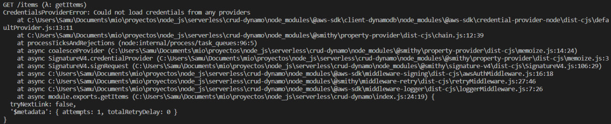
>
> El error proporcionado tiene que ver con problemas de credenciales.
>
> **Solucion**
>
> Debemos configurar nuestras credenciales de aws dentro del pc (aunque sean de mentira).
> Para ello escribimos el siguiente comando en una consola y rellenamos la información que se nos pida (pueden ser datos falsos menos la region. En ese caso usa uno de los permitidos - eu-east-1 - por ejemplo):
> - `aws configure` -> Se debe instalar aws-sdk en el pc
>
> En caso que te de error el comando `aws` debes instalar `aws cli`:
> https://docs.aws.amazon.com/cli/latest/userguide/getting-started-install.html#getting-started-install-instructions

#### Error 04

> **Problema**
>
> Error: `ValidationException: The number of attributes in key schema must match the number of attributes defined in attribute definitions.`
> 
> **Solucion**
>
> Este error viene dado por una malformación de los datos de la tabla. Especificamente en:
>
> ```yml
>         AttributeDefinitions: # Definición de los atributos de la tabla
>           - AttributeName: name # Nombre del atributo
>             AttributeType: S # Tipo de
>           - AttributeName: id
>             AttributeType: 'N'
>           - AttributeName: description
>             AttributeType: S
>         KeySchema: # Llaves del esquema
>           - AttributeName: id # Campo de llave
>             KeyType: HASH # Tipo de llave
> ```
> 
> El problema radica en que la cantidad de valores en `AttributeDefinitions` deben ser igual a la cantidad puesta en `KeySchema`. Por lo tanto, solo declaramos las llaves que estaremos utilizando en el apartado de `AttributeDefinitions` y `KeySchema` definiría el tipo de llave a utilizar. Por lo que el código final queda de la siguiente forma:
> 
> ```yml
>  AttributeDefinitions: # Definición de los atributos de la tabla
>     - AttributeName: id
>       AttributeType: 'N'
>   KeySchema: # Llaves del esquema
>     - AttributeName: id # Campo de llave
>       KeyType: HASH # Tipo de llave
> ```

#### Error 05

> **Problema**
>
> 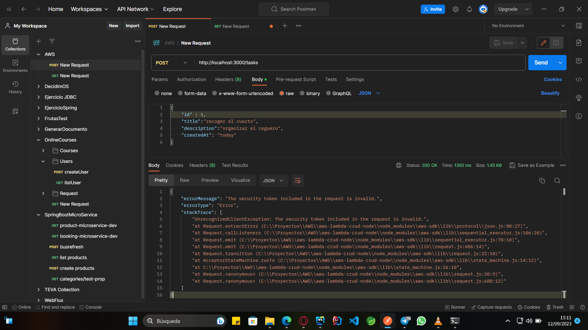
> 
> **Solucion**
> En este caso se estaba utilizando la librería `aws-sdk` directamente y no `@aws-sdk` como hemos utilizado durante el proyecto.
>
> El problema radicaba en que el `sdk` estaba intentando conectarse a amazon para poder ejecutar los comandos internos. Al decirle que su objetivo (`endpoint`) es un servidor local no intentará más conectarse a aws.
>
>``` js
> const AWS = require('aws-sdk');
> // Configura AWS SDK para usar DynamoDB Local
> AWS.config.update({
>    region: "us-west-2",
>    endpoint: "http://localhost:8000"
> });
> ```

#### Error 06

> **Problema**
>
> 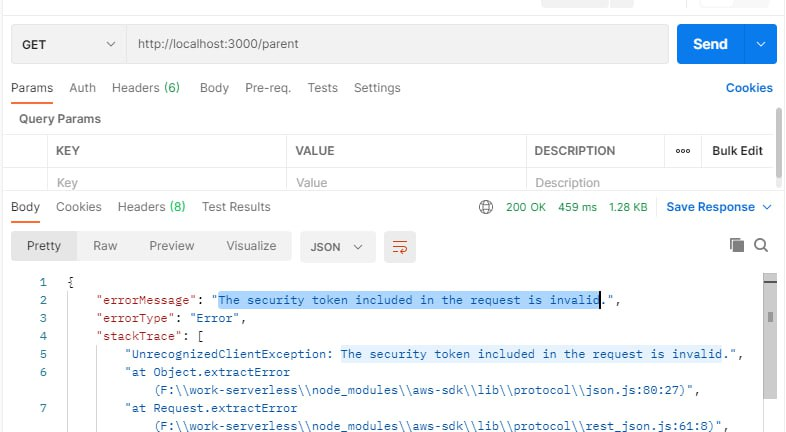
> 
> **Solucion**
> Este error se debe a que el cliente para el llamado de las lambdas está intentando conectarse directamente a aws y no al servidor local. La solución es pasarle a la instancia de `LambdaClient` la siguiente configuración:
>
>``` js
>static lambdaClientConfig = {
>        endpoint: "http://localhost:3002",
>        region: "eu-est-1",
>        credentials: {
>            accessKeyId: 'DEFAULT_ACCESS_KEY',
>            secretAccessKey: 'DEFAULT_SECRET',
>          },
>    }
> ```

# Estructura de la variable event (Llamada http):
```js
{
  body: '{\n\t"name":"Nombre",\n\t"description": "asyc"\n}',
  cookies: [],
  headers: {
    'content-type': 'application/json',
    'user-agent': 'PostmanRuntime/7.24.1',
    accept: '*/*',
    'postman-token': '2995a40e-5678-4879-9b99-4ecadf3a5813',
    host: 'localhost:3000',
    'accept-encoding': 'gzip, deflate, br',
    connection: 'keep-alive',
    'content-length': '44'
  },
  isBase64Encoded: false,
  pathParameters: { id: '1' },
  queryStringParameters: null,
  rawPath: '/item/1',
  rawQueryString: '',
  requestContext: {
    accountId: 'offlineContext_accountId',
    apiId: 'offlineContext_apiId',
    authorizer: { jwt: [Object] },
    domainName: 'offlineContext_domainName',
    domainPrefix: 'offlineContext_domainPrefix',
    http: {
      method: 'PUT',
      path: '/item/1',
      protocol: 'HTTP/1.1',
      sourceIp: '127.0.0.1',
      userAgent: 'PostmanRuntime/7.24.1'
    },
    operationName: undefined,
    requestId: 'offlineContext_resourceId',
    routeKey: 'PUT /item/{id}',
    stage: '$default',
    time: '11/Sep/2023:21:52:13 -0400',
    timeEpoch: 1694483533463
  },
  routeKey: 'PUT /item/{id}',
  stageVariables: null,
  version: '2.0'
} 
```
# Codigo alternativo

### Update Item 1
> Para la primera variante veremos como utilizar el id que viene de la url y añadirlo al objeto

```js
module.exports.updateItem = async (event) =>  {
    let body = null;
    try{
    let itemData = JSON.parse(event.body);
    const id = event.pathParameters.id;

    // Opcion 1
    item['id']=id;

    // Opcion 2
    item = {
      ...item,
      id: id,
    }
    
    await database().send(new PutCommand({TableName: options.tableName, Item}));
    body = {
      message: "Dato modificado correctamente",
      items: Item
    }
  }
  catch(e){
    logs.writeLog(e);
    body = {
      title: "Hubo un error en el proceso de creación de datos",
      message: e,
      items: []
    }
  }
    return {
      statusCode: 200,
      body: JSON.stringify(
        body,
        null,
        2
      ),
    };
  }
```

### Update Item 2

> La segunda variante es mucho más sencilla ya que desde el body vienen todo los datos necesarios.

```js
module.exports.updateItem = async (event) =>  {
    let body = null;
    try{
    let itemData = JSON.parse(event.body);
    
    await database().send(new PutCommand({TableName: options.tableName, Item}));
    body = {
      message: "Dato modificado correctamente",
      items: Item
    }
  }
  catch(e){
    logs.writeLog(e);
    body = {
      title: "Hubo un error en el proceso de creación de datos",
      message: e,
      items: []
    }
  }
    return {
      statusCode: 200,
      body: JSON.stringify(
        body,
        null,
        2
      ),
    };
  }
```

# Codigos complementarios

## Message.js
```js
module.exports = class Messages {
    static getAllError = 'Hubo un error a la hora de realizar la busqueda';
}
```

## Constant.js
```js
module.exports = class Constants {
    static tableName = 'itemTable';

    static items = [];

    static infokeConfig = {
        FunctionName: "crud-dynamo-dev-chain2", // Name of the function convention service-stage-function
        InvocationType: "RequestResponse" , //"Event" || "RequestResponse" || "DryRun",
        // LogType: "None" || "Tail",
        // ClientContext: "STRING_VALUE",
        Payload: "BLOB_VALUE",
        // Qualifier: "STRING_VALUE",
    }

    static lambdaClientConfig = {
        endpoint: "http://localhost:3002",
        region: "eu-est-1",
        credentials: {
            accessKeyId: 'DEFAULT_ACCESS_KEY',
            secretAccessKey: 'DEFAULT_SECRET',
          },
    }
}
```

## Log.js
```js
module.exports = class Logs {
  static writeLog(e){
      console.log(e);
  }
}
```