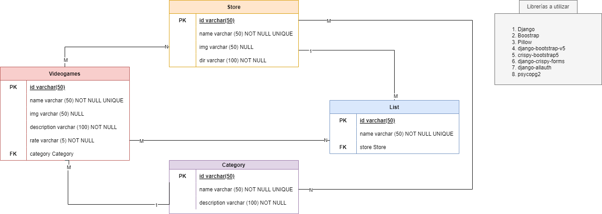

# Poniendo a prueba lo aprendido

En este apartado veremos como crear una aplicación sencilla con todo lo visto en el tutorial del objetivo 3. La aplicación consiste en una cadena de tiendas de videojuegos. Solo nos concentraremos en la lógica de los CRUDS de las tiendas y sus productos. El carrito de compra será un sistema dummy que usará `webSocket` para el intercambio de información, pero no poseerá validaciones ni tabla propia en el backend. A continuación mostramos un diagrama del sistema que vamos a desarrollar:

