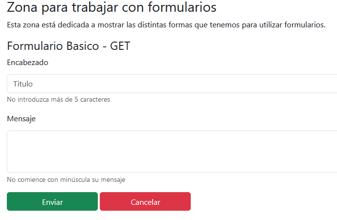
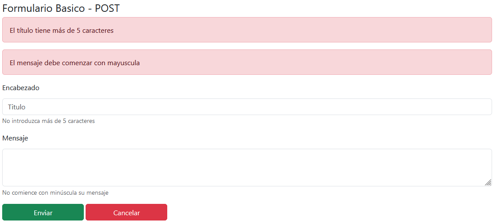
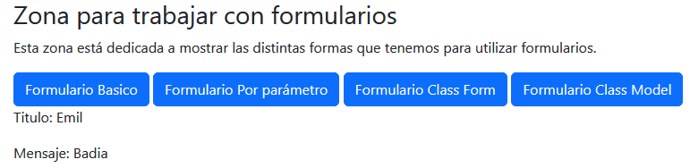
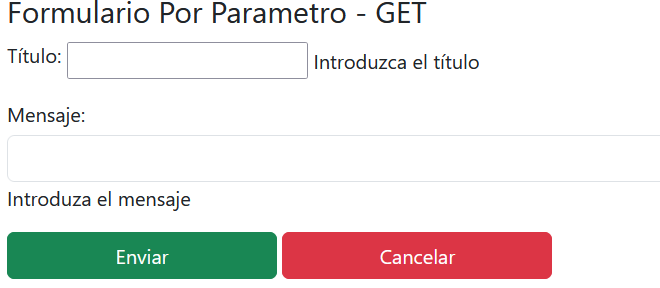
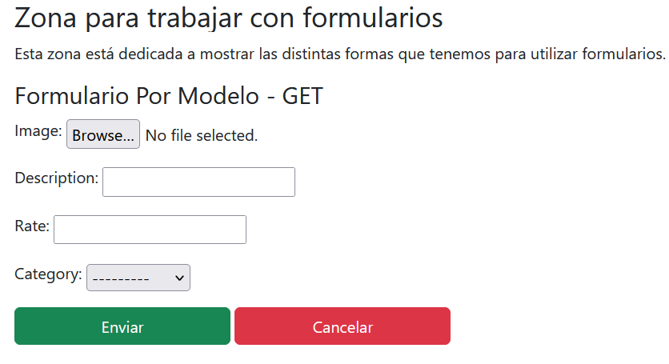
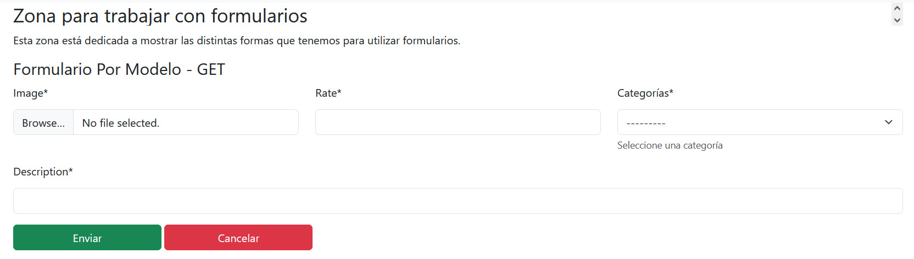

# Tutorial Django

En este tutorial estaremos abordando los temas relacionados con:

- **Formularios**.
- Vistas genéricas en Django.
- Llamadas a servicios externos
- Pruebas. DDT.
- Autenticación
- Websocket.

El código correspondiente a este repositorio lo puede encontrar en:
- [Code](https://github.com/BadiaValdes/django-curso-fab)
- Rama feat/working-around

> Es importante mencionar que en este documento solo estaremos viendo fragmentos de códigos, por lo que se les recomienda ir al repositorio en github para tener una visión global del proyecto

# Primero

Comencemos creando una vista sencilla para mostrar nuestro formulario. Esta vista la crearemos a partir de una función en `Django` (def) y no mediante una clase (esto lo veremos más adelante). Para crear una vista, nos dirigimos a nuestro archivo `view.py` y agregamos un método sencillo que devuelva una página llamada `index_form`:

```py
def form_index(request, *args,**kwargs):
    context = {
        'data1':'test',
        'forms': [
            {
            "name":"Formulario Basico",
            "url":"st_mvc:form_basico"
        },
            {
                "name": "Formulario Class Form",
                "url": "st_mvc:forms"
            },
            {
                "name": "Formulario Class Model",
                "url": "st_mvc:forms"
            }
        ]
    }

    if 'form_data' in request.session:
        context['form_data'] = request.session['form_data']
        del request.session['form_data']

    return render(request, INDEX_TEMPLATE_FORM, context)
```

Esta función tiene como objetivo mostrar la pantalla inicial de los formularios. Dentro creamos una variable de contexto para almacenar la información que queremos mostrar en el `Template`. Centrémonos en la variable `forms`. Dentro estamos almacenando todos los formularios que vamos a mostrar y las respectivas url a las que se van a dirigir.

Seguido tenemos este fragmento de código:

```py
  if 'form_data' in request.session:
        context['form_data'] = request.session['form_data']
        del request.session['form_data']
```

En otro momento veremos esto, pero aquí estamos agregando datos al contexto. Los datos los buscamos dentro de la variable de sesión (más adelante veremos sobre esto). De esta forma, cada vez que terminemos de enviar los datos de un formulario, podremos ver los resultados en la página `index` de este apartado. Por último tenemos el return de la aplicación:

```py
return render(request, INDEX_TEMPLATE_FORM, context)
```

En el `return` utilizamos la función `render`. Esta función nos permite realizar dos cosas muy importantes dentro de Django:
- Decirle al sistema que plantilla utilizar
- Definir los datos que serán renderizados en la plantilla.

En nuestro caso, para evitar problemas de cambios de nombres en las plantillas, decidimos utilizar un script que contenga variables constantes, una de esas variables es `INDEX_TEMPLATE_FORM`. A continuación mostramos un fragmento de este archivo:

```py
# Templates
BASE_TEMPLATE_DIR = '../templates/'

# Template for st_mvc
ST_MVC_TEMPLATE_DIR = f'{BASE_TEMPLATE_DIR}st_mvc/'
INDEX_TEMPLATE = f'{ST_MVC_TEMPLATE_DIR}index.html'

# Templates for obj 3
FORM_TEMPLATE_DIR = f'{BASE_TEMPLATE_DIR}form_obj3/'
INDEX_TEMPLATE_FORM = f'{FORM_TEMPLATE_DIR}index_form.html'
STATIC_TEMPLATE_FORM = f'{FORM_TEMPLATE_DIR}forms/form_static.html'
```

> Hagamos un apartado antes de continuar:
> En el código anterior vemos el uso de la letra `f` delante de los `Strings` nos permite incrustar variables dentro de la cadena mediante `{}`

Seguimos con el tutorial. Como vimos arriba, enviamos a la página de index 4 tipos de formularios distintos, en este apartado estaremos indagando en la forma de trabajar con cada uno.

# Formularios

El primer formulario que veremos será el estático. Este es el típico formulario utilizado en aplicaciones html. Simplemente agregaremos variables python que indiquen donde enviar la información.

## Formulario Básico


En vez de comenzar por el `view` iniciaremos por la plantilla, ya que nos dará una vista general de la situación:

> Para la plantilla de formulario  básico usaremos `form_static.html`.

```html
<form action="" method="post" enctype="multipart/form-data">
        
        
            
                <div class="alert alert-danger" role="alert">
                    {{ error_message }}
                </div>
            
        
        <div class="mb-3">
            <label for="title" class="form-label">Encabezado</label>
            <input type="text" class="form-control" id="title" name="title" placeholder="Titulo">
            <span id="passwordHelpBlock" class="form-text">
              No introduzca más de 5 caracteres
            </span>
        </div>
        <div class="mb-3">
            <label for="message" class="form-label">Mensaje</label>
            <textarea class="form-control" id="message" name="message" rows="3"></textarea>
            <span id="passwordHelpBlock" class="form-text">
              No comience con minúscula su mensaje
            </span>
        </div>
    <div class="row-cols-6">
         <button type="submit" class="btn btn-success">Enviar</button>
        <a class="btn btn-danger" href="">Cancelar</a>
    </div>
</form>
```

Como pueden ver, esto es un formulario común y corriente. Los cambios principales están en el uso de Jinja como motor de plantillas. A continuación explicaremos las partes más importantes del código:

```html
action=""
```

- En un formulario normal el action indica la url hacia donde se enviará la información. En este caso estamos utilizando las variables `url` de Django, de esta forma evitamos tener que realizar un `hardcode` de las mismas. 


```html

```

- Esto es muy importante que lo tenga un formulario debido a que es un token de autenticidad. Si el formulario no envía esta información al view encargado de manejar la petición POST, el sistema mostrará un error.

```html

    
        <div class="alert alert-danger" role="alert">
            {{ error_message }}
        </div>
    

```

- Gracias a la posibilidad de enviar variables desde el `view` a la `template`, podemos controlar los mensajes de error que le queremos mostrar al usuario.
- En este caso estamos preguntando por la existencia de una variable llamada `error_messages`. En caso de que exista, mostraremos todos los errores de mensajes que posea.


Ya los demás códigos son básicos de un formulario, pero ojo, el parámetro que define los `keys` de los valores que se enviarán al `view` es el `name` de los `input`. Así que tengan en cuenta que si el formulario no posee los `name` en los input, no se enviarán los datos correctamente. Además debe tener en cuenta el `enctype` de la etiqueta `form`. De esta forma definimos la estructura del dato a enviar, sin esto, es posible que los datos nunca lleguen a su destino dentro de `Django`.

Pasemos ahora a ver el view:

```py
def form_basico(request, *args,**kwargs):
    context = {}
    context['error_messages']=[]
    if request.method == METHODS['GET']:
        context['welcome']="Formulario Basico - GET"
    elif request.method == METHODS['POST']:
        if request.POST['title'] and len(request.POST['title']) > 5:
            context['error_messages'].append('El título tiene más de 5 caracteres')
        if request.POST['message'] and not request.POST['message'].strip()[0].isupper():
            context['error_messages'].append('El mensaje debe comenzar con mayuscula')
        context['welcome'] = "Formulario Basico - POST"
        if len(context['error_messages']) < 1:
            form_dat = {
                "title": request.POST['title'],
                "message": request.POST['message']
            }
            request.session['form_data']=form_dat
            return redirect(reverse('st_mvc:forms'))
    return render(request, STATIC_TEMPLATE_FORM, context)
```

Uff mucho texto no??

Vamos por parte para no salir corriendo. En python las funciones se declaran con `def` y en Django, poseen como parámetro obligatorio `request` (si va a ser utilizada en la url); los parámetros `args` y `kwargs` hacen referencia a datos extras que pueden viajar por la url (un `kwargs` puede ser el id incrustado en la url). Bajando en el código aparece la declaración del objeto `context` y la asignación del `key` `erro_messages` para almacenar el arreglo de errores.

Debajo, encontramos un `if request.method == METHODS['GET']:`. Mediante la variable del request `request.method` podemos identificar el tipo de petición que está llegando al método, por lo que podemos en un solo método controlar peticiones `POST` y `GET`. Dicha variable de iguala a `METHODS['POST']` que es un diccionario creado por nosotros para tener un mejor acceso al tipo de petición que queremos.

> Existe un término acuñado por varios youtubers denominado `magic string`. Esto parte del supuesto que el valor que estamos poniendo nunca va a cambiar. Por ejemplo, `request.POST['title']`, en el fragmento anterior estamos suponiendo que el valor siempre se llamará `title`. Esto puede traer problemas para el desarrollo si este valor cambia.
>
> Claro que no podemos evitar los `magic string` pero podemos mitigar su uso agrupando en variables datos que pueden cambiar en algún momento y es utilizado en varios lugares a la vez. Por ejemplo, puede que diferentes `view` usen el mismo `template`, por lo que creamos la variable `STATIC_TEMPLATE_FORM` pero en casos como request.POST['title'] no es muy necesario.

Seguimos. Si la peticiones se realiza mediante el método `GET` entonces solo agregaremos un texto al contexto. Esto quedaría de la siguiente forma:



Como pueden observar, no poseemos datos como los mensajes de errores u otros elementos que son tratados solamente en el apartado `POST`. En la misma interfaz se dan tips para levantar los errores dentro del formulario. Introduzcamos datos erróneos, presionamos el botón enviar y esperemos para ver los mensajes de error:



Primero podemos observar el cambio en el título de la página; antes terminaba con `GET`, pero ahora cambió a `POST`. No solo eso, antes no aparecían los mensajes y ahora si, por lo que las validaciones se están haciendo correctamente. Ahora introduzcamos datos correctamente para comprobar como funcionan las variables de sesión vistas anteriormente:



Lo que hicimos en el paso anterior fue enviar datos de la petición post a otro view de nuestra aplicación. En un principio pensamos en pasar una variable de contexto, pero esto no funciona, así que se decidió utilizar las variables de sesiones.

Django brinda un mecanismo que nos permite almacenar información de forma global dentro de la aplicación. Si vienen de usar nodejs, sería algo similar a `Redux`, no por como funciona, sino como manejan estados globales dentro de la aplicación. Este mecanismo se encuentra bajo el nombre de sesiones. Dentro de esta variable (objeto) podemos almacenar cualquier información que necesitemos.

Así es como podemos almacenar datos en la variable de sesión:

```py
form_dat = {
                "title": request.POST['title'],
                "message": request.POST['message']
            }
request.session['form_data']=form_dat
```

De esta forma podemos obtener los datos:

```py
if 'form_data' in request.session:
    context['form_data'] = request.session['form_data']
```

Terminado el formulario básico, pasemos al formulario creado mediante las clases `Form` de Django. Esta aproximación de trabajo puede ser mejor para aquellas personas que no estén muy familiarizados con html o simplemente quieren un enfoque más programático.

## Formularios por clase

La idea de esta parte es utilizar la clase `Form` de Django y mediante el contexto, enviarla a la plantilla. Comencemos creando la clase para nuestro formulario. Para ello nos creamos un archivo llamada `form.py` (en nuestro caso creamos la carpeta `form` y dentro un archivo llamado `forms.py`) y dentro pondremos toda la lógica de construcción y parte de la validación del formulario. Tengan en cuenta que existen diferentes formas de validar formularios, si quieren conocer un poco más a fondo pueden ir a este link [Medium Django Form](https://medium.com/@devsumitg/mastering-django-forms-a-comprehensive-guide-for-beginners-193665f1408d). Comencemos mostrando como queda nuestro formulario:

```py
class ParamForm(forms.Form):
    title = forms.CharField(
        error_messages={'max_length': length_error(field='Título', length='5', max=True)},
        min_length=1,
        max_length=5,
        help_text='Introduzca el título',
        label='Título',
        required=True)
    message = forms.CharField(
        widget=forms.TextInput(attrs={'class':'form-control'}),
        max_length=100,
        help_text='Introduza el mensaje',
        label='Mensaje',
        error_messages={'upper_case':START_UPPER_CASE},
        validators=[validate_first_letter_uppercase],)

    def is_valid(self):
        print("El formulario es valido")


    def clean(self):
        print("Clean Data")
```

Como pueden ver podemos realizar varias configuraciones para la creación de un formulario; muchas de las propiedades que se utilizan son opcionales, por lo que no debemos alarmarnos. Dividamos el código para que lo puedan entender mejor:

```py
class ParamForm(forms.Form):
```

- Declaramos la clase con el nombre que queramos y hacemos que extienda de `forms.Form` (`from django import forms`).
- Al extender de la clase `Form` de Django nos permite acceder a todas las configuraciones disponibles para la creación de un formulario

```py
 message = forms.CharField(
        widget=forms.TextInput(attrs={'class':'form-control'}),
        max_length=100,
        help_text='Introduza el mensaje',
        label='Mensaje',
        error_messages={'upper_case':START_UPPER_CASE},
        validators=[validate_first_letter_uppercase],)
```

- Primero definimos una variable `message` que va a poseer todos los datos del input del formulario
- Le asignamos la creación de un objeto de tipo `forms.CharField`. Esto nos permite crear un input de tipo texto.
- Dentro de `CharField` comenzamos a modificar todas las propiedades. Aquí solo explicaremos las utilizadas:
    - `widget`: Nos permite definir el tipo de objeto a mostrar en HTML. TextInput es similar al textArea. 
        - `attrs`: Es una propiedad que nos permite adicionar atributos a nuestro tag html. En este caso estamos agregando una clase.
    - `max_length`: Como su nombre indica, nos permite definir el tamaño máximo que puede tener un campo de texto.
    - `help_text`: Este es el texto de ayuda que aparecerá en la pantalla debajo del campo
    - `label`: El texto para reconocer el campo. Es el típico label de html.
    - `error_messages`: Aquí podemos definir mensajes de errores y sobre escribir los que ya existen; el `required` por ejemplo.
    - `validators`: Además, podemos definir todos los validadores que queramos dentro del campo. Ya este validador en específico lo vimos dentro del cuerpo del formulario básico, de todas formas les dejo el código:

```py
def validate_first_letter_uppercase(value):
    if not value.strip()[0].isupper():
        print('error')
        raise ValidationError(START_UPPER_CASE, 'upper_error')
```

> En el atributo `validators` no se pasa el parámetro value de la función ya que Django se encarga de inyectarlo. Pero que pasa si queremos pasar parámetros, es decir, no voy a crear 5 funciones diferentes para medir el tamaño de varios elementos.
> Pues esto es bastante sencillo, solamente debemos encapsular nuestra función dentro de otra; es decir, creamos una función que devuelve otra función:

```py
def validate_length(field, max_length, min_length):
    def inner_fn(value):
        if len(value) > max_length:
            raise ValidationError(length_error(field, max_length, True))
        elif len(value) < min_length:
            raise ValidationError(length_error(field, min_length, False))
    return inner_fn
```

> De esta forma, podemos pasar parámetros a una función de validación y a la vez permitir la inyección del valor ocn el que se va a trabajar.

```py
def is_valid(self):
    print("El formulario es valido")
    return super().is_valid()


def clean(self):
     print(self)
    cleaned_data = super().clean()
    title = cleaned_data.get('title')
    print(title)
    print("Clean Data")
```

- Estos son métodos propios de todas las clase `Form`
- El primero (`is_valid`) nos permite realizar acciones para comprobar si los valores del formularios son validos o no. Debe retornar `True` o `False`.
    - Yo ustedes no tocaría este método, si queremos hacer validaciones manuales es mejor usar el clean.
    - Este método no solo analiza la validez de los datos sino del formulario en general. Por lo que valida también que se posea el `crf_token`
- El segundo (`clean`) se ejecutará al final del ciclo de vida del formulario. Dentro del mismo tendremos acceso a los datos del formulario ya "limpios"; es decir, poder acceder directamente al valor del campo.
    - Puede ser utilizado también para validación. Su uso frecuente se ve en la validación de campos que dependen de otros. Imagina que según la edad tengas que validar el tipo de película seleccionado. 

Al ser ciclos de vida diferentes, el primer método en ejecutarse será `is_valid` y por último el `clean`. El `is_valid` es el método que le dirá a la clase que es un formulario valido para procesar, a partir de ahí ejecutará todos los validadores declarados en los campos y una serie de métodos internos como el `clean`. En este caso, sobrescribimos `clean` para que se adapte a nuestras necesidades. Veamos ahora como queda el `view`:

```py
def form_by_parameter(request, *args, **kwargs):
    context = {}
    context['form'] = ParamForm()
    if request.method == METHODS['GET']:
        context['welcome'] = "Formulario Por Parámetro - GET"
    elif request.method == METHODS['POST']:
        print(request.POST)
        form = ParamForm(request.POST)
        if form.is_valid():
            context['welcome'] = "Formulario Por Parámetro - POST"
        else:
            context['form']=form
            context['welcome'] = "Formulario Por Parámetro - POST WITH ERROR"
    return render(request, PARAM_TEMPLATE_FORM, context)
```

Similar a la anterior, verificamos que petición se está realizando y según el resultado tomamos una acción en específico. En este código introducimos el uso del formulario creado con anterioridad. Mediante la creación de una instancia del formulario `context['form'] = ParamForm()` la plantilla será capaz de renderizar los campos necesarios. De esta forma nos evitamos el código HTML correspondiente al formulario y permite un manejo y validación más familiar para aquellos que les guste programar en python. 

En el método pos hacemos dos operaciones con el formulario. La primera es volver a crear el objeto de `ParamForm` con los datos enviados por el formulario `request.POST`; de esta forma creamos una instancia del formulario pero con los datos provenientes de la primera petición y con el proceso de validación concluido. Posteriormente accedemos al método `is_valid` de la instancia de `Form` que devolverá verdadero si no existe error en los datos almacenados; en caso contrario devuelve falso. Ahora, para poder mostrar los errores que se encontraron durante el proceso de validación, debemos reasignar el formulario (con los datos del post) a nuestra variable de contexto. Y ya de esta forma, se podrán ver los errores en el `template`.

Para terminar con este tipo de formulario, nos dirigimos a ver cómo queda la plantilla programada:

```html

    
        
            <div class="alert alert-danger">
                <strong>{{ error|escape }}</strong>
            </div>
        
    

<form action="" method="post" enctype="multipart/form-data">
    
    {{ form.as_p }}
<div class="row-cols-6">
        <button type="submit" class="btn btn-success">Enviar</button>
    <a class="btn btn-danger" href="">Cancelar</a>
</div>
</form>
```

Como en este caso estamos tratando los errores en el archivo `form.py` no podemos acceder de la forma que lo hicimos en implementaciones anteriores. Existen nos formas de mostrar los errores cuando se utiliza este tipo de formulario:

```html

    
        
            <div class="alert alert-danger">
                <strong>{{ error|escape }}</strong>
            </div>
        
    

```

- La primera y vista anteriormente, se encarga de iterar por cada campo del formulario buscando la existencia de errores.

```html

<div class="alert alert-danger">
    <strong>{{ form.errors }}</strong>
</div>

```

- Esta es la segunda forma, el inconveniente es que el error viene ya pre-formateado en html.

Antes de concluir con este formulario y mostrar su resultado visual debemos explicar la siguiente línea de código:

```html
{{ form.as_p }}
```

- Django interpreta que debe mostrar el formulario cuando solamente ponemos `form`
- El `.as_p` es para encapsular el formulario dentro de una etiqueta P.
    - Otras opciones pueden ser `as_div` o `as_table`

Ahora si, vamos a mostrar como queda el formulario:



# Formulario por modelo

Ya para terminar el apartado de formularios, vamos a hablar sobre los formularios por modelo. Estos son formularios semi automáticos, ya que la clase busca el modelo a utilizar y a partir de los campos existentes, crea el formulario. De igual forma, podemos modificar los valores que tendrá cada input del formulario. 

Para este caso utilizaremos los siguiente modelos:

```py
class Category(BaseModelWithName):
    description = models.CharField(max_length=100, null=False)

class VideoGames(BaseModelWithName):
    image = models.ImageField(upload_to="mvc_image")
    description = models.CharField(max_length=150, null=False)
    rate = models.CharField(max_length=5)
    category = models.ForeignKey(Category, on_delete=models.CASCADE)
```

Como hemos hecho hasta el momento, nos dirigimos a nuestro archivo `forms.py` y comenzaremos a crear nuestro formulario.Verán que este es bastante sencillo:

```py
class VideoGamesForm(forms.ModelForm):
    class Meta:
            model = Store  # Modelo a utilizar en el formulario
            fields = ('name', 'dir', 'category', 'rate')  # Campos a mostrar, Ojo el orden importa
```

Saltemos a lo más importante:
- `forms.ModelForm`: Cuando hacemos que nuestro formulario extienda de la clase `ModelForm` estamos delegando toda la lógica de creación y manejo a `Django`. De esta forma, solo necesitamos declarar el modelo a utilizar y los campos a renderizar. Es posible, mediante `override` modificar el comportamiento de los métodos del formulario y la forma de mostrar los datos, como se hizo anteriormente. Más adelante veremos como hacer esto.
- `Meta`: Recuerden que la clase meta nos permite establecer datos importantes a utilizar dentro de la clase actual; en ocasiones anteriores la utilizábamos para darle forma al formulario y lo volveremos a hacer, un poco más adelante. En este momento solo la estamos utilizando para decirle al `ModelFrom` que modelo debe utilizar y que campos debe renderizar.
    - `model`: Es el atributo de la clase `ModelForm` que nos permite definir el modelo a utilizar.
    - `fields`: Es el atributo de la clase `ModelForm` que nos permite definir los campos a mostrar en la plantilla. Si queremos mostrar todos los campos, debemos asignarle el valor de `'__all__'`. Ojo, si hacen esto, incluso el campo `id` se mostrará. 
        - Este atributo tiene su contraparte `exclude = [CAMPOS]`. Este permite excluir campos del renderizado. Puedes usar esta en vez de `fields` si tienes demasiados campos y muy pocos son los que no deseas mostrar.

Pasemos al view:

> Recuerden que esto es incrementar, solo el último cambio se verá en el código final, por lo que si quieren ir viendo como evoluciona, deben guiarse por esta documentación.

```py
def form_class_model(request, *args, **kwargs):
    context = {}
    context['form'] = VideoGamesForm()
    if request.method == METHODS['GET']:
        context['welcome'] = "Formulario Por Modelo - GET"
    elif request.method == METHODS['POST']:
        print(request.POST)
        form = VideoGamesForm(request.POST, request.FILES)
        if form.is_valid():
            context['welcome'] = "Formulario Por Modelo - POST"
        else:
            context['form']=form
            context['welcome'] = "Formulario Por Modelo - POST WITH ERROR"
    return render(request, PARAM_TEMPLATE_FORM, context)
```

Prácticamente es la misma view que escribimos para el formulario por clase. Por lo que pueden ver esto no cambia nada, simplemente es una forma sencilla de crear el formulario sin que tengamos que programar nada dentro de esa clase. Más adelante, veremos las vistas genéricas y como trabajar con los formularios dentro de ellas, pero básicamente es lo mismo que hemos aprendido hasta el momento. Vemos ahora como quedó el resultado final ya que la plantilla es la misma que el formulario anterior:



Está feo verdad. Bueno esto podemos arreglarlo mediante el uso de `crispy`. En el formulario anterior utilizamos la propiedad `attrs` del `widget` para dar estilo a nuestro `input`; ahora usaremos `crispy`.Esta librería de Django nos permite agregar estilos a los formularios y crear un `layout` de forma programática. Veamos como queda nuestro formulario:

> Para instalar `crispy`, utilize el siguiente comando: 
> `pipenv isntall django-crispy-forms`
> o `pip install django-crispy-forms` si no usas entorno virtual.

```py
# Cripsy <- Importamos
from crispy_forms.helper import FormHelper
from crispy_forms.layout import Layout, Submit, Field as F, HTML, Row, Column

class VideoGamesForm(forms.ModelForm):
    category = forms.ModelChoiceField(
        widget=forms.Select(),
        help_text='Seleccione una categoría',
        error_messages={'required': 'Debe seleccionar una categoría'},
        required=True,
        label='Categorías',
        queryset=Category.objects.all()
    )

    class Meta:
        model = VideoGames  # Modelo a utilizar en el formulario
        fields = ('image', 'description', 'rate', 'category')  # Campos a mostrar, Ojo el orden importa

    def __init__(self, *args, **kwargs):
        super().__init__(*args, **kwargs)
        # Adicionamos la ayuda de cripsy para crear el layout
        self.helper = FormHelper()

        self.helper.layout = Layout(
            Row(
                Column(F('image')),
                Column(F('rate')),
                Column(F('category'))
            ),
            Row(
                Column(F('description'))
            ),
            Column(
                Submit("create_store", "Enviar", css_class='btn-success button-form'),  # id. Nombre.
                HTML('<a href="" class="btn btn-danger button-form"> Cancelar </a> '),
                css_class='button-form'
        ))
```

Dentro de este código podemos ver varias transformaciones con respecto al anterior. La primera y más notable es:

```py
category = forms.ModelChoiceField(
    widget=forms.Select(),
    help_text='Seleccione una categoría',
    error_messages={'required': 'Debe seleccionar una categoría'},
    required=True,
    label='Categorías',
    queryset=Category.objects.all()
)
```

Dentro de los formularios, como vimos en el anterior a este, podemos declarar los campos a utilizar como propiedades de la clase. En este caso hacemos lo mismo, pero estamos sobrescribiendo una propiedad. En este caso, tenemos el `field` `category`, si yo quiero sobrescribir el comportamiento del campo del formulario a utilizar para dicho `field`, solo debo declararlo como propiedad de la clase. Todo lo demás dentro del formulario se mantiene igual menos:

```py
def __init__(self, *args, **kwargs):
    super().__init__(*args, **kwargs)
    # Adicionamos la ayuda de cripsy para crear el layout
    self.helper = FormHelper()

    self.helper.layout = Layout(
        Row(
            Column(F('image')),
            Column(F('rate')),
            Column(F('category'))
        ),
        Row(
            Column(F('description'))
        ),
        Column(
            Submit("create_store", "Enviar", css_class='btn-success button-form'),  # id. Nombre.
            HTML('<a href="" class="btn btn-danger button-form"> Cancelar </a> '),
            css_class='button-form'
    ))
```

El método `__init__` es lo más cercano que tenemos en `Django` a un constructor y dentro podemos inicializar las propiedades de nuestra clase. En este caso estamos declarando el atributo `helper` y le asignamos la clase `FormHelper` de `crispy`. Esto nos permitirá, en la plantilla utilizar la etiqueta `crispy`. De esta forma, mediante las clases de `crispy` podemos darle forma a nuestro formulario:
- `Layout`: Permite declarar la creación de un maquetado.
- `Row`: Define el uso de una fila dentro del formulario. Sería similar a poner `class: row` dentro del div.
- `Column`: Similar al anterior, pero esta vez estaremos creando una columna.
- `F`: El verdadero nombre es `Fild`, pero pudieron ver en la importación, que esta clase posee un `as F` detrás, esto quiere decir que dentro del código tendré acceso a todas las funcionalidades de `Field` si utilizo solamente F. Es similar a un `alias`.
- `Submit`: Permite crear un botón de tipo `submit`. Para los formularios `crispy` el uso de los botones incrustados en el `HTML` no nos permite interactuar con el formulario. Por ello, debemos crear los botones igualmente por aquí.
- `HTML`: Nos permite incrustar código HTML dentro del formulario.

Existen otras clases que podemos utilizar, pero para un formulario sencillo, no hay mucho más que hacer. Veamos como queda el template y mostremos una imagen del resultado final:

```html

 <form action="" method="post" enctype="multipart/form-data">
    
    
    <div class="row-cols-6">
        <button type="submit" class="btn btn-success">Enviar</button>
        <a class="btn btn-danger" href="">Cancelar</a>
    </div>
</form>
```

> El `template` es similar al anterior, por lo que solo pusimos los datos más importantes.

- ``: De esta forma estamos diciéndole al motor de plantillas de `Django` que en este `HTML` estaremos utilizando las etiquetas de la librería `crispy`.
- ``: En ocasiones anteriores utilizábamos el `as_p` o `as_table` para definir la forma de mostrar el formulario. En este caso dejamos que `crispy` se encarge de darle estilo al formulario utilizando el `Layout` declarado en el archivo `form.py`



Se ve mucho mejor verdad, incluso le dimos una mejor organización a los componentes.

> Si quiere aprender como subir imágenes mediante un formulario de `Django`, puede ir al siguiente link: https://pillow.readthedocs.io/en/stable/. Solo debemos instalar `pillow` y tenemos la mitad de la pelea ganada. La otra mitad es simplemente declarativa.
