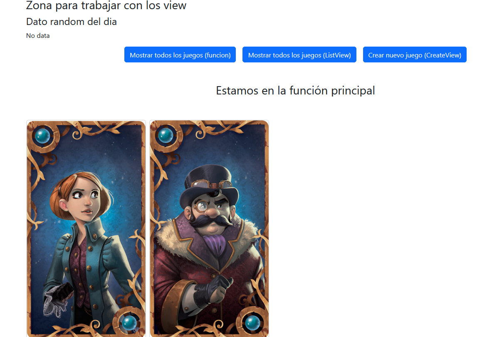
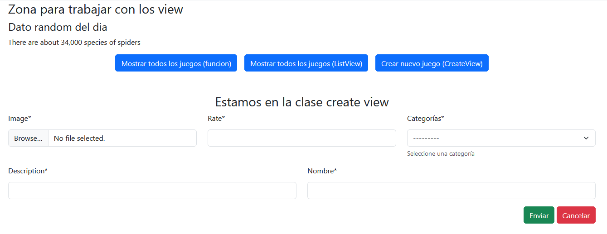

# Tutorial Django

En este tutorial estaremos abordando los temas relacionados con:

- [Formularios](https://github.com/BadiaValdes/docs/blob/doc/python/django.obj3_form.md).
- **Vistas genéricas en Django**.
- **Llamadas a servicios externos**
- Pruebas. DDT.
- Autenticación
- Websocket.

El código correspondiente a este repositorio lo puede encontrar en:
- [Code](https://github.com/BadiaValdes/django-curso-fab)
- Rama feat/working-around

> Es importante mencionar que en este documento solo estaremos viendo fragmentos de códigos, por lo que se les recomienda ir al repositorio en github para tener una visión global del proyecto

# Primero

En este tutorial estaremos tratando la creación de vista genérica y llamadas a apis externas desde un componente. En el curso de trabajo con [formularios](https://github.com/BadiaValdes/docs/blob/doc/python/django.obj3_form.md), vimos como implementar un `view` mediante funciones y como renderizar `forms` en las plantillas. También vimos como enviar datos a la plantilla y como renderizarlos. Aquí vamos a comenzar con mostrar los datos mediante una función sencilla en la pantalla principal de nuestra aplicación y posteriormente pasaremos a las vistas genéricas.

Antes de seguir, es bueno decir que las vistas genéricas son clases propias del `framework` `Django` que nos abstrae de la lógica de implementación y permite que el programador se centre en el desarrollo del componente. `Django` brinda una clase genérica por cada acción perteneciente a un `CRUD`. Para más información detallada de esta parte, puede dirigirse a:
- https://docs.djangoproject.com/en/4.2/topics/class-based-views/generic-display/
- https://docs.djangoproject.com/en/4.2/ref/class-based-views/generic-display/

Para probar todas las acciones que vamos a realizar en este tutorial, vamos a utilizar los modelos:

```py
class Category(BaseModelWithName):
    description = models.CharField(max_length=100, null=False)

class VideoGames(BaseModelWithName):
    image = models.ImageField(upload_to="mvc_image")
    description = models.CharField(max_length=150, null=False)
    rate = models.CharField(max_length=5)
    category = models.ForeignKey(Category, on_delete=models.CASCADE)
```

de nuestro código principal. De esta forma, podremos ver mejor el poder de las vistas genéricas.

## Función para retornar datos

Comencemos creando un par de archivos llamados `video_game.py` y `category.py` para almacenar la lógica de los CRUD que vamos a realizar. Ahora solo nos centraremos en el primero, dejando el segundo para cundo comencemos con las vistas genéricas. El código del view del primero sería:

```py
def index_video_game(request):
    context = {}
    context['navigation'] = NAVIGATE
    context['random_fact'] = get_random_fact()
    # Vamos a tomar todos los videojuegos y guardarlos en el contexto
    context['video_games'] = VideoGames.objects.all()
    context['from'] = 'Estamos en la función principal'
    return render(request, INDEX_TEMPLATE_DIR_OBJ3, context)
```

Aunque ya vimos esto en el curso de [formularios](https://github.com/BadiaValdes/docs/blob/doc/python/django.obj3_form.md), volveremos a verlo en este apartado:
- `context`: La variable `context` nos permite pasar datos de nuestro view a nuestra plantilla.
- `VideoGames.objects.all()`: Esta línea es bastante util. Vamos a dividirla en dos para que sea más entendible:
    - `VideoGames.objects`: Me permite acceder a todos los métodos del `ORM` de `Django` para manipular los datos correspondientes al modelo `VideoGames`.
    - `.all()`: Permite acceder a todos los datos del modelo `VideoGames` almacenados en base de datos.
- `render(request, INDEX_TEMPLATE_DIR_OBJ3, context)`: La función render nos permite utilizar una plantilla e incrustarle datos, de esta forma, podemos mostrar información al cliente. Esta función recibe 3 parámetros:
    - `request`: Los valores provenientes de la petición.
    - `plantilla`: Dirección física a la plantilla a utilizar. En nuestro caso guardamos la dirección en una variable constante.
    - `context`: El contexto son los datos a utilizar para el renderizado de la plantilla.

Otra cosa, aquí estamos utilizando una constante de navegación y un método de llamada externa a API:

```py
# Navegación
NAVIGATE = [
    {
        'name': 'Mostrar todos los juegos (funcion)',
        'url': 'st_mvc:generic',
    },
    {
        'name': 'Mostrar todos los juegos (ListView)',
        'url': 'st_mvc:generic_list',
    },
    {
        'name': 'Crear nuevo juego (CreateView)',
        'url': 'st_mvc:generic_create',
    },
]
```

```py
# Llamada a api externa
def get_random_fact():
    limit = 1
    api_url = 'https://api.api-ninjas.com/v1/facts?limit={}'.format(limit)
    response = requests.get(api_url, headers={'X-Api-Key': 'API_KEY'})
    if response.status_code == requests.codes.ok:
        return response.json()[0]['fact']
    else:
        return 'No hay fechas para hoy'
```

> Más adelante explicaremos este código.

Terminando con el `view` tenemos que pasar a la `url` y después a la `plantilla`:

```py
# url
# ...
path('generic', video_game.index_video_game, name='generic'),
# ...
```

Dentro del archivo `url.py` se encuentran todas las declaraciones de navegación de nuestra aplicación. Existen dos métodos útiles para este apartado, nosotros estamos usando `path` que proporciona una declaración de `url` más sencilla y clara; más adelante veremos el `re_path` que es la segunda opción disponible. Como segundo parámetro tanto `path` como `re_path` tenemos el método a utilizar cuando la `url` es invocada por `Django`. Por último tenemos un nombre (`name`) que nos permitirá llamar a la `url` en la plantilla sin necesidad de importarnos si cambia o no.

```html
<!-- plantilla -->





    <div class="container">
        <h3>Zona para trabajar con los view</h3>
        <h4>Dato random del dia</h4>
        <p>{{ random_fact }}</p>
        <div class="d-flex flex-row gap-3 justify-content-center align-content-center">
            
                <a href="" class="btn btn-primary">{{ nav.name }}</a>
            
                <p>No data</p>
            
        </div>
        
            <h3 class="d-flex flex-row align-content-center justify-content-center pt-5 overflow-hidden">
                {{ from }}
            </h3>
        
        <section class="d-flex justify-content-center align-content-center flex-column">
            
                <div class="d-flex flex-row gap-2 pt-5">
                    
                        <div class="card" style="width: 18rem;">
                            
                            <div class="card-body">
                                <h5 class="card-title">{{ video_game.name }}</h5>
                                <p class="card-text">{{ video_game.description }}</p>
                                <a href="#" class="btn btn-primary">{{ video_game.rate }}</a>
                            </div>
                            <div class="card-footer d-flex flex-column gap-1">
                                <span class="badge bg-secondary">{{ video_game.category.name }}</span>
                                <div class="d-flex flex-row gap-1 justify-content-between align-content-center">
                                    <a href="" class="btn btn-primary">Modifivar</a>
                                    <a href="" class="btn btn-secondary">Ver</a>
                                    <a href="" class="btn btn-danger">Eliminar</a>
                                </div>
                            </div>
                        </div>
                    
                </div>
            
        </section>
    </div>

```

Bastante grande, pero no teman, básicamente se hace grande por el uso de un componente card de `Bootstrap`. Hablemos de los nomenclatura de los códigos:
- `{{ video_game.category.name }}` -> Para mostrar los datos de una variable pasa por contexto utilizamos `{{}}` y dentro escribimos el nombre que le dimos en el `view` dentro de `context`
- `` -> Para utilizar lógica de programación, dentro de la plantilla, debemos utilizar ``. Entre los símbolos de `%` escribimos el código; en el ejemplo anterior estamos utilizando un ciclo `for`. Esto también nos sirve para crear secciones dentro de la plantilla o importar o extender de otras plantillas.

Pero bueno, veamos como queda visual lo que acabamos de hacer:



Teniendo el resultado, veamos una forma de hacerlo mucho más sencilla mediante las `generic views`. 

## Vista genérica de listar (`List View`)

Las vistas genéricas de `Django` nos proporcionan una implementación sencilla y sin contratiempos de lo que queremos hacer. Se basan en ¿Porqué debo escribir código para buscar todos los valores si es algo sencillo?. Esto es lo que hacen las vistas genéricas, abstraen de operaciones mundanas como la anterior y permite al programador concentrarse en lo que importa realmente. Vamos a mostrar como queda el `view` anterior pero utilizando la vista genérica:

```py
class VideoGameList(ListView):
    model = VideoGames
    template_name = LIST_TEMPLATE_DIR_OBJ3

    def get_context_data(self, **kwargs):
        context = super().get_context_data(**kwargs)
        context['navigation'] = NAVIGATE
        context['random_fact'] = get_random_fact()
        context['from'] = 'Estamos en la clase list view'

        return context
```

Un poco similar, pero tengan en cuenta que aquí estamos creando el contexto y eso lleva un par de códigos extras, pero si quitamos ese método y solo nos concentramos en capturar los datos y mostrarlos en la plantilla, nos quedamos en 3 líneas de código:

```py
class VideoGameList(ListView):
    model = VideoGames
    template_name = LIST_TEMPLATE_DIR_OBJ3
```

La clase `ListView` posee una serie de atributos y métodos que nos permiten agregar comportamiento a nuestra clase. Los dos primeros atributos a sobrescribir son (`model` y `template_name`). El primero define el modelo que vamos a utilizar para la petición, incluso si queremos no declaramos el model, pero en cambio debemos añadir el `queryset`; el segundo es el `template_name` que viene siendo la dirección a nuestra plantilla. Al principio de este curso se mostraron dos links para obtener información sobre las vistas genéricas. Además, en nuestro caso sobrescribimos el método `get_context_data` que nos permite modificar los datos que enviaremos en el contexto a la plantilla. Ahora, el contexto cambia un poco ahora. Los datos correspondientes a los videojuegos viajarán dentro de la variable `object_list`. La plantilla sería la misma que la anterior, solo cambiaríamos el ciclo for y lo `mostraremos` a continuación:

```html

```

El resultado visual es el mismo que el anterior, por lo que no lo mostraremos y pasaremos al siguiente paso. La vista genérica para crear datos.

## Vista genérica para crear datos (`Create View`)

Este vista genérica nos permite olvidarnos de la lógica básica de creación de elementos y centrarnos en añadir datos extras o lógica de validación. Este tipo de clase utiliza formularios para trabajar, por lo que debemos pasar por el tutorial [Formularios](https://github.com/BadiaValdes/docs/blob/doc/python/django.obj3_form.md), casi al final para ver el correspondiente a `VideoGameForm`. Conociendo esto, podemos pasar a enseñar la clase:

```py
class VideoGameCreate(CreateView):
    model = VideoGames
    form_class = VideoGamesForm
    template_name = CREATE_TEMPLATE_DIR_OBJ3
    success_url = reverse_lazy('st_mvc:generic_list')

    def get_context_data(self, **kwargs):
        context = super().get_context_data(**kwargs)
        context['navigation'] = NAVIGATE
        context['random_fact'] = get_random_fact()
        context['from'] = 'Estamos en la clase create view'

        return context
```

Similar a la clase del `list view` pero con algunas propiedades extras como son:
- `success_url`: hacia donde redireccionará la página cuando el proceso de crear datos haya sido terminado correctamente.
- `form_class`: definición del formulario a utilizar.

Además añadimos el método `get_context_data` y aparte también añadimos los dos siguientes métodos:

```py
def post(self, request, *args, **kwargs):
    request.POST = request.POST.copy()  # De esta forma si se puede modificar el valor de los campos
    print('1')
    # Se ejecuta al llegar la petición post
    return super(CreateView, self).post(request, **kwargs)

def form_valid(self, form):
    # Esto se ejecuta si el formulario es valido pero antes de salvar los datos
    object = form.save(commit=False)
    print('2')
    print(object)
    return super(VideoGameCreate, self).form_valid(form)
```

El método `POST` nos permite manejar las peticiones de tipo `post` que sean dirigidas a esta clase, por lo tanto, es el primer método que se invoca en la cadena. El segundo método añadido fue `form_valid` que en caso que el formulario sea válido, nos permite añadir información extra al objecto a utilizar. A pesar que vean el valor `print(2)` dentro, este método solo se ejecutará después de que el formulario haya validado por completo los datos y antes de que sean salvados en la base de datos. Un ejemplo de uso para este método es añadir el usuario que hace la petición o información que no es necesaria que sea llenada dentro del formulario.

Veamos la plantilla a utilizar para esta clase:

```html




    <form   method="post" enctype="multipart/form-data">
        
        
    </form>

```



Bastante sencillo y práctico, ya no debo preocuparme por guardar los datos en base de datos una vez creados, ya se que el sistema se encargará por mi; pero, ¿cómo modificaría los datos?. Esto nos lleva a nuestra siguiente clase. Aunque pasemos antes por `url.py`:

```py
path('generic', video_game.index_video_game, name='generic'),
path('generic/create', video_game.VideoGameCreate.as_view(), name='generic_create'),
```

La primera `url` pertenece a un método y como pueden observar, se realiza una llamada directa. El segundo pertenece a la clase que estábamos viendo y normalmente utilizábamos métodos y ahora estamos llamando una clase, pues `Django` no se lleva muy bien con esto y por eso podemos utilizar el método `as_view()`. Este método nos permite devolver los datos necesarios para que el método `path` pueda trabajar correctamente.

## Clase genérica para modificar datos (`UpdateView`)

Esta clase genérica es bastante similar al `CreateView` y funcionan parecido, simplemente esta posee un método inicial que a partir de un dato pasado por url, busca el objeto a actualizar y como esta clase depende de `url.py`, veamos como queda:

```py
 re_path('generic/update/(?P<pk>[0-9a-f]{32})', video_game.VideoGameUpdate.as_view(), name='generic_update'),
```

Anteriormente habíamos hablado sobre el método `re_path` dentro de `Django` y que era bastante similar a `path`. Lo estamos utilizando debido a que necesitamos utilizar una expresión regular para validar el tamaño de la llave primaria que nos enviará el usuario mediante la `url`. Esto también sirve para darle una mayor protección a nuestra aplicación y de esta forma evitar posibles ataques mediante `url`. Conociendo esto, vamos a ver el view que utilizamos para modificar datos:

```py
class VideoGameUpdate(UpdateView):
    model = VideoGames
    form_class = VideoGamesForm
    template_name = CREATE_TEMPLATE_DIR_OBJ3
    success_url = reverse_lazy('st_mvc:generic_list')

    def get_context_data(self, **kwargs):
        context = super().get_context_data(**kwargs)
        context['navigation'] = NAVIGATE
        context['random_fact'] = get_random_fact()
        context['from'] = 'Estamos en la clase update view'

        return context
```

Como pueden ver, no cambio en nada con respecto al utilizado para el crear y por lo tanto la plantilla es la misma; por lo que no hace falta entrar en más detalles con esta clase. Teniendo el `update` y el `create`, solo nos resta pasar a trabajar con el `delete` y el `details`.

## Vista de detalles (`Detail View`)

Casi siempre cuando listamos datos, debemos mostrar detalles de los mismos al cliente. Para ello podemos apoyarnos en la clase `DetailView` que como las clases anteriores, posee una lógica básica de implementación, solo queda que el programador la modifique a su gusto:

```py
class VideoGameDetail(DetailView):
    model = VideoGames
    template_name = DETAIL_TEMPLATE_DIR_OBJ3

    def get_context_data(self, **kwargs):
        context = super().get_context_data(**kwargs)
        context['navigation'] = NAVIGATE
        context['random_fact'] = get_random_fact()
        context['from'] = 'Estamos en la clase delete view'

        return context
```

Esta vista es similar al `ListView`, la diferencia está que utiliza una url similar al `CreateView` y `UpdateView` y solo devuelve un dato en vez de un listado. En nuestra plantilla podremos acceder al dato obtenido mediante la variable `object`. De esta forma, ya poseemos un sistema que es capaz de hacer todas las funciones básicas de un `CRUD`, solo nos viene faltando el `DeleteView`, pero antes vamos a mostrar la `url` correspondiente y la plantilla utilizada:

```py
#url.py

re_path('generic/detail/(?P<pk>[0-9a-f]{32})', video_game.VideoGameDetail.as_view(), name='generic_detail'),
```

```html
<!-- plantilla -->




<div class="card justify-content-center align-content-center" style="max-width: 540px;">
  <div class="row g-0">
    <div class="col-md-4">
      
    </div>
    <div class="col-md-8">
      <div class="card-body d-flex flex-column gap-1 align-content-center justify-content-start">
        <h5 class="card-title">{{ object.name }}</h5>
          <p>Descripción</p>
        <p class="card-text">{{ object.description }}</p>
        <p class="card-text">Rate</p>
        <p class="badge bg-secondary">{{ object.rate }}</p>
          <p class="card-text">Categoria</p>
        <p class="badge bg-secondary">{{ object.category }}</p>
          <a class="btn btn-primary" href="">Regresar</a>
      </div>
    </div>
  </div>
</div>

```

## Vista genérica para eliminar datos (`DeleteView`)

Este tipo de vista no tiene mucha lógica, simplemente enviamos un dato a eliminar y ya. Pues bueno, esta clase hace más que eso, pide que tengas un formulario que pregunte si deseas eliminar el elemento o no. Esto lo hace por seguridad, de esta forma se evita que se borre un dato innecesariamente y que el que haya enviado el comando de eliminar no sea un agente externo; esto lo hace validando el `crf_token`. Veamos como queda nuestro `view`:

```py
class VideoGameDelete(DeleteView):
    model = VideoGames
    template_name = DELETE_TEMPLATE_DIR_OBJ3
    success_url = reverse_lazy('st_mvc:generic_list')

    def get_context_data(self, **kwargs):
        context = super().get_context_data(**kwargs)
        context['navigation'] = NAVIGATE
        context['random_fact'] = get_random_fact()
        context['from'] = 'Estamos en la clase delete view'

        return context
```

No muy distinta a la que ya vimos en el `create` o el `update`, pero en este caso no es obligatorio declarar el formulario, ya que como es sencillo, podemos crearlo directamente en el `html`. A parte de eso no existe ningún otro cambio. Pasemos entonces a la plantilla:

```html

    <div class="container">
        <form method="post">
            <p>Está seguro que desea eliminar el elemento "{{ object }}"?</p>
            <input type="submit" class="btn btn-danger" value="Eliminar">
            <a href="" class="btn btn-secondary">Cancelar</a>
        </form>
    </div>

```

Así de sencillo, un formulario preguntando si quieres eliminar el elemento y ya. No hay complicación ni preocupación. Ahora, a lo mejor te estas preguntando y si quiero hacer algo dinámico que no tenga que pasar por un formulario, pues en ese caso puedes crear un método que se encargue de eliminar el elemento y de esa forma no necesitas el formulario. En caso que lo quieras dinamizar aún más, te sugiero utilizar `AJAX` para realizar peticiones a los `endpoints` de `Django`.

Por último y para terminar, vamos a mostrar el archivo `url.py`:

```py
re_path('generic/delete/(?P<pk>[0-9a-f]{32})', video_game.VideoGameDelete.as_view(), name='generic_delete'),
```

Sip, aquí volvimos a utilizar `re-path`.

# Conclusión

De esta forma llegamos al final del curso de vistas genéricas dentro de `Django`. Ahora solo resta estudiar un poco más del tema y hacer ejercicios prácticos. Recuerda que la mejor forma de estudiar un lenguaje o `framework` es haciendo un trabajo. Si quieres indagar más en el tema, te vuelvo a dejar los links para buscar información de las clases genéricas y recuerda que la documentación de `Django` es una de las mejores para aprender:

- https://docs.djangoproject.com/en/4.2/topics/class-based-views/generic-display/
- https://docs.djangoproject.com/en/4.2/ref/class-based-views/generic-display/
- https://docs.djangoproject.com/en/5.0/