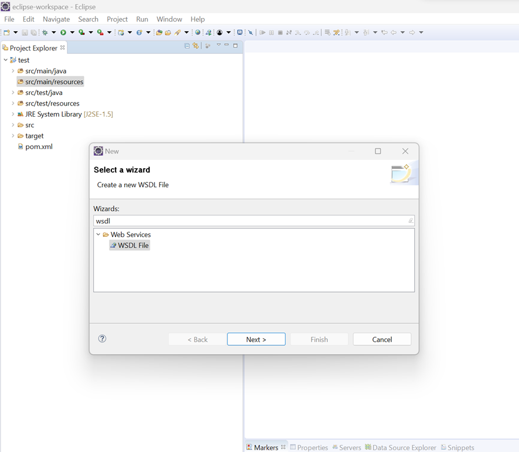
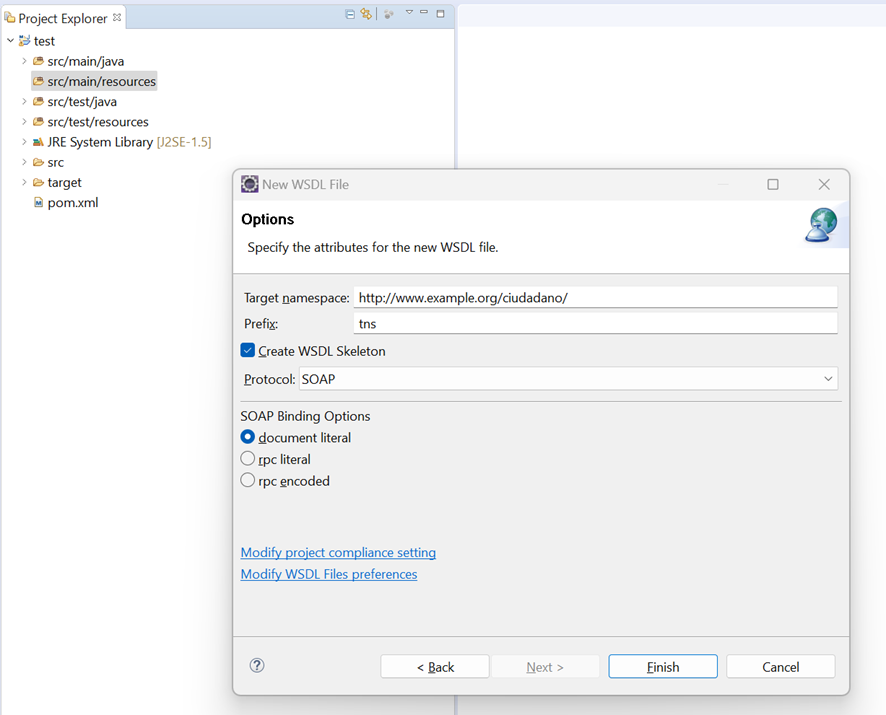
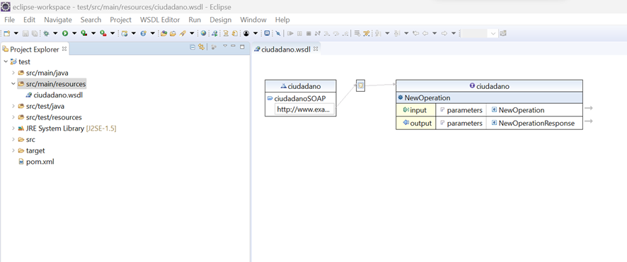

# WSDL

# Caso de estudio

Para la creación de este documento seguiremos un caso de estudio bastante sencillo. Crearemos un `WSDL` de peticiones de datos a videojuegos. A continuación presentamos las clases en formato `JAVA` que estaremos creando.

> Ojo estas son las clases generales, en el WSDL las operaciones también se toman como clases, pero veremos eso en el apartado de [estructura](#estructura)

```java
class Game {
    public String id;
    public String name;
    public Optional<int> score;
    public String description;
    public GenderType gender;
}

class GenreType {
    public String id;
    public String name;
    public String description;
}
```

# Estructura

Visto lo anterior, vamos a mostrar como queda el WSDL final y poco a poco iremos desmembrando su implementación para ver que significa cada punto.

```xml
<?xml version="1.0" encoding="UTF-8" standalone="no"?>
<wsdl:definitions xmlns:soap="http://schemas.xmlsoap.org/wsdl/soap/" xmlns:tns="http://www.example.org/TestWSDLFile/" xmlns:wsdl="http://schemas.xmlsoap.org/wsdl/" xmlns:xsd="http://www.w3.org/2001/XMLSchema" name="TestWSDLFile" targetNamespace="http://www.example.org/TestWSDLFile/">
  <wsdl:types>
    <xsd:schema targetNamespace="http://www.example.org/TestWSDLFile/">
      <xsd:element name="GetGame">
        <xsd:complexType>
          <xsd:sequence>
            <xsd:element name="gameId" type="xsd:string"/>
          </xsd:sequence>
        </xsd:complexType>
      </xsd:element>
      <xsd:element name="GetGameResponse">
        <xsd:complexType>
          <xsd:sequence>
            <xsd:element name="game" type="tns:Game"/>
          </xsd:sequence>
        </xsd:complexType>
      </xsd:element>
    
      <xsd:complexType name="Game">
      	<xsd:sequence>
      		<xsd:element name="id" type="xsd:string"></xsd:element>
      		<xsd:element name="name" type="xsd:string"></xsd:element>
      		<xsd:element name="score" type="xsd:int" maxOccurs="1"
      			minOccurs="0">
      		</xsd:element>
      		<xsd:element name="description" type="xsd:string"></xsd:element>
      		<xsd:element name="genre" type="tns:genreType"></xsd:element>
      	</xsd:sequence>
      </xsd:complexType>

      <xsd:complexType name="genreType">
      	<xsd:sequence>
      		<xsd:element name="id" type="xsd:string"></xsd:element>
      		<xsd:element name="name" type="xsd:string"></xsd:element>
      		<xsd:element name="description" type="xsd:string"></xsd:element>
      	</xsd:sequence>
      </xsd:complexType>
      <xsd:element name="CreateGame">
      	<xsd:complexType>
      		<xsd:sequence>

      			<xsd:element name="input" type="tns:Game"></xsd:element>
      		</xsd:sequence>
      	</xsd:complexType>
      </xsd:element>
      <xsd:element name="CreateGameResponse">
      	<xsd:complexType>
      		<xsd:sequence>

      			<xsd:element name="out" type="tns:Game"></xsd:element>
      		</xsd:sequence>
      	</xsd:complexType>
      </xsd:element>
      <xsd:element name="GetGenre">
      	<xsd:complexType>
      		<xsd:sequence>

      			<xsd:element name="in" type="xsd:string"></xsd:element>
      		</xsd:sequence>
      	</xsd:complexType>
      </xsd:element>
      <xsd:element name="GetGenreResponse">
      	<xsd:complexType>
      		<xsd:sequence>

      			<xsd:element name="genre" type="tns:genreType"></xsd:element>
      		</xsd:sequence>
      	</xsd:complexType>
      </xsd:element>
      <xsd:element name="CreateGenre">
      	<xsd:complexType>
      		<xsd:sequence>

      			<xsd:element name="genre" type="tns:genreType"></xsd:element>
      		</xsd:sequence>
      	</xsd:complexType>
      </xsd:element>
      <xsd:element name="CreateGenreResponse">
      	<xsd:complexType>
      		<xsd:sequence>

      			<xsd:element name="out" type="tns:genreType"></xsd:element>
      		</xsd:sequence>
      	</xsd:complexType>
      </xsd:element>
      <xsd:element name="CreateGenreFault">
      	<xsd:complexType>
      		<xsd:sequence>

      			<xsd:element name="CreateGenreFault"
      				type="xsd:string">
      			</xsd:element>
      		</xsd:sequence>
      	</xsd:complexType>
      </xsd:element>
    </xsd:schema>
  </wsdl:types>
  <wsdl:message name="GetGameRequest">
    <wsdl:part element="tns:GetGame" name="parameters"/>
  </wsdl:message>
  <wsdl:message name="GetGameResponse">
    <wsdl:part element="tns:GetGameResponse" name="parameters"/>
  </wsdl:message>
  <wsdl:message name="CreateGameRequest">
  	<wsdl:part name="parameters" element="tns:CreateGame"></wsdl:part>
  </wsdl:message>
  <wsdl:message name="CreateGameResponse">
  	<wsdl:part name="parameters" element="tns:CreateGameResponse"></wsdl:part>
  </wsdl:message>
  <wsdl:message name="GetGenreRequest">
  	<wsdl:part name="parameters" element="tns:GetGenre"></wsdl:part>
  </wsdl:message>
  <wsdl:message name="GetGenreResponse">
  	<wsdl:part name="parameters" element="tns:GetGenreResponse"></wsdl:part>
  </wsdl:message>
  <wsdl:message name="CreateGenreRequest">
  	<wsdl:part name="parameters" element="tns:CreateGenre"></wsdl:part>
  </wsdl:message>
  <wsdl:message name="CreateGenreResponse">
  	<wsdl:part name="parameters" element="tns:CreateGenreResponse"></wsdl:part>
  </wsdl:message>
  <wsdl:message name="CreateGenreFault">
  	<wsdl:part name="parameters" element="tns:CreateGenreFault"></wsdl:part>
  </wsdl:message>
  <wsdl:portType name="TestWSDLFile">
    <wsdl:operation name="GetGame">
      <wsdl:input message="tns:GetGameRequest"/>
      <wsdl:output message="tns:GetGameResponse"/>
    </wsdl:operation>
    <wsdl:operation name="CreateGame">
    	<wsdl:input message="tns:CreateGameRequest"></wsdl:input>
    	<wsdl:output message="tns:CreateGameResponse"></wsdl:output>
    </wsdl:operation>
    <wsdl:operation name="GetGenre">
    	<wsdl:input message="tns:GetGenreRequest"></wsdl:input>
    	<wsdl:output message="tns:GetGenreResponse"></wsdl:output>
    </wsdl:operation>
    <wsdl:operation name="CreateGenre">
    	<wsdl:input message="tns:CreateGenreRequest"></wsdl:input>
    	<wsdl:output message="tns:CreateGenreResponse"></wsdl:output>
        <wsdl:fault name="fault" message="tns:CreateGenreFault"></wsdl:fault>
    </wsdl:operation>
  </wsdl:portType>
  <wsdl:binding name="TestWSDLFileSOAP" type="tns:TestWSDLFile">
    <soap:binding style="document" transport="http://schemas.xmlsoap.org/soap/http"/>
    <wsdl:operation name="GetGame">
      <soap:operation soapAction="http://www.example.org/TestWSDLFile/GetGame"/>
      <wsdl:input>
        <soap:body use="literal"/>
      </wsdl:input>
      <wsdl:output>
        <soap:body use="literal"/>
      </wsdl:output>
    </wsdl:operation>
      <wsdl:operation name="CreateGame">
          <soap:operation soapAction="http://www.example.org/TestWSDLFile/GetGame"/>
          <wsdl:input>
              <soap:body use="literal"/>
          </wsdl:input>
          <wsdl:output>
              <soap:body use="literal"/>
          </wsdl:output>
      </wsdl:operation>
      <wsdl:operation name="GetGenre">
          <soap:operation soapAction="http://www.example.org/TestWSDLFile/GetGame"/>
          <wsdl:input>
              <soap:body use="literal"/>
          </wsdl:input>
          <wsdl:output>
              <soap:body use="literal"/>
          </wsdl:output>
      </wsdl:operation>
      <wsdl:operation name="CreateGenre">
          <soap:operation soapAction="http://www.example.org/TestWSDLFile/GetGame"/>
          <wsdl:input>
              <soap:body use="literal"/>
          </wsdl:input>
          <wsdl:output>
              <soap:body use="literal"/>
          </wsdl:output>
      </wsdl:operation>
  </wsdl:binding>
  <wsdl:service name="TestWSDLFile">
    <wsdl:port binding="tns:TestWSDLFileSOAP" name="TestWSDLFileSOAP">
      <soap:address location="http://www.example.org/"/>
    </wsdl:port>
  </wsdl:service>
</wsdl:definitions>
```

Comencemos a destripar el WSDL:

## Encabezado

```xml
<wsdl:definitions xmlns:soap="http://schemas.xmlsoap.org/wsdl/soap/" xmlns:tns="http://www.example.org/TestWSDLFile/" xmlns:wsdl="http://schemas.xmlsoap.org/wsdl/" xmlns:xsd="http://www.w3.org/2001/XMLSchema" name="TestWSDLFile" targetNamespace="http://www.example.org/TestWSDLFile/">
```

El encabezado dentro de los XML declaramos una serie atributos que son similares a los metaTags:
- `name`: ESpecifica el nombre del web service
- `targetNamespace`: Define el namespace sobre el cual se rige este archivo dentro del webservice. Imagina que es como el namespace de C# o los paquetes de java.
- `xmlns:soap`, `xmlns:tns`, `xmlns:wsdl`, `xmlns:xsd`: Estos atributos definen prefijos a utilizar dentro del cuerpo del WSDL y su valor hace referencia al namespace donde estarán trabajando.

## Creando datos (XSD)

```xml
 <wsdl:types>
    <xsd:schema targetNamespace="http://www.example.org/TestWSDLFile/">
      <xsd:element name="GetGame">
        <xsd:complexType>
          <xsd:sequence>
            <xsd:element name="gameId" type="xsd:string"/>
          </xsd:sequence>
        </xsd:complexType>
      </xsd:element>
      <xsd:element name="GetGameResponse">
        <xsd:complexType>
          <xsd:sequence>
            <xsd:element name="game" type="tns:Game"/>
          </xsd:sequence>
        </xsd:complexType>
      </xsd:element>
    
      <xsd:complexType name="Game">
      	<xsd:sequence>
      		<xsd:element name="id" type="xsd:string"></xsd:element>
      		<xsd:element name="name" type="xsd:string"></xsd:element>
      		<xsd:element name="score" type="xsd:int" maxOccurs="1"
      			minOccurs="0">
      		</xsd:element>
      		<xsd:element name="description" type="xsd:string"></xsd:element>
      		<xsd:element name="genre" type="tns:genreType"></xsd:element>
      	</xsd:sequence>
      </xsd:complexType>

      <xsd:complexType name="genreType">
      	<xsd:sequence>
      		<xsd:element name="id" type="xsd:string"></xsd:element>
      		<xsd:element name="name" type="xsd:string"></xsd:element>
      		<xsd:element name="description" type="xsd:string"></xsd:element>
      	</xsd:sequence>
      </xsd:complexType>
      <xsd:element name="CreateGame">
      	<xsd:complexType>
      		<xsd:sequence>

      			<xsd:element name="input" type="tns:Game"></xsd:element>
      		</xsd:sequence>
      	</xsd:complexType>
      </xsd:element>
      <xsd:element name="CreateGameResponse">
      	<xsd:complexType>
      		<xsd:sequence>

      			<xsd:element name="out" type="tns:Game"></xsd:element>
      		</xsd:sequence>
      	</xsd:complexType>
      </xsd:element>
      <xsd:element name="GetGenre">
      	<xsd:complexType>
      		<xsd:sequence>

      			<xsd:element name="in" type="xsd:string"></xsd:element>
      		</xsd:sequence>
      	</xsd:complexType>
      </xsd:element>
      <xsd:element name="GetGenreResponse">
      	<xsd:complexType>
      		<xsd:sequence>

      			<xsd:element name="genre" type="tns:genreType"></xsd:element>
      		</xsd:sequence>
      	</xsd:complexType>
      </xsd:element>
      <xsd:element name="CreateGenre">
      	<xsd:complexType>
      		<xsd:sequence>

      			<xsd:element name="genre" type="tns:genreType"></xsd:element>
      		</xsd:sequence>
      	</xsd:complexType>
      </xsd:element>
      <xsd:element name="CreateGenreResponse">
      	<xsd:complexType>
      		<xsd:sequence>

      			<xsd:element name="out" type="tns:genreType"></xsd:element>
      		</xsd:sequence>
      	</xsd:complexType>
      </xsd:element>
      <xsd:element name="CreateGenreFault">
      	<xsd:complexType>
      		<xsd:sequence>

      			<xsd:element name="CreateGenreFault"
      				type="xsd:string">
      			</xsd:element>
      		</xsd:sequence>
      	</xsd:complexType>
      </xsd:element>
    </xsd:schema>
  </wsdl:types>
```

Todo este framgento representa los tipos de datos que estaremos utilizando en nuestro archivo `wsdl`. Su delcaración comienza encerrando el esquema dentro de la etiqueta `wsdl:types`. El esquema es declarado mediante `xsd:schema`. Ahora veamos coda una de las partes que componen la declaración de tipos:

### Elemento del xml

#### Element

```xml
<xsd:element name="GetGame">
    <xsd:complexType>
        <xsd:sequence>
            <xsd:element name="gameId" type="xsd:string"/>
        </xsd:sequence>
    </xsd:complexType>
</xsd:element>
```

En este caso estamos declarando un elemento propio del XML (`xsd:element`). Es decir, se crea una especie de variable para el wsdl; en este caso estamos creando un objeto. Cuando declaramos un `xsd:element` directo en el cuerpo del esquema, estamos queriendo decir que ese elemento será utilizado en algunas de las operaciones que veremos más adelante. Y como este dato es un objeto, debemos declarar que datos poseerá dentro. Esta declaración se puede realizar de dos formas, la primera y la que veremos aquí la llamaremos anonima; es decir, no puede ser utilizada por otro elemento (la declaración interna de datos). La segunda forma es creando un `complex type` nombrado que sería el equivalente a un tipo de dato; este ejemplo lo veremos más adelante.

Conociendo el trabalenguas anterior, veamos los datos que posee dentro esta etiqueta:
- `xsd:complexType`: Esta etiqueta define un objeto complejo a crear. Como se mencionó es un complexType anonimo; a el solo tendrá acceso el elemento `GetGame` y si quiero que otro elemento tengua una estructura similar, debo crearlo desde cero. Imagina que el `complex type` anonimo hace que el elemento `GetGame` se convierta en una clase.
- `xsd:sequence`: La secuendia hace referencia a diferentes valores (atributos de la clase por ejemplo) que puede poseer un `complex type`.
- `<xsd:element name="gameId" type="xsd:string"/>`: Fijate que aqui igualmente estamos declarando un element, pero este posee un atributo `type`, aquí queremos decir que este elemento es un primitivo de nuestra "clase". Es decir, el atributo de la clase si queremos hacer la analogía.

#### Complex Type

Ahora vayamos en dirección contraria, en vez de crear un `element` que posea un `context type`, quiero crear un `complex type` que será reutilizado por diferentes `elements`. En este caso, la idea es realizar directamente la declaración del `complex type` directamente dentro de la etiqueta `xsd:schema`:

```xml
<xsd:complexType name="Game">
    <xsd:sequence>
        <xsd:element name="id" type="xsd:string"></xsd:element>
        <xsd:element name="name" type="xsd:string"></xsd:element>
        <xsd:element name="score" type="xsd:int" maxOccurs="1"
            minOccurs="0">
        </xsd:element>
        <xsd:element name="description" type="xsd:string"></xsd:element>
        <xsd:element name="genre" type="tns:genreType"></xsd:element>
    </xsd:sequence>
</xsd:complexType>
```

En este caso comenzamos declarando el `xsd:complexType` con el nombre `Game`; este es el que anteriormente llamamos `complex type` nombrado. Dentro de la misma forma que hicimos anteriormente, declaramos una secuencia con los diferentes `atributos` que tendrá esta `clase`. Si, el `complex type `directamente declarado en la etiqueta `xsd:schema` es similar a un `DTO` que creemos en java; el `DTO` será utilizado por una clase principal para devolver los datos. Cada elemento declarado dentro de la secuencia puede ser un primitivo como son los primeros ejemplos u otro DTO como vemos en `<xsd:element name="genre" type="tns:genreType"></xsd:element>`.

El atributo `type` dentro de la etiqueta element puede hacer referencia tanto a un tipo de dato primitivo o uno complejo. La diferencia de esta declaración está en la forma de llamar a ese dato:
- Un dato primitivo tiene al principio del selector `xsd:`. Esto lo vimos en el encabezado del archivo `WSDL`, `xmlns:xsd="http://www.w3.org/2001/XMLSchema"`; en ese momento, declaramos que el prefijo `xsd` será el encargado de acceder a todos los datos primitivos que pueden ser utilizados en XML. Por ello, el namespace utilizado apnto a `XMLSchema`.
- Un dato complejo como lo es el `genreType`. De la misma forma que declaramos el prefijo `xsd`, declaramos uno llamado `tns` que apunta al mismo namespace del wsdl declarado (`xmlns:tns="http://www.example.org/TestWSDLFile/"`). Esto quiere decir que cualquier `element` que en el `type` tenga el prefijo `tns` apuntará a un `complex type` nombrado declarado en el archivo `WSDL`. 

#### Juntando los dos anteriores

En esta caso vamos a juntar una declaración directa de `element` donde en la secuencia utilicemos un named `complex type` para hacer referencia a un `objeto` de una `clase`.

```xml
<xsd:element name="GetGameResponse">
    <xsd:complexType>
        <xsd:sequence>
            <xsd:element name="game" type="tns:Game"/>
        </xsd:sequence>
    </xsd:complexType>
</xsd:element>
```

Bastante sencillo verdad. Ahora puedo utilizar la clase `Game` en cualquier elemento que quiera declarar dentro de la etiqueta `xsd:schema`. De esta forma reutilizo código.

## Creando mensajes

Conciendo la forma de crear los datos (`XSD`) de nuestro `WSDL`, es hora declrar los `mensajes` de entrada y salida. Estos `mensajes` son declaraciones de los datos (`elements`) de entrada y salida que serán utilizados por el `webService`. Su objetivo es declarar la estructura a utilizar por los `endpoints` del `webservice` para enviar y recibir mensajes.

```xml
<wsdl:message name="GetGameRequest">
    <wsdl:part element="tns:GetGame" name="parameters"/>
</wsdl:message>
<wsdl:message name="GetGameResponse">
    <wsdl:part element="tns:GetGameResponse" name="parameters"/>
</wsdl:message>
<wsdl:message name="CreateGameRequest">
    <wsdl:part name="parameters" element="tns:CreateGame"></wsdl:part>
</wsdl:message>
<wsdl:message name="CreateGameResponse">
    <wsdl:part name="parameters" element="tns:CreateGameResponse"></wsdl:part>
</wsdl:message>
<wsdl:message name="GetGenreRequest">
    <wsdl:part name="parameters" element="tns:GetGenre"></wsdl:part>
</wsdl:message>
<wsdl:message name="GetGenreResponse">
    <wsdl:part name="parameters" element="tns:GetGenreResponse"></wsdl:part>
</wsdl:message>
<wsdl:message name="CreateGenreRequest">
    <wsdl:part name="parameters" element="tns:CreateGenre"></wsdl:part>
</wsdl:message>
<wsdl:message name="CreateGenreResponse">
    <wsdl:part name="parameters" element="tns:CreateGenreResponse"></wsdl:part>
</wsdl:message>
<wsdl:message name="CreateGenreFault">
    <wsdl:part name="parameters" element="tns:CreateGenreFault"></wsdl:part>
</wsdl:message>
```

Como podemos ver, la declaración de los mensajes es bastante sencilla; pero tiene su truco. Comencemos por la declaración del mensaje:

```xml
<wsdl:message name="GetGameRequest">
</wsdl:message>
<wsdl:message name="GetGameResponse">
</wsdl:message>
```

Solo voy a poner la declaración para que puedan notar algo interesante. Los nombres de los mensajes comienzan con el mismo nombre. Esto es una estrategia que utiliza `WSDL` para que el `webService` pueda saber que dos mensajes pertenecen a un `endpoint`. Entonces al final se le pone `Request` o `Response`; de esta forma se define cual de los dos mensajes será utilizado para recibir datos y cual para responder.

Dentro de cada mensaje debemos declarar el elemento (`Clase`) que se estará utilizando para manejar los datos de entrada o salida:

```xml
<wsdl:part name="parameters" element="tns:CreateGenre"></wsdl:part>
```

El `wsdl:part` hace referencia a los parámetros que utilizará el mensaje para manejar los datos. En este caso, estamos apuntando a una clase creada en la sección `xsd:schema`; especificamente las que declaramos con `xsd:element` como etiqueta padre.

## Declarando los puertos (endpoints)

Pasado la declaración de los mensajes, toca crear las operaciones que realizará nuestro `webService`:

```xml
<wsdl:portType name="TestWSDLFile">
    <wsdl:operation name="GetGame">
        <wsdl:input message="tns:GetGameRequest"/>
        <wsdl:output message="tns:GetGameResponse"/>
    </wsdl:operation>
    <wsdl:operation name="CreateGame">
        <wsdl:input message="tns:CreateGameRequest"></wsdl:input>
        <wsdl:output message="tns:CreateGameResponse"></wsdl:output>
    </wsdl:operation>
    <wsdl:operation name="GetGenre">
        <wsdl:input message="tns:GetGenreRequest"></wsdl:input>
        <wsdl:output message="tns:GetGenreResponse"></wsdl:output>
    </wsdl:operation>
    <wsdl:operation name="CreateGenre">
        <wsdl:input message="tns:CreateGenreRequest"></wsdl:input>
        <wsdl:output message="tns:CreateGenreResponse"></wsdl:output>
        <wsdl:fault name="fault" message="tns:CreateGenreFault"></wsdl:fault>
    </wsdl:operation>
</wsdl:portType>
```

La etiqueta encargada de declarar los `endopint` es `wsdl:portType` y como casi todo posee un atributo `name` para identificarla. Dentro debemos declarar las diferentes operaciones disponibles del `webService`. Se acuerdan que en apartado anterior se utilizaba la estrategia de nombres para declarar los mensajes e identificar cual era de entrada y salida, pues aquí utilizamos la misma estrategia pero para agrupar los mensajes en operaciones:

```xml
<wsdl:operation name="GetGame">
        <wsdl:input message="tns:GetGameRequest"/>
        <wsdl:output message="tns:GetGameResponse"/>
    </wsdl:operation>
```

La operación tendra como valor del atributo `name` las palabras coumnes de los nombres de los mensajes; en este caso los mensajes son:
- `GetGameRequest`
- `GetGameResponse`

Por lo que el nombre de la operación será `GetGame`.

> Tenga en cuenta que esto es una convención de nombres, no es obligatorio; pero muchos plugins utilizan esta convención de nombres para trabajar.

Ahora, dentro de cada operación debemos decir que mensaje será utilizado para entrada y cual para salida, esto se hace con las siguientes etiquetas:
- `wsdl:input` para la entrada
- `wsdl:output` para la salida

## Forma de devolver el mensaje

```xml
<wsdl:binding name="TestWSDLFileSOAP" type="tns:TestWSDLFile">
    <soap:binding style="document" transport="http://schemas.xmlsoap.org/soap/http"/>
    <wsdl:operation name="GetGame">
        <soap:operation soapAction="http://www.example.org/TestWSDLFile/GetGame"/>
        <wsdl:input>
        <soap:body use="literal"/>
        </wsdl:input>
        <wsdl:output>
        <soap:body use="literal"/>
        </wsdl:output>
    </wsdl:operation>
</wsdl:binding>
``` 

En este caso, estamos definiendo la forma en que será tratada la petición `SOAP` hacia la operación `GetGame`. La idea aquí es declarar que el XML recibido por esta operación no estará codificado o poseerá elemntos extras; simplemente la petición será directa (`XML` puro) y la respuesta también. 

> Ojo, esto se utiliza para exponer todas las operaciones declaradas, por lo que debemos agregar todas las demas.

## Declaración del servicio a exponer

Ahora solo falta epxoner el servicio brindado por el WSDL. Aquí lo que hacemos es crear un servicio y dentro declaramos los puertos a utilizar; en este caso apunta al `wsdl:binding` que se encarga de exponer todos los puertos. Dentro, declaramos una etiqueta con prefijo `Saop` que nos permite definir la dirección que debe llegar en el `envelop` de la petición.

```xml
<wsdl:service name="TestWSDLFile">
    <wsdl:port binding="tns:TestWSDLFileSOAP" name="TestWSDLFileSOAP">
        <soap:address location="http://www.example.org/"/>
    </wsdl:port>
</wsdl:service>
```


# WSDL y Eclipse

Duro hacer todo eso manual ¿verdad?.

Pues no cunda el pánico, tenemos una herramienta muy util que nos permite crear de forma visual el WSDL. Más que una herramienta es un IDE. Eclipse, especificamente en Eclispe JEE, podemos de forma visual crear nuestros archivos WSDL y de esta forma evitar todos los problemas que puede conyevar crear este archivo desde cero. Para descargar este software, podemos dirigirnos al siguietne link [EclipseJEE](https://www.eclipse.org/downloads/packages/). Para crear el WSDL seguimos los siguientes pasos:

Paso 1: 
Creamos un proyecto maven simple u otro tipo de proyecto java

Paso 2:
Creamos el fichero WSDL:


 
Luego se define tu target namespace, pueden dejar el por defecto aunque en proyecto reales siempre se pone algo identificativo.
El prefijo es lo que se usará en el XML para hacer referencia al namespace.

El SOAP hace referencia al formato de los mensajes.

El SOAP binding hace referencia a la forma de intercambiar los mensajes, el estándar es document literal, los demás son viejos y ya no se usan.



La vista gráfica es la siguiente, se recomienda hacer los cambios en esta vista para evitar cualquier problema en el esquema:



En la vista XML podemos notar:
•	El schema, que es donde se definen las estructuras de datos que se usarán. En este caso se tienen 2 elements que tienen embebido dentro un `complextype`, estos `complextype` pueden estar independiente con un nombre y ser referenciados por su nombre en el `element`.
•	Los `message` se dejan tal cual, se van modificando a medida que se cambian las otras cosas.
•	El `portType` se le llama la parte abstracta, es como la definición de una `interfaz`, `método` y `variables` de `entrada` y de `salida`.
•	El `binding` define el uso de SOAP y el `document/literal`.
•	El service define el endpoint que tendrá el servicio. En tiempo de diseño es cualquiera, cuando se despliega el servidor actualiza ese campo con el endpoint real.

 


